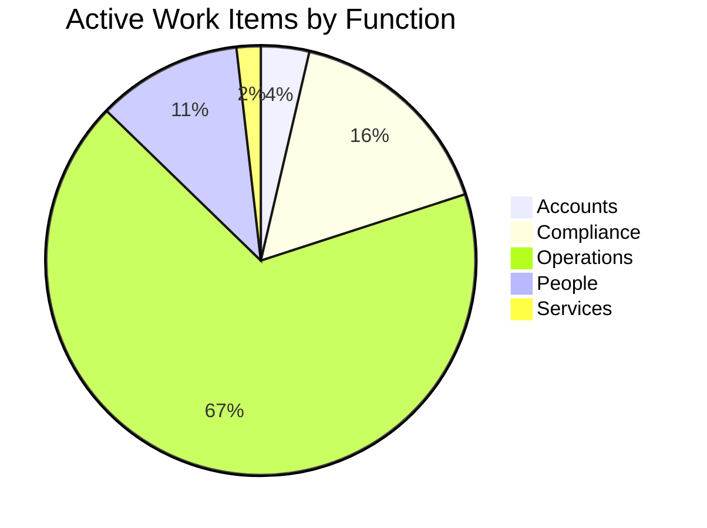
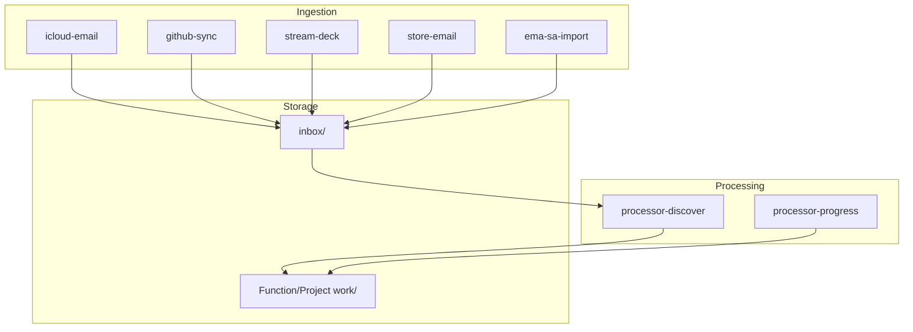

  <a href="README.md" style="display:inline-block; background-color:#f1f3f4; color:#3c4043; padding:6px 14px; text-decoration:none; border-radius:16px; font-weight:500; font-size:14px; margin-right:6px;">📖 RTRM</a>
  <a href="dashboard.md" style="display:inline-block; background-color:#e8f0fe; color:#1967d2; padding:6px 14px; text-decoration:none; border-radius:16px; font-weight:bold; font-size:14px; margin-right:6px;">📊 Dashboard</a>
  <a href="Accounts/dashboard.md" style="display:inline-block; background-color:#f1f3f4; color:#3c4043; padding:6px 14px; text-decoration:none; border-radius:16px; font-weight:500; font-size:14px; margin-right:6px;">📒 Accounts</a>
  <a href="Compliance/dashboard.md" style="display:inline-block; background-color:#f1f3f4; color:#3c4043; padding:6px 14px; text-decoration:none; border-radius:16px; font-weight:500; font-size:14px; margin-right:6px;">⚖️ Compliance</a>
  <a href="Operations/dashboard.md" style="display:inline-block; background-color:#f1f3f4; color:#3c4043; padding:6px 14px; text-decoration:none; border-radius:16px; font-weight:500; font-size:14px; margin-right:6px;">🧑‍💻 Operations</a>
  <a href="People/dashboard.md" style="display:inline-block; background-color:#f1f3f4; color:#3c4043; padding:6px 14px; text-decoration:none; border-radius:16px; font-weight:500; font-size:14px; margin-right:6px;">👥 People</a>
  <a href="Services/dashboard.md" style="display:inline-block; background-color:#f1f3f4; color:#3c4043; padding:6px 14px; text-decoration:none; border-radius:16px; font-weight:500; font-size:14px; ">🔌 Services</a>

  <a href="_pipeline/index.md">Pipeline</a> <a href="_pipeline/reports/tick-1063.md" style="font-size:11px; color:#5f6368;">#1063</a> · <a href="_tools/README.md">Tools</a> · <a href="_knowledge/roadmap.md">Roadmap</a> · <a href="_knowledge/philosophy.md">Philosophy</a> · <a href="_knowledge/research/README.md">Research</a>

  <a href="#last-tick" style="color: #1a73e8; text-decoration: none; margin-right: 8px;">Last Tick</a> · 
  <a href="#service-activity" style="color: #1a73e8; text-decoration: none; margin-right: 8px; margin-left: 8px;">Services</a> · 
  <a href="#health" style="color: #1a73e8; text-decoration: none; margin-right: 8px; margin-left: 8px;">Health</a> · 
  <a href="#attention" style="color: #1a73e8; text-decoration: none; margin-right: 8px; margin-left: 8px;">Attention</a> · 
  <a href="#detail" style="color: #1a73e8; text-decoration: none; margin-right: 8px; margin-left: 8px;">Pipeline & Detail</a> · 
  <a href="#projects" style="color: #1a73e8; text-decoration: none; margin-left: 8px;">Projects</a>

# Dashboard

> Auto-updated by pipeline. Do not edit manually.

## Last Tick

**[Tick #1063](_pipeline/reports/tick-1063.md)** · 2026-09-01 09:29 UTC · scheduled · **Diagnostics**: normal · **Historical rescan**: no

### Work Items

- No durable work-item changes in this tick.

### Company In Progress

- 🧭 [O.440](Operations/_work/O.440-contract-support-seed-crystallisation.md) — **Contract Support: Seed Crystallisation** · `authorized-awaiting-application`
  - Apply the existing Director decision recorded through [O.452-Review-seed-crystallisation-support-amendment](Operations/_work/O.452-Review-seed-crystallisation-support-amendment.md) through the normal approval lifecycle. Do not ask for the same authorization again. Compilation, data repair, supervised trial and resumption remain separately gated.
- 🧭 [O.449](Operations/_work/O.449-AI-Agent-Development-Platforms-consultation.md) — **Set Up Paid Consulting Engagement — AlphaSights**
  - Use the source correspondence to bootstrap the consulting-engagement process. Obtain the client legal entity, billing details, purchase-order or engagement paperwork and service date before preparing the final sales order or invoice. Drafts remain under Mandip's control; do not send or accept external terms automatically.
- 🧭 [O.465](Operations/_work/O.465-research-corpus-residual-repair.md) — **Research Corpus Residual Repair**
  - Continue the company-owned turn.

## Service Activity

| When | Contract | Availability | Imported | Duplicate | Deferred | Failed | Trial |
|---|---|---|---:|---:|---:|---:|---|
| 2026-08-29 13:26 | Voice Note Import Contract | unavailable | 0 | 0 | 0 | 0 | blocked |
| 2026-08-29 12:30 | Voice Note Import Contract | available | 1 | 8 | 3 | 0 | blocked |
| 2026-08-28 21:38 | Voice Note Import Contract | available | 0 | 8 | 1 | 0 | blocked |
| 2026-08-28 21:36 | Voice Note Import Contract | available | 5 | 3 | 0 | 0 | blocked |
| 2026-08-28 21:35 | Voice Note Import Contract | available | 0 | 3 | 5 | 0 | blocked |

## Agency

- **Waiting on you**: 0
- **Company obligations**: 3
- **Raw unsettled records**: 6
- **Latest move at**: 2026-08-25T10:16:21.736285+00:00
- **Latest move**: You responded to Review seed crystallisation support amendment.
- **Latest move evidence**: All right. First of all, that was a very nice uh intro um to the problem space. But I think this might be a duplicate. Um I'm not sure whether we've already handled the the contract side or is this a downstream action of the of the other authorization that I provided earlier today.
- **Latest move tick**: 1004

### Waiting on You (0)

Nothing presented and unanswered.

### Company Owes (3)

| Since | Obligation | Records | Company next action |
|---|---|---:|---|
| 2026-08-26T18:12:56.073931+00:00 | [Turn reconciliation — G.001](_pipeline/turns/replay-2026-08-26-18-55-27.md) | 1 | Attach this instruction to G.001 and present the matched proposal for Director review. |
| 2026-08-25T10:16:21.736285+00:00 | [Review seed crystallisation support amendment](Operations/_work/O.453-Review-seed-crystallisation-support-amendment.md) | 4 | Reconcile the response and settle the obligation. |
| 2026-08-25T08:02:18.159899+00:00 | [Set Up Paid Consulting Engagement — AlphaSights](Operations/_work/O.449-AI-Agent-Development-Platforms-consultation.md) | 1 | Use the source correspondence to bootstrap the consulting-engagement process. Obtain the client legal entity, billing details, purchase-order or engagement paperwork and service date before preparing the final sales order or invoice. Drafts remain under Mandip's control; do not send or accept external terms automatically. |

### Activity Since Latest Move (60 ticks)

| Tick | Compute | Inspected | Created | Progressed | LLM tokens |
|---:|---:|---:|---:|---:|---:|
| [#1004](_pipeline/reports/tick-1004.md) | 45.5s | 17 | 0 | 0 | 0 |
| [#1005](_pipeline/reports/tick-1005.md) | 47.0s | 17 | 0 | 0 | 0 |
| [#1006](_pipeline/reports/tick-1006.md) | 44.4s | 17 | 0 | 0 | 0 |
| [#1007](_pipeline/reports/tick-1007.md) | 46.5s | 17 | 0 | 0 | 0 |
| [#1008](_pipeline/reports/tick-1008.md) | 54.6s | 17 | 0 | 0 | 0 |
| [#1009](_pipeline/reports/tick-1009.md) | 42.3s | 17 | 0 | 0 | 0 |
| [#1010](_pipeline/reports/tick-1010.md) | 47.9s | 17 | 0 | 0 | 0 |
| [#1011](_pipeline/reports/tick-1011.md) | 44.0s | 17 | 0 | 0 | 0 |
| [#1012](_pipeline/reports/tick-1012.md) | 47.2s | 17 | 0 | 0 | 0 |
| [#1013](_pipeline/reports/tick-1013.md) | 56.5s | 17 | 1 | 0 | 775 |
| [#1014](_pipeline/reports/tick-1014.md) | 46.0s | 17 | 0 | 0 | 0 |
| [#1015](_pipeline/reports/tick-1015.md) | 40.1s | 17 | 0 | 0 | 0 |
| [#1016](_pipeline/reports/tick-1016.md) | 44.0s | 17 | 0 | 0 | 0 |
| [#1017](_pipeline/reports/tick-1017.md) | 46.8s | 17 | 0 | 0 | 0 |
| [#1018](_pipeline/reports/tick-1018.md) | 43.8s | 17 | 0 | 0 | 0 |
| [#1019](_pipeline/reports/tick-1019.md) | 45.7s | 17 | 0 | 0 | 0 |
| [#1020](_pipeline/reports/tick-1020.md) | 48.0s | 17 | 0 | 0 | 0 |
| [#1021](_pipeline/reports/tick-1021.md) | 46.1s | 17 | 0 | 0 | 0 |
| [#1022](_pipeline/reports/tick-1022.md) | 52.1s | 17 | 0 | 0 | 0 |
| [#1023](_pipeline/reports/tick-1023.md) | 58.1s | 17 | 0 | 0 | 0 |
| [#1024](_pipeline/reports/tick-1024.md) | 43.3s | 17 | 0 | 0 | 0 |
| [#1025](_pipeline/reports/tick-1025.md) | 37.6s | 17 | 0 | 0 | 0 |
| [#1026](_pipeline/reports/tick-1026.md) | 50.2s | 17 | 0 | 0 | 0 |
| [#1027](_pipeline/reports/tick-1027.md) | 51.0s | 17 | 0 | 0 | 0 |
| [#1028](_pipeline/reports/tick-1028.md) | 46.0s | 17 | 0 | 0 | 0 |
| [#1029](_pipeline/reports/tick-1029.md) | 45.0s | 17 | 0 | 0 | 0 |
| [#1030](_pipeline/reports/tick-1030.md) | 40.7s | 17 | 0 | 0 | 0 |
| [#1031](_pipeline/reports/tick-1031.md) | 45.7s | 17 | 0 | 0 | 0 |
| [#1032](_pipeline/reports/tick-1032.md) | 118.9s | 17 | 0 | 0 | 0 |
| [#1033](_pipeline/reports/tick-1033.md) | 47.8s | 17 | 0 | 0 | 0 |
| [#1034](_pipeline/reports/tick-1034.md) | 160.1s | 18 | 1 | 0 | 0 |
| [#1035](_pipeline/reports/tick-1035.md) | 6.3s | 0 | 0 | 0 | 0 |
| [#1036](_pipeline/reports/tick-1036.md) | 542.0s | 19 | 2 | 0 | 0 |
| [#1037](_pipeline/reports/tick-1037.md) | 205.6s | 19 | 0 | 0 | 0 |
| [#1038](_pipeline/reports/tick-1038.md) | 84.5s | 19 | 0 | 0 | 0 |
| [#1039](_pipeline/reports/tick-1039.md) | 61.0s | 19 | 0 | 0 | 0 |
| [#1040](_pipeline/reports/tick-1040.md) | 55.3s | 19 | 0 | 0 | 0 |
| [#1041](_pipeline/reports/tick-1041.md) | 53.9s | 19 | 1 | 0 | 794 |
| [#1042](_pipeline/reports/tick-1042.md) | 66.8s | 19 | 0 | 0 | 0 |
| [#1043](_pipeline/reports/tick-1043.md) | 43.1s | 19 | 0 | 0 | 0 |
| [#1044](_pipeline/reports/tick-1044.md) | 43.5s | 19 | 0 | 0 | 0 |
| [#1045](_pipeline/reports/tick-1045.md) | 43.8s | 19 | 0 | 0 | 0 |
| [#1046](_pipeline/reports/tick-1046.md) | 48.4s | 19 | 0 | 0 | 0 |
| [#1047](_pipeline/reports/tick-1047.md) | 48.3s | 19 | 0 | 0 | 0 |
| [#1048](_pipeline/reports/tick-1048.md) | 1072.7s | 19 | 0 | 0 | 0 |
| [#1049](_pipeline/reports/tick-1049.md) | 2.3s | 0 | 0 | 0 | 0 |
| [#1050](_pipeline/reports/tick-1050.md) | 42.8s | 19 | 0 | 0 | 0 |
| [#1051](_pipeline/reports/tick-1051.md) | 37.7s | 19 | 0 | 0 | 0 |
| [#1052](_pipeline/reports/tick-1052.md) | 6684.9s | 0 | 0 | 0 | 0 |
| [#1053](_pipeline/reports/tick-1053.md) | 3.0s | 0 | 0 | 0 | 0 |
| [#1054](_pipeline/reports/tick-1054.md) | 3.0s | 0 | 0 | 0 | 0 |
| [#1055](_pipeline/reports/tick-1055.md) | 5.2s | 0 | 0 | 0 | 0 |
| [#1056](_pipeline/reports/tick-1056.md) | 2.6s | 0 | 0 | 0 | 0 |
| [#1057](_pipeline/reports/tick-1057.md) | 2231.5s | 19 | 2 | 0 | 0 |
| [#1058](_pipeline/reports/tick-1058.md) | 45.3s | 19 | 0 | 0 | 0 |
| [#1059](_pipeline/reports/tick-1059.md) | 6.5s | 0 | 0 | 0 | 0 |
| [#1060](_pipeline/reports/tick-1060.md) | 6.8s | 0 | 0 | 0 | 0 |
| [#1061](_pipeline/reports/tick-1061.md) | 6.4s | 0 | 0 | 0 | 0 |
| [#1062](_pipeline/reports/tick-1062.md) | 42.9s | 19 | 0 | 0 | 0 |
| [#1063](_pipeline/reports/tick-1063.md) | 6.1s | 0 | 0 | 0 | 0 |

## Health

| Function | Status | Active | Waiting | Done |
|----------|--------|--------|---------|------|
| [Accounts](Accounts/dashboard.md) | 🔄 | 2 | 0 | 13 |
| [Compliance](Compliance/dashboard.md) | ⏸️ | 9 | 1 | 13 |
| [Operations](Operations/dashboard.md) | ⚠️ | 37 | 0 | 453 |
| [People](People/dashboard.md) | ⚠️ | 6 | 0 | 1 |
| [Services](Services/dashboard.md) | 🔄 | 1 | 0 | 11 |
| **Total** | | **55** | **1** | **491** |

### Work Item Distribution

### Status Distribution

## Attention

### Decisions Waiting (25)

Blocked on a human answer — not staleness.

| Kind | Subject | Detail | Link |
|------|---------|--------|------|
| Contract proposal | Agent-Human Interaction Services Agreement | Blocked — missing prerequisites — `pipeline.README.md` | [View](Operations/_work/approvals/contract-proposal-agent-human-interaction-services-agreement.md) |
| Contract proposal | Communication Archival Services Agreement | Blocked — missing prerequisites — `../Compliance/privacy.README.md`, `../Compliance/confidentiality.README.md` | [View](Operations/_work/approvals/contract-proposal-communication-archival-services-agreement.md) |
| Contract proposal | Hardware and Software Procurement Services Agreement | Blocked — missing prerequisites — `../HR/README.md`, `../Operations/_data/assets.md` | [View](Operations/_work/approvals/contract-proposal-hardware-and-software-procurement-services-agreement.md) |
| Contract proposal | LLM Harvesting and Corpus Evaluation Services Agreem | Blocked — missing prerequisites — `pipeline.README.md`, `../Compliance/README.md`, `../Inbox/README.md` | [View](Operations/_work/approvals/contract-proposal-llm-harvesting-and-corpus-evaluation-services-agreement.md) |
| Contract proposal | Networking and Industry Engagement Services Agreemen | Blocked — missing prerequisites — `../Partnerships/README.md`, `../Procurement/README.md`, `../Knowledge/README.md` | [View](Operations/_work/approvals/contract-proposal-networking-and-industry-engagement-services-agreement.md) |
| Contract proposal | Project Documentation and Reporting Services Agreeme | Blocked — missing prerequisites — `../Accounts/README.md`, `../Operations/_contracts/director-resolution.README.md` | [View](Operations/_work/approvals/contract-proposal-project-documentation-and-reporting-services-agreement.md) |
| Contract proposal | Purchase Order Processing Services Agreement | Blocked — missing prerequisites — `pipeline.README.md`, `../Services/README.md`, `../Accounts/tax-compliance.README.md`, `../Accounts/README.md` | [View](Operations/_work/approvals/contract-proposal-purchase-order-processing-services-agreement.md) |
| Contract proposal | Sales Workflow Formalization | Awaiting approval | [View](Operations/_work/approvals/contract-proposal-sales-workflow-formalization.md) |
| Contract proposal | SDLC Process Review Services Agreement | Awaiting approval | [View](Operations/_work/approvals/contract-proposal-sdlc-process-review-services-agreement.md) |
| Contract proposal | Support Amendment — Seed Crystallisation | Awaiting approval | [View](Operations/_work/approvals/contract-proposal-seed_crystallisation-support-amendment.md) |
| Contract proposal | WhatsApp Digest Processing Services Agreement | Blocked — missing prerequisites — `../People/_data/people.md` | [View](Operations/_work/approvals/contract-proposal-whatsapp-digest-processing-services-agreement.md) |
| Review point | pipeline RP-5 | Contract proposals bypass the canonical attention stream | [View](Operations/_contracts/pipeline.REVIEW.md) |
| Review point | pipeline RP-2 | The company turn has no completion criterion | [View](Operations/_contracts/pipeline.REVIEW.md) |
| Review point | pipeline RP-3 | Support wrappers are created without an idempotency check | [View](Operations/_contracts/pipeline.REVIEW.md) |
| Review point | pipeline RP-4 | Human response reconciliation waits for the schedule | [View](Operations/_contracts/pipeline.REVIEW.md) |
| Review point | seed-crystallisation RP-1 | Require a no-op for unchanged inputs | [View](Operations/_contracts/seed-crystallisation.REVIEW.md) |
| Review point | seed-crystallisation RP-2 | Validate source provenance before mutation | [View](Operations/_contracts/seed-crystallisation.REVIEW.md) |
| Review point | seed-crystallisation RP-3 | Exclude generated outputs from research inputs | [View](Operations/_contracts/seed-crystallisation.REVIEW.md) |
| Review point | seed-crystallisation RP-4 | Implement inductive analysis as contracted | [View](Operations/_contracts/seed-crystallisation.REVIEW.md) |
| Review point | seed-crystallisation RP-8 | Index seed counts do not match the themes | [View](Operations/_contracts/seed-crystallisation.REVIEW.md) |
| Review point | seed-crystallisation RP-9 | Theme files grow without bound | [View](Operations/_contracts/seed-crystallisation.REVIEW.md) |
| Review point | seed-crystallisation RP-5 | Bound autonomous mutation | [View](Operations/_contracts/seed-crystallisation.REVIEW.md) |
| Review point | seed-crystallisation RP-6 | Replace retry-on-breach with containment | [View](Operations/_contracts/seed-crystallisation.REVIEW.md) |
| Review point | seed-crystallisation RP-7 | Define supervised trial and promotion evidence | [View](Operations/_contracts/seed-crystallisation.REVIEW.md) |
| Review point | voice-note-import-contract RP-2 | The contract cannot leave trial, and says so to no one | [View](Operations/_contracts/voice-note-import-contract.REVIEW.md) |

### Stale Work Items

| Function | Item | Reason | Link |
|----------|------|--------|------|
| Accounts | The Fox & Hounds, Whittlebury — Business | Open 97 days | [A.011](Accounts/_work/A.011-Retail-Receipt.md) |
| Compliance | Register for Corporation Tax | Open 109 days | [C.004.1](Compliance/_work/C.004.1-Register-for-corporation-tax.md) |
| Compliance | Assess VAT registration requirement | Open 109 days | [C.004.2](Compliance/_work/C.004.2-Assess-VAT-registration.md) |
| Compliance | virtual-office-service-address.md | Open 101 days | [C.015](Compliance/_work/C.015-virtual-office-service-addressmd.md) |
| Compliance | ICO Data Protection Fee Direct Debit Con | Open 69 days | [C.017](Compliance/_work/C.017-ICO-Data-Protection-Fee-Direct-Debit-Confirmation.md) |
| Compliance | BYOD Policy Review and Compliance | Open 67 days | [C.021](Compliance/_work/C.021-BYOD-Policy-Review-and-Compliance.md) |
| Compliance | Health and Safety compliance process imp | Open 64 days | [C.028](Compliance/_work/C.028-Health-and-Safety-compliance-process-implementation.md) |
| Compliance | EU AI Act Article 52 Compliance | Open 64 days | [C.029](Compliance/_work/C.029-EU-AI-Act-Article-52-Compliance.md) |
| Compliance | Compliance: Employment Rights Act s.1 co | Open 64 days | [C.034](Compliance/_work/C.034-Compliance-Employment-Rights-Act-s1-contract.md) |
| Compliance | Anonymous User Experience and Contract F | Awaiting input | [C.037](Compliance/_work/C.037-Anonymous-User-Experience-and-Contract-Framework.md) |
| Operations | WhatsApp digest: Jatin/Mandip/Kash (2026 | Open 19 days | [I.004](Operations/_work/I.004-WhatsApp-digest-JatinMandipKash-2026-08-12.md) |
| Operations | InstantID tool exploration | Open 18 days | [I.005](Operations/_work/I.005-InstantID-tool-exploration.md) |
| Operations | Apple Developer Program Enrollment | Open 57 days | [O.008](Operations/_work/O.008-Apple-Developer-Program-Enrollment.md) |
| Operations | Migrate Winston app to Ema Next | Open 53 days | [O.009](Operations/_work/O.009-Migrate-Winston-app-to-Ema-Next.md) |
| Operations | Integration of courier services into SPI | Open 35 days | [P.003](Operations/_work/P.003-Integration-of-courier-services-into-SPINE.md) |
| Operations | RightStore Nimbus Proposal V2 Review | Open 32 days | [P.004](Operations/_work/P.004-RightStore-Nimbus-Proposal-V2-Review.md) |
| Operations | RightStore by Nimbus deck development | Open 32 days | [P.005](Operations/_work/P.005-RightStore-by-Nimbus-deck-development.md) |
| Operations | IBIS system overview for Christie & Co | Open 28 days | [P.006](Operations/_work/P.006-IBIS-system-overview-for-Christie-Co.md) |
| Operations | Project prioritization and competitor re | Open 28 days | [P.007](Operations/_work/P.007-Project-prioritization-and-competitor-research.md) |
| People | H.002 — Tech Toast Attendee Outreach | Open 56 days | [H.002](People/_work/H.002-tech-toast-attendee-outreach.md) |
| People | Review compensation and workload distrib | Open 53 days | [H.003](People/_work/H.003-Review-compensation-and-workload-distribution.md) |
| People | People Development and Learning Framewor | Open 49 days | [H.004](People/_work/H.004-People-Development-and-Learning-Framework.md) |
| People | Onboarding and Integration of James Lowm | Open 48 days | [H.005](People/_work/H.005-Onboarding-and-Integration-of-James-Lowman-CEO.md) |
| People | CEO recruitment update: James Lowman wit | Open 33 days | [H.006](People/_work/H.006-CEO-recruitment-update-James-Lowman-withdrawal.md) |
| People | Potential CEO candidate: Ilann Hepworth | Open 33 days | [H.007](People/_work/H.007-Potential-CEO-candidate-Ilann-Hepworth.md) |
| Services | Nimbus platform access and subscription  | Open 64 days | [S.018](Services/_work/S.018-Nimbus-platform-access-and-subscription-management.md) |

## Detail

### Pipeline

**Total Ticks**: 1063

| Source | Enabled | Status | Last Run | Detail |
|--------|---------|--------|----------|--------|
| icloud-email | 🟢 Yes | ✅ ok | 2026-09-01 10:29 | 0 new, 0 synced |
| github-sync | 🟢 Yes | ✅ ok | 2026-09-01 10:13 | 0 synced |
| stream-deck | ⚪ No | ✅ ok | 2026-09-01 10:13 | 0 copied, 0 noise, 0 hal |
| processor-discover | 🟢 Yes | ✅ ok | — | 0 processed, 0 created |
| processor-progress | 🟢 Yes | ✅ ok | — | 0 progressed |
| whatsapp | 🟢 Yes | ✅ ok | 2026-09-01 10:13 | 0 processed, 0 failed |
| companies-house | ⚪ No | — | — | — |
| hostinger | ⚪ No | — | — | — |
| store-email | 🟢 Yes | — | — | — |
| ema-sa-import | 🟢 Yes | — | — | — |
| antigravity-brain | ⚪ No | — | — | — |

### Recent Pipeline Runs

| Run | Duration | icloud-email | github-sync | processor-discover | processor-progress | Cost | Carbon |
|-----|----------|--------------|-------------|--------------------|--------------------|------|--------|
| [2026-09-01 10:29](_pipeline/logs/2026-09-01_10-29-26.md) | 6s | [✓](_pipeline/logs/2026-09-01_10-29-26.md#icloud-email) 0 new, 0 synced | — | — | — | $0.0000 | ~0.003g |
| [2026-09-01 10:13](_pipeline/logs/2026-09-01_10-13-23.md) | 43s | [✓](_pipeline/logs/2026-09-01_10-13-23.md#icloud-email) 0 new, 0 synced | [✓](_pipeline/logs/2026-09-01_10-13-23.md#github-sync) 0 synced | — | [✓](_pipeline/logs/2026-09-01_10-13-23.md#processor-progress) 0 progressed | $0.0000 | ~0.018g |
| [2026-09-01 09:57](_pipeline/logs/2026-09-01_09-57-58.md) | 6s | [✓](_pipeline/logs/2026-09-01_09-57-58.md#icloud-email) 0 new, 0 synced | — | [✓](_pipeline/logs/2026-09-01_09-57-58.md#processor-discover) 0 processed, 0 created | — | $0.0000 | ~0.003g |
| [2026-09-01 09:38](_pipeline/logs/2026-09-01_09-38-11.md) | 7s | [✓](_pipeline/logs/2026-09-01_09-38-11.md#icloud-email) 0 new, 0 synced | — | — | — | $0.0000 | ~0.003g |
| [2026-09-01 09:22](_pipeline/logs/2026-09-01_09-22-46.md) | 6s | [✓](_pipeline/logs/2026-09-01_09-22-46.md#icloud-email) 0 new, 0 synced | — | [✓](_pipeline/logs/2026-09-01_09-22-46.md#processor-discover) 0 processed, 0 created | — | $0.0000 | ~0.003g |

### Source Topology

### Contracts

| Contract | Function | Cadence | Last Run | Compiled |
|----------|----------|---------|----------|----------|
| [Consulting Engagement Administration](Operations/_contracts/consulting-engagement-administration.README.md) | Operations | on-demand | — | ⚪ No |
| [Conversational Initiative](Operations/_contracts/conversational-initiative.README.md) | Operations | on-demand | — | ⚪ No |
| [Creative Asset Production](Operations/_contracts/creative-asset-production.README.md) | Operations | on-demand | — | ⚪ No |
| [Github Issue Sync](Operations/_contracts/github-issue-sync.README.md) | Operations | per-tick | — | ⚪ No |
| [Icloud Email Import](Operations/_contracts/icloud-email-import.README.md) | Operations | per-tick | — | ⚪ No |
| [Impact Cascade](Operations/_contracts/impact-cascade.README.md) | Operations | per-tick | 2026-08-25 11:40 | ⚪ No |
| [Information Triage](Operations/_contracts/information-triage.README.md) | Operations | per-tick | 2026-09-01 10:13 | 🟢 Yes |
| [Mailroom](Operations/_contracts/mailroom.README.md) | Operations | per-tick | 2026-09-01 10:13 | 🟢 Yes |
| [Seed Crystallisation](Operations/_contracts/seed-crystallisation.README.md) | Operations | per-tick | 2026-08-24 15:27 | 🟢 Yes |
| [Stack Improvement](Operations/_contracts/stack-improvement.README.md) | Operations | weekly | — | ⚪ No |
| [Voice Note Import Contract](Operations/_contracts/voice-note-import-contract.README.md) | Operations | per-tick | 2026-08-29 13:23 | 🟢 Yes |
| [Whatsapp Import](Operations/_contracts/whatsapp-import.README.md) | Operations | per-tick | — | ⚪ No |

### Projects

| Project | Status | Active | Waiting | Done |
|---------|--------|--------|---------|------|
| [5et.aiguy.cloud](projects/5et.aiguy.cloud/README.md) | ✅ | 0 | 0 | 0 |
| [5et.uk](projects/5et.uk/README.md) | ✅ | 0 | 0 | 0 |
| [ai-course](projects/ai-course/README.md) | ✅ | 0 | 0 | 0 |
| [bekame-collab](projects/bekame-collab/README.md) | ✅ | 0 | 0 | 0 |
| [blockvey](projects/blockvey/README.md) | ✅ | 0 | 0 | 0 |
| [car-personality](projects/car-personality/README.md) | ✅ | 0 | 0 | 0 |
| [chess](projects/chess/README.md) | ⚠️ | 4 | 0 | 0 |
| [cv-builder](projects/cv-builder/README.md) | ✅ | 0 | 0 | 0 |
| [ema-sa](projects/ema-sa/README.md) | ⏸️ | 27 | 1 | 0 |
| [game](projects/game/README.md) | 🔄 | 2 | 0 | 0 |
| [golf](projects/golf/README.md) | ✅ | 0 | 0 | 0 |
| [home-information-pack](projects/home-information-pack/README.md) | ✅ | 0 | 0 | 0 |
| [hyperscaler](projects/hyperscaler/README.md) | ✅ | 0 | 0 | 0 |
| [irontec](projects/irontec/README.md) | ✅ | 0 | 0 | 0 |
| [legal-system-research](projects/legal-system-research/README.md) | ✅ | 0 | 0 | 0 |
| [mylang](projects/mylang/README.md) | 🔄 | 1 | 0 | 0 |
| [myos](projects/myos/README.md) | ✅ | 0 | 0 | 0 |
| [nature-app](projects/nature-app/README.md) | ✅ | 0 | 0 | 0 |
| [open-contracts](projects/open-contracts/README.md) | ⚠️ | 5 | 0 | 0 |
| [push-to-talk](projects/push-to-talk/README.md) | ✅ | 0 | 0 | 0 |
| [right-store](projects/right-store/README.md) | ✅ | 0 | 0 | 0 |
| [sole-trader-saas](projects/sole-trader-saas/README.md) | ✅ | 0 | 0 | 0 |
| [store-dash](projects/store-dash/README.md) | ⏸️ | 28 | 3 | 184 |

### Knowledge

| Metric | Value |
|--------|-------|
| Notes | 1227 |
| Themes | 22 |
| Coverage | 10.9% |

📊 [Full Knowledge Report](_knowledge/research/report.md)

### Gate Tracks (3)

| Case | Phase | Item | # | Gate |
|---|---|---|---:|---|
| seed_crystallisation | authorized-awaiting-application | [O.440](Operations/_work/O.440-contract-support-seed-crystallisation.md) | 1 | Verify recovery through the governed supervised trial before proposing resumption. |
| pipeline — commit scope | verify | [O.459](Operations/_work/O.459-pipeline-commit-scope.md) | 1 | Observe three real ticks before narrowing the prefix list |
| pipeline — commit scope | verify | [O.459](Operations/_work/O.459-pipeline-commit-scope.md) | 2 | Audit Phases 1–5 writers for explicit staging; record which rely on prefix staging |
| pipeline — commit scope | verify | [O.459](Operations/_work/O.459-pipeline-commit-scope.md) | 3 | Verify across three real ticks before removing any prefix |
| pipeline — commit scope | verify | [O.459](Operations/_work/O.459-pipeline-commit-scope.md) | 4 | Open IE.002 once verified, and resolve RP-1 |
| pipeline — ingest materiality | verify | [O.460](Operations/_work/O.460-ingest-filter-discarded-order-confirmation.md) | 1 | Review `_pipeline/skipped.jsonl` after three business days for wrongly skipped material mail |
| pipeline — ingest materiality | verify | [O.460](Operations/_work/O.460-ingest-filter-discarded-order-confirmation.md) | 2 | Audit the store-dash mailbox filter for the same inverted `noreply@` rule |
| pipeline — ingest materiality | verify | [O.460](Operations/_work/O.460-ingest-filter-discarded-order-confirmation.md) | 3 | Backfill check — search the mailbox for transactional mail dropped before this fix |
| pipeline — ingest materiality | verify | [O.460](Operations/_work/O.460-ingest-filter-discarded-order-confirmation.md) | 4 | Consider the same materiality test for the WhatsApp and drop-folder paths |

### Agency Log (8)

| At | Who | Event |
|---|---|---|
| 2026-09-01 09:13 | company | Turn settled · contract |
| 2026-09-01 08:31 | you | Responded · contract |
| 2026-08-29 13:31 | company | Cue published · contract |
| 2026-08-29 13:31 | company | Question prepared · contract |
| 2026-08-29 13:15 | company | Turn settled · contract |
| 2026-08-29 13:00 | you | Responded · contract |
| 2026-08-29 12:59 | company | Cue published · contract |
| 2026-08-29 12:59 | company | Question prepared · contract |
