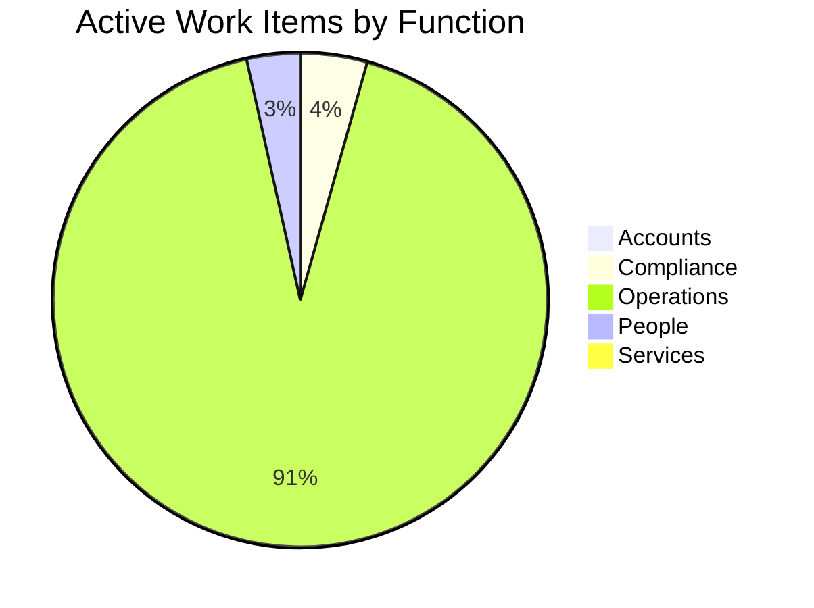
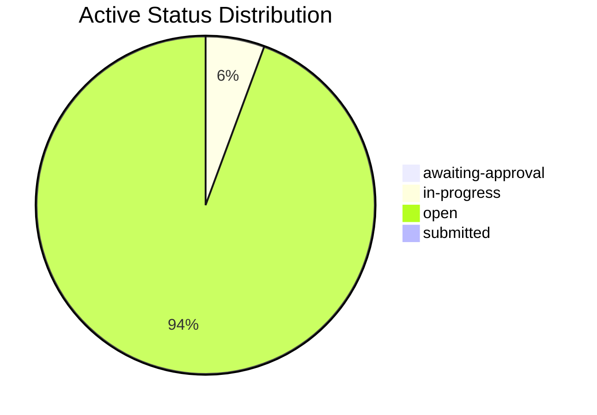
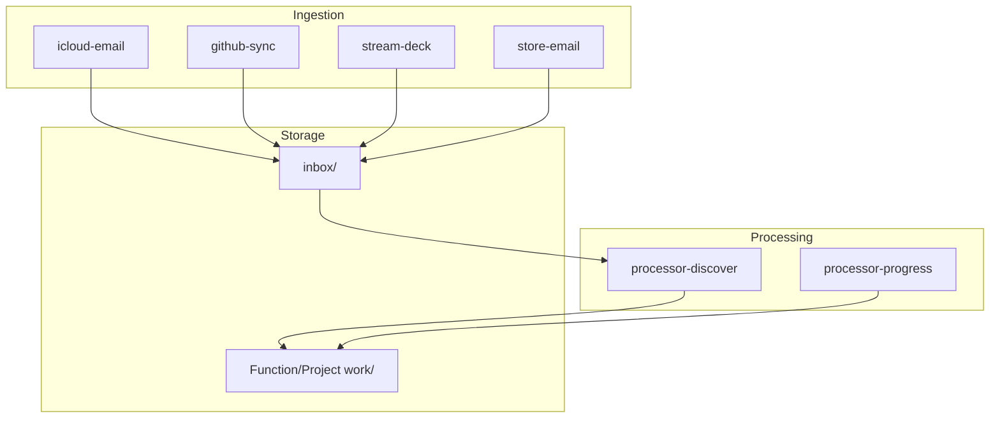

  <a href="README.md" style="display:inline-block; background-color:#f1f3f4; color:#3c4043; padding:6px 14px; text-decoration:none; border-radius:16px; font-weight:500; font-size:14px; margin-right:6px;">📖 RTRM</a>
  <a href="dashboard.md" style="display:inline-block; background-color:#e8f0fe; color:#1967d2; padding:6px 14px; text-decoration:none; border-radius:16px; font-weight:bold; font-size:14px; margin-right:6px;">📊 Dashboard</a>
  <a href="Accounts/dashboard.md" style="display:inline-block; background-color:#f1f3f4; color:#3c4043; padding:6px 14px; text-decoration:none; border-radius:16px; font-weight:500; font-size:14px; margin-right:6px;">📒 Accounts</a>
  <a href="Compliance/dashboard.md" style="display:inline-block; background-color:#f1f3f4; color:#3c4043; padding:6px 14px; text-decoration:none; border-radius:16px; font-weight:500; font-size:14px; margin-right:6px;">⚖️ Compliance</a>
  <a href="Operations/dashboard.md" style="display:inline-block; background-color:#f1f3f4; color:#3c4043; padding:6px 14px; text-decoration:none; border-radius:16px; font-weight:500; font-size:14px; margin-right:6px;">🧑‍💻 Operations</a>
  <a href="People/dashboard.md" style="display:inline-block; background-color:#f1f3f4; color:#3c4043; padding:6px 14px; text-decoration:none; border-radius:16px; font-weight:500; font-size:14px; margin-right:6px;">👥 People</a>
  <a href="Services/dashboard.md" style="display:inline-block; background-color:#f1f3f4; color:#3c4043; padding:6px 14px; text-decoration:none; border-radius:16px; font-weight:500; font-size:14px; ">🔌 Services</a>

  <a href="_pipeline/index.md">Pipeline</a> <a href="_pipeline/reports/tick-1370.md" style="font-size:11px; color:#5f6368;">#1370</a> · <a href="_tools/README.md">Tools</a> · <a href="_knowledge/roadmap.md">Roadmap</a> · <a href="_knowledge/philosophy.md">Philosophy</a> · <a href="_knowledge/research/README.md">Research</a>

  <a href="#unit-dashboards" style="color: #1a73e8; text-decoration: none; margin-right: 8px;">Units</a> · 
  <a href="#last-tick" style="color: #1a73e8; text-decoration: none; margin-right: 8px;">Last Tick</a> · 
  <a href="#service-activity" style="color: #1a73e8; text-decoration: none; margin-right: 8px; margin-left: 8px;">Services</a> · 
  <a href="#health" style="color: #1a73e8; text-decoration: none; margin-right: 8px; margin-left: 8px;">Health</a> · 
  <a href="#attention" style="color: #1a73e8; text-decoration: none; margin-right: 8px; margin-left: 8px;">Attention</a> · 
  <a href="#detail" style="color: #1a73e8; text-decoration: none; margin-right: 8px; margin-left: 8px;">Pipeline & Detail</a> · 
  <a href="#projects" style="color: #1a73e8; text-decoration: none; margin-left: 8px;">Projects</a>

# Dashboard

> Auto-updated by pipeline. Do not edit manually.

## Unit dashboards

One hop from company scope to a unit or nested dashboard. Omitted when no `projects/**/dashboard.md` exists.

| Unit | Dashboard | Kind |
|------|-----------|------|
| [BOTTA Face](projects/botta/README.md) | [botta](projects/botta/dashboard.md) | tick |
| [Chess ♟️](projects/chess/README.md) | [chess](projects/chess/dashboard.md) | manual |
| [Ema Solutions Architect](projects/ema-sa/README.md) | [ema-sa](projects/ema-sa/dashboard.md) | tick |
| [Irontec](projects/irontec/README.md) | [irontec](projects/irontec/dashboard.md) | manual |
| [Irontec › Irontec Marketing](projects/irontec/Marketing/README.md) | [irontec/Marketing](projects/irontec/Marketing/dashboard.md) | nested |
| [Open Contracts](projects/open-contracts/README.md) | [open-contracts](projects/open-contracts/dashboard.md) | manual |
| [Push to Talk](projects/push-to-talk/README.md) | [push-to-talk](projects/push-to-talk/dashboard.md) | manual |
| [store-dash](projects/store-dash/README.md) | [store-dash](projects/store-dash/dashboard.md) | partial |

## Last Tick

**[Tick #1370](_pipeline/reports/tick-1370.md)** · 2026-09-16 10:57 UTC · scheduled · **Diagnostics**: normal · **Historical rescan**: no

### Work Items

- No durable work-item changes in this tick.

### Progression

1 executed · 4 attempted without change · 163 blocked

### Company-Owned Turns

- 🧭 [O.440](Operations/_work/O.440-contract-support-seed-crystallisation.md) — **Contract Support: Seed Crystallisation** · `authorized-awaiting-application`
  - Apply the existing Director decision recorded through [O.452-Review-seed-crystallisation-support-amendment](archive/O.452-Review-seed-crystallisation-support-amendment.md) through the normal approval lifecycle. Do not ask for the same authorization again. Compilation, data repair, supervised trial and resumption remain separately gated.
- 🧭 [O.449](Operations/_work/O.449-AI-Agent-Development-Platforms-consultation.md) — **Set Up Paid Consulting Engagement — AlphaSights**
  - Use the source correspondence to bootstrap the consulting-engagement process. Obtain the client legal entity, billing details, purchase-order or engagement paperwork and service date before preparing the final sales order or invoice. Drafts remain under Mandip's control; do not send or accept external terms automatically.
- 🧭 [O.465](Operations/_work/O.465-research-corpus-residual-repair.md) — **Research Corpus Residual Repair**
  - Continue the company-owned turn.

## Service Activity

| When | Contract | Availability | Imported | Duplicate | Deferred | Failed | Trial |
|---|---|---|---:|---:|---:|---:|---|
| 2026-08-29 13:26 | Voice Note Import Contract | unavailable | 0 | 0 | 0 | 0 | blocked |
| 2026-08-29 12:30 | Voice Note Import Contract | available | 1 | 8 | 3 | 0 | blocked |
| 2026-08-28 21:38 | Voice Note Import Contract | available | 0 | 8 | 1 | 0 | blocked |
| 2026-08-28 21:36 | Voice Note Import Contract | available | 5 | 3 | 0 | 0 | blocked |
| 2026-08-28 21:35 | Voice Note Import Contract | available | 0 | 3 | 5 | 0 | blocked |

## Agency

- **Waiting on you**: 7
- **Company obligations**: 4
- **Raw unsettled records**: 5
- **Latest move at**: 2026-09-07T10:23:40.354071+00:00
- **Latest move**: You responded to Review: Voice Note Import Services Agreement.
- **Latest move evidence**: Yeah, there's got a little recommendation on this as well.
- **Latest move tick**: 1311

### Since Your Last Turn

- **Turn at**: 2026-09-14T14:43:12.860222+00:00
- **Turn tick**: 1334
- **Turn commit**: 296b0346
- **Window**: 36 ticks · 1 d 20 h
- **Evidence**: dashboards + tick reports
- **Your threads**: 7
- **Elsewhere**: 25
- **Beneath**: 1 progressed, 102 created, 2210 inspected without change

| Scope | Tick | Item | Summary |
|---|---:|---|---|
| yours | 1366 | [A 016 Processing Fuel Receipt FOR Business Travel](Accounts/_work/A.016-Processing-fuel-receipt-for-business-travel.md) | The company asked you about this. |
| yours | 1366 | [A 018 ICO Data Protection FEE](Accounts/_work/A.018-ico-data-protection-fee.md) | The company asked you about this. |
| yours | 1366 | [A 017 Incorporation Expense](Accounts/_work/A.017-incorporation-expense.md) | The company asked you about this. |
| yours | 1366 | [A 019 Google Play Subscription MAY](Accounts/_work/A.019-google-play-subscription-may.md) | The company asked you about this. |
| yours | 1366 | [A 005 Privacy Screen Protector](Accounts/_work/A.005-privacy-screen-protector.md) | The company asked you about this. |
| yours | 1366 | [A 014 Google ONE Subscription Receipt](Accounts/_work/A.014-Google-One-Subscription-Receipt.md) | The company asked you about this. |
| yours | 1366 | [A 011 Retail Receipt](Accounts/_work/A.011-Retail-Receipt.md) | The company asked you about this. |
| elsewhere | 1369 | [C 036 LLM Processing OF Personal Data Risk](Compliance/_work/C.036-LLM-processing-of-personal-data-risk.md) | Progressed. |
| elsewhere | 1368 | [Operations](Operations/dashboard.md) | Load 112 → 211 active. |
| elsewhere | 1368 | [WhatsApp digest: Jatin/Mandip/Kash (2026-09-16)](Operations/_work/O.622-WhatsApp-digest-JatinMandipKash-2026-09-16.md) | Created. |
| elsewhere | 1368 | [Book Your Place On The Lunch Attendee Sheet For Mayfair AI, Tech + Related](Operations/_work/O.623-Book-Your-Place-On-The-Lunch-Attendee-Sheet-For-Mayfair-AI-T.md) | Created. |
| elsewhere | 1365 | [Cloudflare AI bot control updates](Operations/_work/O.621-Cloudflare-AI-bot-control-updates.md) | Created. |
| elsewhere | 1358 | [Review generated playbook against pipeline output](Operations/_work/O.620-Review-generated-playbook-against-pipeline-output.md) | Created. |
| elsewhere | 1351 | [Record of RightStore-3 Bootstrap Command](Operations/_work/I.022-Record-of-RightStore-3-Bootstrap-Command.md) | Created. |
| elsewhere | 1349 | [RightStore D2S integration architecture proposal](Operations/_work/O.590-RightStore-D2S-integration-architecture-proposal.md) | Created. |
| elsewhere | 1349 | [WhatsApp digest: Jatin Blocvey (2026-09-15)](Operations/_work/O.591-WhatsApp-digest-Jatin-Blocvey-2026-09-15.md) | Created. |
| elsewhere | 1347 | [People](People/dashboard.md) | Load 6 → 8 active. |
| elsewhere | 1347 | [Paternity Leave Enquiry](People/_work/H.009-Paternity-Leave-Enquiry.md) | Created. |
| elsewhere | 1346 | [Upstream and Downstream Integrations Concept](Operations/_work/I.021-Upstream-and-Downstream-Integrations-Concept.md) | Created. |
| elsewhere | 1344 | [Observation: Reduce call pauses for better flow](Operations/_work/I.020-Observation-Reduce-call-pauses-for-better-flow.md) | Created. |
| elsewhere | 1344 | [Build HR Policy Assistant with Compliance Check](Operations/_work/O.564-Build-HR-Policy-Assistant-with-Compliance-Check.md) | Created. |
| elsewhere | 1344 | [Streamlining Manager Role in HR Processes](People/_work/H.008-Streamlining-Manager-Role-in-HR-Processes.md) | Created. |
| elsewhere | 1343 | [Manager Demo Flow and Audio Observations](Operations/_work/I.019-Manager-Demo-Flow-and-Audio-Observations.md) | Created. |
| elsewhere | 1340 | [Compliance](Compliance/dashboard.md) | Load 9 → 10 active. |
| elsewhere | 1340 | [Kōdo Engineering: Vision Master setup and dongle](Operations/_work/P.018-Kōdo-Engineering-Vision-Master-setup-and-dongle.md) | Created. |
| elsewhere | 1340 | [Request for PSC code for Blocvey Ltd confirmation statement](Compliance/_work/C.038-Request-for-PSC-code-for-Blocvey-Ltd-confirmation-statement.md) | Created. |
| elsewhere | 1340 | [WhatsApp digest: Kōdo Engineering (2026-09-15)](Operations/_work/O.552-WhatsApp-digest-Kōdo-Engineering-2026-09-15.md) | Created. |
| elsewhere | 1338 | [AI employee slide intro should not be silent](Operations/_work/I.016-AI-employee-slide-intro-should-not-be-silent.md) | Created. |
| elsewhere | 1338 | [Observation: Intro duration and sound characteristics](Operations/_work/I.017-Observation-Intro-duration-and-sound-characteristics.md) | Created. |
| elsewhere | 1338 | [Indexed Model vs. LLM: Muse-Glimmer](Operations/_work/I.018-Indexed-Model-vs-LLM-Muse-Glimmer.md) | Created. |
| elsewhere | 1336 | [Stream Deck voice recording observation](Operations/_work/I.015-Stream-Deck-voice-recording-observation.md) | Created. |
| elsewhere | 1335 | [Critical Video Audio Missing](Operations/_work/O.534-Critical-Video-Audio-Missing.md) | Created. |

### Waiting on You (7)

| Since | Question |
|---|---|
| 2026-09-16T08:49:54.483221+00:00 | [A.005-privacy-screen-protector](Accounts/_work/A.005-privacy-screen-protector.md) |
| 2026-09-16T08:49:57.154966+00:00 | [A.011-Retail-Receipt](Accounts/_work/A.011-Retail-Receipt.md) |
| 2026-09-16T08:49:59.549572+00:00 | [A.014-Google-One-Subscription-Receipt](Accounts/_work/A.014-Google-One-Subscription-Receipt.md) |
| 2026-09-16T08:50:02.191093+00:00 | [A.016-Processing-fuel-receipt-for-business-travel](Accounts/_work/A.016-Processing-fuel-receipt-for-business-travel.md) |
| 2026-09-16T08:50:04.272809+00:00 | [A.017-incorporation-expense](Accounts/_work/A.017-incorporation-expense.md) |
| 2026-09-16T08:50:06.928162+00:00 | [A.018-ico-data-protection-fee](Accounts/_work/A.018-ico-data-protection-fee.md) |
| 2026-09-16T08:50:09.598797+00:00 | [A.019-google-play-subscription-may](Accounts/_work/A.019-google-play-subscription-may.md) |

### Company Owes (4)

| Since | Obligation | Records | Company next action |
|---|---|---:|---|
| 2026-09-07T15:01:30.441306+00:00 | [Turn reconciliation — EA.001](_pipeline/turns/2026-09-07-15-00-13-chief-of-staff-call.md) | 1 | Monitor repository commits for evidence of Ema integration to determine if a specific task needs to be opened or appended to existing Ema-related work items. |
| 2026-09-07T10:23:40.354071+00:00 | [Review: Voice Note Import Services Agreement](Operations/_contracts/voice-note-import-contract.REVIEW.md) | 2 | Reconcile Mandip's complete response against the canonical task and improve the work before asking again. |
| 2026-09-07T08:52:56.745898+00:00 | [Review: Model Evaluation Services Agreement](Operations/_contracts/model-selection.REVIEW.md) | 1 | Reconcile Mandip's complete response against the canonical task and improve the work before asking again. |
| 2026-08-26T18:12:56.073931+00:00 | [Turn reconciliation — G.001](_pipeline/turns/replay-2026-08-26-18-55-27.md) | 1 | Attach this instruction to G.001 and present the matched proposal for Director review. |

### Activity Since Latest Move (60 ticks)

| Tick | Compute | Inspected | Created | Progressed | LLM tokens |
|---:|---:|---:|---:|---:|---:|
| [#1311](_pipeline/reports/tick-1311.md) | 6.7s | 0 | 0 | 0 | 0 |
| [#1312](_pipeline/reports/tick-1312.md) | 835.0s | 34 | 8 | 0 | 2420 |
| [#1313](_pipeline/reports/tick-1313.md) | 6.0s | 0 | 0 | 0 | 0 |
| [#1314](_pipeline/reports/tick-1314.md) | 38.8s | 0 | 1 | 0 | 0 |
| [#1315](_pipeline/reports/tick-1315.md) | 278.7s | 35 | 0 | 0 | 0 |
| [#1316](_pipeline/reports/tick-1316.md) | 59.0s | 0 | 1 | 0 | 0 |
| [#1317](_pipeline/reports/tick-1317.md) | 7.0s | 0 | 0 | 0 | 0 |
| [#1318](_pipeline/reports/tick-1318.md) | 370.9s | 37 | 1 | 0 | 0 |
| [#1319](_pipeline/reports/tick-1319.md) | 6.9s | 0 | 0 | 0 | 0 |
| [#1320](_pipeline/reports/tick-1320.md) | 8.2s | 0 | 0 | 0 | 0 |
| [#1321](_pipeline/reports/tick-1321.md) | 260.1s | 38 | 1 | 0 | 0 |
| [#1322](_pipeline/reports/tick-1322.md) | 6.6s | 0 | 0 | 0 | 0 |
| [#1323](_pipeline/reports/tick-1323.md) | 7.4s | 0 | 0 | 0 | 0 |
| [#1324](_pipeline/reports/tick-1324.md) | 7.4s | 0 | 0 | 0 | 0 |
| [#1325](_pipeline/reports/tick-1325.md) | 248.4s | 38 | 0 | 0 | 0 |
| [#1326](_pipeline/reports/tick-1326.md) | 6.5s | 0 | 0 | 0 | 0 |
| [#1327](_pipeline/reports/tick-1327.md) | 6.1s | 0 | 0 | 0 | 0 |
| [#1328](_pipeline/reports/tick-1328.md) | 5.7s | 0 | 0 | 0 | 0 |
| [#1329](_pipeline/reports/tick-1329.md) | 274.6s | 38 | 0 | 0 | 0 |
| [#1330](_pipeline/reports/tick-1330.md) | 268.3s | 0 | 9 | 0 | 522 |
| [#1331](_pipeline/reports/tick-1331.md) | 7.1s | 0 | 0 | 0 | 0 |
| [#1332](_pipeline/reports/tick-1332.md) | 263.0s | 46 | 0 | 0 | 0 |
| [#1333](_pipeline/reports/tick-1333.md) | 393.8s | 0 | 30 | 0 | 5784 |
| [#1334](_pipeline/reports/tick-1334.md) | 533.5s | 80 | 9 | 0 | 525 |
| [#1335](_pipeline/reports/tick-1335.md) | 104.5s | 0 | 1 | 0 | 526 |
| [#1336](_pipeline/reports/tick-1336.md) | 179.2s | 0 | 1 | 0 | 541 |
| [#1337](_pipeline/reports/tick-1337.md) | 333.2s | 83 | 2 | 0 | 0 |
| [#1338](_pipeline/reports/tick-1338.md) | 152.1s | 0 | 3 | 0 | 1680 |
| [#1339](_pipeline/reports/tick-1339.md) | 618.3s | 98 | 15 | 0 | 0 |
| [#1340](_pipeline/reports/tick-1340.md) | 484.9s | 106 | 9 | 0 | 1480 |
| [#1341](_pipeline/reports/tick-1341.md) | 34.3s | 0 | 0 | 0 | 0 |
| [#1342](_pipeline/reports/tick-1342.md) | 27.0s | 0 | 0 | 0 | 0 |
| [#1343](_pipeline/reports/tick-1343.md) | 497.9s | 108 | 3 | 0 | 637 |
| [#1344](_pipeline/reports/tick-1344.md) | 240.3s | 0 | 8 | 0 | 1732 |
| [#1345](_pipeline/reports/tick-1345.md) | 17.3s | 0 | 0 | 0 | 0 |
| [#1346](_pipeline/reports/tick-1346.md) | 603.0s | 120 | 6 | 0 | 516 |
| [#1347](_pipeline/reports/tick-1347.md) | 300.2s | 0 | 12 | 0 | 1591 |
| [#1348](_pipeline/reports/tick-1348.md) | 191.7s | 0 | 7 | 0 | 533 |
| [#1349](_pipeline/reports/tick-1349.md) | 509.5s | 144 | 5 | 0 | 1330 |
| [#1350](_pipeline/reports/tick-1350.md) | 174.5s | 0 | 7 | 0 | 562 |
| [#1351](_pipeline/reports/tick-1351.md) | 663.4s | 160 | 10 | 0 | 544 |
| [#1352](_pipeline/reports/tick-1352.md) | 127.0s | 0 | 3 | 0 | 547 |
| [#1353](_pipeline/reports/tick-1353.md) | 8.0s | 0 | 0 | 0 | 0 |
| [#1354](_pipeline/reports/tick-1354.md) | 395.2s | 168 | 5 | 0 | 0 |
| [#1355](_pipeline/reports/tick-1355.md) | 1025.3s | 0 | 1 | 0 | 0 |
| [#1356](_pipeline/reports/tick-1356.md) | 1123.6s | 169 | 0 | 0 | 0 |
| [#1357](_pipeline/reports/tick-1357.md) | 7.6s | 0 | 0 | 0 | 0 |
| [#1358](_pipeline/reports/tick-1358.md) | 306.2s | 170 | 1 | 0 | 645 |
| [#1359](_pipeline/reports/tick-1359.md) | 7.7s | 0 | 0 | 0 | 0 |
| [#1360](_pipeline/reports/tick-1360.md) | 7.7s | 0 | 0 | 0 | 0 |
| [#1361](_pipeline/reports/tick-1361.md) | 7.7s | 0 | 0 | 0 | 0 |
| [#1362](_pipeline/reports/tick-1362.md) | 405.2s | 170 | 0 | 0 | 0 |
| [#1363](_pipeline/reports/tick-1363.md) | 8.7s | 0 | 0 | 0 | 0 |
| [#1364](_pipeline/reports/tick-1364.md) | 8.4s | 0 | 0 | 0 | 0 |
| [#1365](_pipeline/reports/tick-1365.md) | 1098.4s | 237 | 1 | 0 | 4647 |
| [#1366](_pipeline/reports/tick-1366.md) | 7.9s | 0 | 0 | 0 | 0 |
| [#1367](_pipeline/reports/tick-1367.md) | 6.2s | 0 | 0 | 0 | 0 |
| [#1368](_pipeline/reports/tick-1368.md) | 1363.1s | 239 | 2 | 0 | 1780 |
| [#1369](_pipeline/reports/tick-1369.md) | 554.9s | 238 | 0 | 1 | 1998 |
| [#1370](_pipeline/reports/tick-1370.md) | 39.5s | 0 | 0 | 0 | 0 |

## Health

| Function | Status | Active | Waiting | Done |
|----------|--------|--------|---------|------|
| [Accounts](Accounts/dashboard.md) | 🔄 | 2 | 0 | 13 |
| [Compliance](Compliance/dashboard.md) | ⏸️ | 10 | 1 | 13 |
| [Operations](Operations/dashboard.md) | ⚠️ | 211 | 0 | 454 |
| [People](People/dashboard.md) | ⚠️ | 8 | 0 | 1 |
| [Services](Services/dashboard.md) | 🔄 | 1 | 0 | 11 |
| **Total** | | **232** | **1** | **492** |

### Work Item Distribution

### Status Distribution

## Attention

### Decisions Waiting (36 of 59 need you)

Grouped by what each is waiting on. The first two groups are yours.

**Your choice (1)** — A real decision — alternatives are on the table

| Kind | Subject | Detail | Consequence | Link |
|------|---------|--------|-------------|------|
| Review point | voice-note-import-contract RP-3 | minor — New evidence reopens the cost basis on which RP-1 wa | blocks approval only | [View](Operations/_contracts/voice-note-import-contract.REVIEW.md) |

**Your review (35)** — One proposed action each — confirm or send back

| Kind | Subject | Detail | Consequence | Link |
|------|---------|--------|-------------|------|
| Contract proposal | Sales Workflow Formalization | Awaiting approval | blocks approval only | [View](Operations/_work/approvals/contract-proposal-sales-workflow-formalization.md) |
| Contract proposal | SDLC Process Review Services Agreement | Awaiting approval | blocks approval only | [View](Operations/_work/approvals/contract-proposal-sdlc-process-review-services-agreement.md) |
| Contract proposal | Support Amendment — Seed Crystallisation | Awaiting approval | blocks approval only | [View](Operations/_work/approvals/contract-proposal-seed_crystallisation-support-amendment.md) |
| Review point | calendar-import RP-1 | blocking — OAuth scopes | blocks approval only | [View](projects/ema-sa/_contracts/calendar-import.REVIEW.md) |
| Review point | disk-graph RP-1 | blocking — Root is the company disk, not the kernel disk | blocks approval only | [View](Operations/_contracts/disk-graph.REVIEW.md) |
| Review point | disk-graph RP-2 | blocking — Schedule | blocks approval only | [View](Operations/_contracts/disk-graph.REVIEW.md) |
| Review point | disk-graph RP-3 | blocking — Semantics without a model | blocks approval only | [View](Operations/_contracts/disk-graph.REVIEW.md) |
| Review point | disk-graph RP-4 | blocking — Recents is the useful Finder pattern | blocks approval only | [View](Operations/_contracts/disk-graph.REVIEW.md) |
| Review point | granola-sync RP-2 | blocking — Granola subscription / trial | blocks approval only | [View](projects/ema-sa/_contracts/granola-sync.REVIEW.md) |
| Review point | pipeline RP-2 | blocking — The company turn has no completion criterion — Give the company turn a terminal condition in three parts. | blocks approval only | [View](Operations/_contracts/pipeline.REVIEW.md) |
| Review point | pipeline RP-3 | blocking — Support wrappers are created without an idempotency  — Before creating a support wrapper, reject creation where an unsettled | blocks approval only | [View](Operations/_contracts/pipeline.REVIEW.md) |
| Review point | pipeline RP-5 | blocking — Contract proposals bypass the canonical attention st — Make one committed proposal at a time enter the canonical attention | blocks approval only | [View](Operations/_contracts/pipeline.REVIEW.md) |
| Review point | pipeline RP-6 | blocking — Review points bypass the canonical attention stream — Generalise the presentation path RP-5 opens rather than adding a second | blocks approval only | [View](Operations/_contracts/pipeline.REVIEW.md) |
| Review point | pipeline RP-7 | blocking — Every open review point halts its contract, because  — Add a materiality field to the review point format — blocking, material, | blocks approval only | [View](Operations/_contracts/pipeline.REVIEW.md) |
| Review point | slack-import RP-1 | blocking — Implementation not started — Re-render `slack-pipeline.py` flat landing; shadow compare channel-day c | blocks approval only | [View](projects/ema-sa/_contracts/slack-import.REVIEW.md) |
| Review point | slack-import RP-2 | blocking — Mandip Slack user ID — Record in integration README after first successful `users.lookupByEmail | blocks approval only | [View](projects/ema-sa/_contracts/slack-import.REVIEW.md) |
| Review point | learn-the-user RP-1 | material — Catch-up writes Schedule A onto older personal notes — recommendation deferred (π) | blocks approval only | [View](Operations/_contracts/learn-the-user.REVIEW.md) |
| Review point | model-selection RP-2 | material — The resolution floor is specified but the deliverabl — require the report to group candidates that are indistinguishable within | blocks approval only | [View](Operations/_contracts/model-selection.REVIEW.md) |
| Review point | pipeline RP-4 | material — Human response reconciliation waits for the schedule — Separate the input budget from the simulation budget, as an | blocks approval only | [View](Operations/_contracts/pipeline.REVIEW.md) |
| Review point | seed-crystallisation RP-10 | material — Distilled conversation seeds vs bulk LLM harvest — Keep bulk harvest sources out of crystallisation. Land operator-distille | blocks approval only | [View](Operations/_contracts/seed-crystallisation.REVIEW.md) |
| Review point | seed-crystallisation RP-11 | material — Shortcuts as propagation, not autonomous projects — Amend section 5 so a mature cluster that is an *activity* (not only a th | blocks approval only | [View](Operations/_contracts/seed-crystallisation.REVIEW.md) |
| Review point | seed-crystallisation RP-8 | material — Index seed counts do not match the themes — count seed rows structurally (rows inside the Seeds table only), and | blocks approval only | [View](Operations/_contracts/seed-crystallisation.REVIEW.md) |
| Review point | botta RP-1 | minor — No one at BOTTA has been named — When Mandip names the contact, add `People/_network/` and an outbound co | blocks approval only | [View](projects/botta/_contracts/botta.REVIEW.md) |
| Review point | deal-artifact RP-2 | minor — deal-page playbook index — Amend [deal-page](deal-page.README.md) Schedule A when implementation | blocks approval only | [View](projects/ema-sa/_contracts/deal-artifact.REVIEW.md) |
| Review point | deal-artifact RP-3 | minor — Template bootstrap — One-time copy from ema-mcp templates on implementation; commit into 5et. | blocks approval only | [View](projects/ema-sa/_contracts/deal-artifact.REVIEW.md) |
| Review point | deal-artifact RP-4 | minor — Gold artifact promotion — Human promotes selected files into `artifacts/` once; pipeline versions | blocks approval only | [View](projects/ema-sa/_contracts/deal-artifact.REVIEW.md) |
| Review point | deal-page RP-1 | minor — Unit dashboard Deals columns — After [revenue-playbook](revenue-playbook.README.md) writes a snapshot,  | blocks approval only | [View](projects/ema-sa/_contracts/deal-page.REVIEW.md) |
| Review point | email-import RP-4 | minor — `gmail.imap` capability not yet registered — Register at compile time. Does not block supervised trial. | blocks approval only | [View](projects/ema-sa/_contracts/email-import.REVIEW.md) |
| Review point | email-import RP-5 | minor — Shadow compare against ema-mcp gold — After first live supervised trial with imports. | blocks approval only | [View](projects/ema-sa/_contracts/email-import.REVIEW.md) |
| Review point | fathom-import RP-4 | minor — Partner routing and AI classification omitted — None required for approval. Progression or taxonomy, if needed, is a lat | blocks approval only | [View](projects/ema-sa/_contracts/fathom-import.REVIEW.md) |
| Review point | fathom-import RP-6 | minor — `fathom.api` capability not yet registered — Register `fathom.api` adapter during compile (Engineer task). Does not b | blocks approval only | [View](projects/ema-sa/_contracts/fathom-import.REVIEW.md) |
| Review point | granola-import RP-4 | minor — `granola.mcp` capability not yet registered — Register during compile. Does not block drafting or supervised trial. | blocks approval only | [View](projects/ema-sa/_contracts/granola-import.REVIEW.md) |
| Review point | granola-import RP-5 | minor — Shadow compare against ema-mcp gold — Run after first live supervised trial with notes content. | blocks approval only | [View](projects/ema-sa/_contracts/granola-import.REVIEW.md) |
| Review point | granola-sync RP-1 | minor — `granola.mcp` capability registration | blocks approval only | [View](projects/ema-sa/_contracts/granola-sync.REVIEW.md) |
| Review point | llm-interaction-import RP-1 | minor — Catch-up volume vs max_per_run — Keep 50 for trial. Raise after the first debug_tick if the remaining cou | blocks approval only | [View](Operations/_contracts/llm-interaction-import.REVIEW.md) |

**Waiting on a build (15)** — Decided already; no decision needed

| Kind | Subject | Detail | Consequence | Link |
|------|---------|--------|-------------|------|
| Contract proposal | Agent-Human Interaction Services Agreement | Blocked — missing prerequisites — `pipeline.README.md` | blocks approval only | [View](Operations/_work/approvals/contract-proposal-agent-human-interaction-services-agreement.md) |
| Contract proposal | Clipboard Import Services Agreement | Blocked — missing prerequisites — `../Compliance/_contracts/ai-observability.README.md`, `../ema-sa/_contracts/granola-ui-transcripts-import.README.md`, `../Operations/_contracts/execution.README.md` | blocks approval only | [View](Operations/_work/approvals/contract-proposal-clipboard-import-services-agreement.md) |
| Contract proposal | Communication Archival Services Agreement | Blocked — missing prerequisites — `../Compliance/privacy.README.md`, `../Compliance/confidentiality.README.md` | blocks approval only | [View](Operations/_work/approvals/contract-proposal-communication-archival-services-agreement.md) |
| Contract proposal | Event Attendance Services Agreement | Blocked — missing prerequisites — `../Accounts/expenses.README.md`, `../Operations/partnerships.README.md` | blocks approval only | [View](Operations/_work/approvals/contract-proposal-event-attendance-services-agreement.md) |
| Contract proposal | Hardware and Software Procurement Services Agreement | Blocked — missing prerequisites — `../HR/README.md`, `../Operations/_data/assets.md` | blocks approval only | [View](Operations/_work/approvals/contract-proposal-hardware-and-software-procurement-services-agreement.md) |
| Contract proposal | LLM Harvesting and Corpus Evaluation Services Agreem | Blocked — missing prerequisites — `pipeline.README.md`, `../Compliance/README.md`, `../Inbox/README.md` | blocks approval only | [View](Operations/_work/approvals/contract-proposal-llm-harvesting-and-corpus-evaluation-services-agreement.md) |
| Contract proposal | Networking and Industry Engagement Services Agreemen | Blocked — missing prerequisites — `../Partnerships/README.md`, `../Procurement/README.md`, `../Knowledge/README.md` | blocks approval only | [View](Operations/_work/approvals/contract-proposal-networking-and-industry-engagement-services-agreement.md) |
| Contract proposal | Partnership Engagement Services Agreement | Blocked — missing prerequisites — `pipeline.README.md`, `../Operations/_contracts/governance.README.md` | blocks approval only | [View](Operations/_work/approvals/contract-proposal-partnership-engagement-services-agreement.md) |
| Contract proposal | Partnership Integration Services Agreement | Blocked — missing prerequisites — `pipeline.README.md`, `../Legal/README.md`, `../Accounts/README.md` | blocks approval only | [View](Operations/_work/approvals/contract-proposal-partnership-integration-services-agreement.md) |
| Contract proposal | Project Documentation and Reporting Services Agreeme | Blocked — missing prerequisites — `../Accounts/README.md`, `../Operations/_contracts/director-resolution.README.md` | blocks approval only | [View](Operations/_work/approvals/contract-proposal-project-documentation-and-reporting-services-agreement.md) |
| Contract proposal | Project Status Update Services Agreement | Blocked — missing prerequisites — `../Governance/project-governance.README.md` | blocks approval only | [View](Operations/_work/approvals/contract-proposal-project-status-update-services-agreement.md) |
| Contract proposal | Purchase Order Processing Services Agreement | Blocked — missing prerequisites — `pipeline.README.md`, `../Services/README.md`, `../Accounts/tax-compliance.README.md`, `../Accounts/README.md` | blocks approval only | [View](Operations/_work/approvals/contract-proposal-purchase-order-processing-services-agreement.md) |
| Contract proposal | Searchland Partnership Services Agreement | Blocked — missing prerequisites — `pipeline.README.md`, `../store-dash/_work/SD.326-Searchland-API-Trial-and-Partnership-Coordination.md` | blocks approval only | [View](Operations/_work/approvals/contract-proposal-searchland-partnership-services-agreement.md) |
| Contract proposal | WhatsApp Digest Processing Services Agreement | Blocked — missing prerequisites — `../People/_data/people.md` | blocks approval only | [View](Operations/_work/approvals/contract-proposal-whatsapp-digest-processing-services-agreement.md) |
| Review point | seed-crystallisation RP-4 | blocking — Implement inductive analysis as contracted | ⛔ halting seed-crystallisation | [View](Operations/_contracts/seed-crystallisation.REVIEW.md) |

**Waiting on a run (8)** — Remedied already; needs evidence, not a decision

| Kind | Subject | Detail | Consequence | Link |
|------|---------|--------|-------------|------|
| Review point | seed-crystallisation RP-1 | blocking — Require a no-op for unchanged inputs | ⛔ halting seed-crystallisation | [View](Operations/_contracts/seed-crystallisation.REVIEW.md) |
| Review point | seed-crystallisation RP-2 | blocking — Validate source provenance before mutation | ⛔ halting seed-crystallisation | [View](Operations/_contracts/seed-crystallisation.REVIEW.md) |
| Review point | seed-crystallisation RP-3 | blocking — Exclude generated outputs from research inputs | ⛔ halting seed-crystallisation | [View](Operations/_contracts/seed-crystallisation.REVIEW.md) |
| Review point | seed-crystallisation RP-5 | blocking — Bound autonomous mutation | ⛔ halting seed-crystallisation | [View](Operations/_contracts/seed-crystallisation.REVIEW.md) |
| Review point | seed-crystallisation RP-6 | blocking — Replace retry-on-breach with containment | ⛔ halting seed-crystallisation | [View](Operations/_contracts/seed-crystallisation.REVIEW.md) |
| Review point | seed-crystallisation RP-9 | blocking — Theme files grow without bound | ⛔ halting seed-crystallisation | [View](Operations/_contracts/seed-crystallisation.REVIEW.md) |
| Review point | pipeline RP-8 | blocking — A contract could report success while delivering not | blocks approval only | [View](Operations/_contracts/pipeline.REVIEW.md) |
| Review point | seed-crystallisation RP-7 | material — Define supervised trial and promotion evidence | blocks approval only | [View](Operations/_contracts/seed-crystallisation.REVIEW.md) |

### Stale Work Items

| Function | Item | Reason | Link |
|----------|------|--------|------|
| Accounts | The Fox & Hounds, Whittlebury — Business | Open 112 days | [A.011](Accounts/_work/A.011-Retail-Receipt.md) |
| Accounts | Record purchase order AOL223460870 | Open 22 days | [A.026](Accounts/_work/A.026-Record-purchase-order-AOL223460870.md) |
| Compliance | Register for Corporation Tax | Open 124 days | [C.004.1](Compliance/_work/C.004.1-Register-for-corporation-tax.md) |
| Compliance | Assess VAT registration requirement | Open 124 days | [C.004.2](Compliance/_work/C.004.2-Assess-VAT-registration.md) |
| Compliance | virtual-office-service-address.md | Open 116 days | [C.015](Compliance/_work/C.015-virtual-office-service-addressmd.md) |
| Compliance | ICO Data Protection Fee Direct Debit Con | Open 84 days | [C.017](Compliance/_work/C.017-ICO-Data-Protection-Fee-Direct-Debit-Confirmation.md) |
| Compliance | BYOD Policy Review and Compliance | Open 82 days | [C.021](Compliance/_work/C.021-BYOD-Policy-Review-and-Compliance.md) |
| Compliance | Health and Safety compliance process imp | Open 79 days | [C.028](Compliance/_work/C.028-Health-and-Safety-compliance-process-implementation.md) |
| Compliance | EU AI Act Article 52 Compliance | Open 79 days | [C.029](Compliance/_work/C.029-EU-AI-Act-Article-52-Compliance.md) |
| Compliance | Compliance: Employment Rights Act s.1 co | Open 79 days | [C.034](Compliance/_work/C.034-Compliance-Employment-Rights-Act-s1-contract.md) |
| Compliance | LLM processing of personal data — risk | Open 21 days | [C.036](Compliance/_work/C.036-LLM-processing-of-personal-data-risk.md) |
| Compliance | Anonymous User Experience and Contract F | Awaiting input | [C.037](Compliance/_work/C.037-Anonymous-User-Experience-and-Contract-Framework.md) |
| Operations | WhatsApp digest: Jatin/Mandip/Kash (2026 | Open 34 days | [I.004](Operations/_work/I.004-WhatsApp-digest-JatinMandipKash-2026-08-12.md) |
| Operations | InstantID tool exploration | Open 33 days | [I.005](Operations/_work/I.005-InstantID-tool-exploration.md) |
| Operations | WhatsApp digest: Jatin/Mandip/Kash (2026 | Open 22 days | [I.006](Operations/_work/I.006-WhatsApp-digest-JatinMandipKash-2026-08-25.md) |
| Operations | StoreDash WhatsApp digest (2026-08-26) | Open 21 days | [I.007](Operations/_work/I.007-StoreDash-WhatsApp-digest-2026-08-26.md) |
| Operations | WhatsApp digest: Jatin/Mandip/Kash (2026 | Open 21 days | [I.008](Operations/_work/I.008-WhatsApp-digest-JatinMandipKash-2026-08-26.md) |
| Operations | Networking event invitation: AI & FinTec | Open 18 days | [I.009](Operations/_work/I.009-Networking-event-invitation-AI-FinTech-drinks.md) |
| Operations | Apple Developer Program Enrollment | Open 72 days | [O.008](Operations/_work/O.008-Apple-Developer-Program-Enrollment.md) |
| Operations | Migrate Winston app to Ema Next | Open 68 days | [O.009](Operations/_work/O.009-Migrate-Winston-app-to-Ema-Next.md) |
| Operations | Review of new SDLC process flow | Open 26 days | [O.403](Operations/_work/O.403-Review-of-new-SDLC-process-flow.md) |
| Operations | Attention Event Experiment | Open 23 days | [O.424](Operations/_work/O.424-attention-event-experiment.md) |
| Operations | Stream Deck Attention Mode | Open 23 days | [O.430](Operations/_work/O.430-stream-deck-attention-mode.md) |
| Operations | Build Conversational Initiative Path | Open 23 days | [O.437](Operations/_work/O.437-build-conversational-initiative-path.md) |
| Operations | Build Contract Support Loop | Open 23 days | [O.439](Operations/_work/O.439-build-contract-support-loop.md) |
| Operations | Contract Support: Seed Crystallisation | Open 23 days | [O.440](Operations/_work/O.440-contract-support-seed-crystallisation.md) |
| Operations | Complete Contract-Support Loop | Open 22 days | [O.445](Operations/_work/O.445-complete-contract-support-loop.md) |
| Operations | Refine Cloud Connect Direction | Open 23 days | [O.447](Operations/_work/O.447-refine-cloud-connect-direction.md) |
| Operations | Set Up Paid Consulting Engagement — Alph | Open 22 days | [O.449](Operations/_work/O.449-AI-Agent-Development-Platforms-consultation.md) |
| Operations | Bootstrap Impact Cascade | Open 22 days | [O.456](Operations/_work/O.456-bootstrap-impact-cascade.md) |
| Operations | Supply chain constraints on hardware pro | Open 22 days | [O.458](Operations/_work/O.458-Supply-chain-constraints-on-hardware-procurement.md) |
| Operations | Pipeline commits only its own work | Open 22 days | [O.459](Operations/_work/O.459-pipeline-commit-scope.md) |
| Operations | Ingest filter discarded an order confirm | Open 22 days | [O.460](Operations/_work/O.460-ingest-filter-discarded-order-confirmation.md) |
| Operations | Who reviews contracts | Open 22 days | [O.461](Operations/_work/O.461-contract-review-capacity.md) |
| Operations | Wire Cortex local inference path | Open 21 days | [O.462](Operations/_work/O.462-Wire-Cortex-local-inference-path.md) |
| Operations | Inference tier field and tier-grouped ex | Open 21 days | [O.463](Operations/_work/O.463-Inference-tier-field-and-tier-grouped-execution.md) |
| Operations | Confidential computing index | Open 21 days | [O.464](Operations/_work/O.464-Confidential-computing-index.md) |
| Operations | Research Corpus Residual Repair | Open 21 days | [O.465](Operations/_work/O.465-research-corpus-residual-repair.md) |
| Operations | Make dashboard.md the sole frame input | Open 21 days | [O.466](Operations/_work/O.466-make-dashboard-the-sole-frame-input.md) |
| Operations | Record durable human moves from agent se | Open 21 days | [O.467](Operations/_work/O.467-record-durable-human-moves-from-agent-sessions.md) |
| Operations | Register for St. James AI, Tech + Relate | Open 19 days | [O.468](Operations/_work/O.468-Register-for-St-James-AI-Tech-Related-event.md) |
| Operations | Automated Contract Review Phase | Open 15 days | [O.471](Operations/_work/O.471-Automated-contract-review-phase.md) |
| Operations | Harden attention reconciliation and pipe | Open 15 days | [O.472](Operations/_work/O.472-harden-attention-reconciliation-and-pipeline-throughput.md) |
| Operations | Integration of courier services into SPI | Open 50 days | [P.003](Operations/_work/P.003-Integration-of-courier-services-into-SPINE.md) |
| Operations | RightStore Nimbus Proposal V2 Review | Open 47 days | [P.004](Operations/_work/P.004-RightStore-Nimbus-Proposal-V2-Review.md) |
| Operations | RightStore by Nimbus deck development | Open 47 days | [P.005](Operations/_work/P.005-RightStore-by-Nimbus-deck-development.md) |
| Operations | IBIS system overview for Christie & Co | Open 43 days | [P.006](Operations/_work/P.006-IBIS-system-overview-for-Christie-Co.md) |
| Operations | Project prioritization and competitor re | Open 43 days | [P.007](Operations/_work/P.007-Project-prioritization-and-competitor-research.md) |
| Operations | StoreDash client and investment coordina | Open 27 days | [P.008](Operations/_work/P.008-StoreDash-client-and-investment-coordination.md) |
| Operations | StoreDash project documentation and repo | Open 21 days | [P.009](Operations/_work/P.009-StoreDash-project-documentation-and-report-updates.md) |
| Operations | SPINE development and hardware procureme | Open 21 days | [P.010](Operations/_work/P.010-SPINE-development-and-hardware-procurement.md) |
| Operations | London Crypto Networking Event Attendanc | Open 15 days | [P.011](Operations/_work/P.011-London-Crypto-Networking-Event-Attendance.md) |
| People | H.002 — Tech Toast Attendee Outreach | Open 71 days | [H.002](People/_work/H.002-tech-toast-attendee-outreach.md) |
| People | Review compensation and workload distrib | Open 68 days | [H.003](People/_work/H.003-Review-compensation-and-workload-distribution.md) |
| People | People Development and Learning Framewor | Open 64 days | [H.004](People/_work/H.004-People-Development-and-Learning-Framework.md) |
| People | Onboarding and Integration of James Lowm | Open 63 days | [H.005](People/_work/H.005-Onboarding-and-Integration-of-James-Lowman-CEO.md) |
| People | CEO recruitment update: James Lowman wit | Open 48 days | [H.006](People/_work/H.006-CEO-recruitment-update-James-Lowman-withdrawal.md) |
| People | Potential CEO candidate: Ilann Hepworth | Open 48 days | [H.007](People/_work/H.007-Potential-CEO-candidate-Ilann-Hepworth.md) |
| Services | Nimbus platform access and subscription  | Open 79 days | [S.018](Services/_work/S.018-Nimbus-platform-access-and-subscription-management.md) |

## Detail

### Pipeline

**Total Ticks**: 1370

| Source | Enabled | Status | Last Run | Detail |
|--------|---------|--------|----------|--------|
| icloud-email | 🟢 Yes | ✅ ok | 2026-09-16 11:57 | 0 new, 0 synced |
| github-sync | 🟢 Yes | ✅ ok | 2026-09-16 11:32 | 0 synced |
| stream-deck | 🟢 Yes | ✅ ok | 2026-09-16 11:32 | 0 copied, 0 noise, 0 hal |
| processor-discover | 🟢 Yes | ✅ ok | — | 2 processed, 0 created |
| processor-progress | 🟢 Yes | ✅ ok | — | 1 progressed |
| whatsapp | 🟢 Yes | ✅ ok | 2026-09-16 11:32 | 0 processed, 0 failed |
| companies-house | ⚪ No | — | — | — |
| hostinger | ⚪ No | — | — | — |
| store-email | 🟢 Yes | — | — | — |
| llm-interaction-import | ⚪ No | ❌ error | 2026-09-14 14:56 | 50 seeds (7616 new / 7789 scanned) |

### Recent Pipeline Runs

| Run | Duration | icloud-email | github-sync | processor-discover | processor-progress | Cost | Carbon |
|-----|----------|--------------|-------------|--------------------|--------------------|------|--------|
| [2026-09-16 11:57](_pipeline/logs/2026-09-16_11-57-26.md) | 40s | [✓](_pipeline/logs/2026-09-16_11-57-26.md#icloud-email) 0 new, 0 synced | — | [✓](_pipeline/logs/2026-09-16_11-57-26.md#processor-discover) 2 processed, 0 created | — | $0.0000 | ~0.016g |
| [2026-09-16 11:32](_pipeline/logs/2026-09-16_11-32-32.md) | 555s | [✓](_pipeline/logs/2026-09-16_11-32-32.md#icloud-email) 0 new, 0 synced | [✓](_pipeline/logs/2026-09-16_11-32-32.md#github-sync) 0 synced | [✓](_pipeline/logs/2026-09-16_11-32-32.md#processor-discover) 3 processed, 0 created | [✓](_pipeline/logs/2026-09-16_11-32-32.md#processor-progress) 1 progressed | $0.0002 | ~0.897g |
| [2026-09-16 10:36](_pipeline/logs/2026-09-16_10-36-39.md) | 1363s | [✓](_pipeline/logs/2026-09-16_10-36-39.md#icloud-email) 0 new, 0 synced | [✓](_pipeline/logs/2026-09-16_10-36-39.md#github-sync) 0 synced | [✓](_pipeline/logs/2026-09-16_10-36-39.md#processor-discover) 14 processed, 2 created | [✓](_pipeline/logs/2026-09-16_10-36-39.md#processor-progress) 0 progressed | $0.0002 | ~1.070g |
| [2026-09-16 10:20](_pipeline/logs/2026-09-16_10-20-56.md) | 6s | [✓](_pipeline/logs/2026-09-16_10-20-56.md#icloud-email) 0 new, 0 synced | — | — | — | $0.0000 | ~0.003g |
| [2026-09-16 10:05](_pipeline/logs/2026-09-16_10-05-09.md) | 8s | [✓](_pipeline/logs/2026-09-16_10-05-09.md#icloud-email) 1 new, 1 synced | — | — | — | $0.0000 | ~0.003g |

### Source Topology

### Contracts

| Contract | Function | Cadence | Last Run | Compiled |
|----------|----------|---------|----------|----------|
| [Clipboard Import](Operations/_contracts/clipboard-import.README.md) | Operations | per-tick | — | ⚪ No |
| [Code Documentation](Operations/_contracts/code-documentation.README.md) | Operations | weekly | — | ⚪ No |
| [Consulting Engagement Administration](Operations/_contracts/consulting-engagement-administration.README.md) | Operations | on-demand | — | ⚪ No |
| [Conversational Initiative](Operations/_contracts/conversational-initiative.README.md) | Operations | on-demand | — | ⚪ No |
| [Creative Asset Production](Operations/_contracts/creative-asset-production.README.md) | Operations | on-demand | — | ⚪ No |
| [Github Issue Sync](Operations/_contracts/github-issue-sync.README.md) | Operations | per-tick | — | ⚪ No |
| [Icloud Email Import](Operations/_contracts/icloud-email-import.README.md) | Operations | per-tick | — | ⚪ No |
| [Impact Cascade](Operations/_contracts/impact-cascade.README.md) | Operations | per-tick | 2026-08-25 11:40 | ⚪ No |
| [Information Triage](Operations/_contracts/information-triage.README.md) | Operations | per-tick | 2026-09-16 11:36 | 🟢 Yes |
| [Learn The User](Operations/_contracts/learn-the-user.README.md) | Operations | per-tick | — | ⚪ No |
| [Seed Crystallisation](Operations/_contracts/seed-crystallisation.README.md) | Operations | per-tick | 2026-08-24 15:27 | 🟢 Yes |
| [Stack Improvement](Operations/_contracts/stack-improvement.README.md) | Operations | weekly | — | ⚪ No |
| [Voice Note Import Contract](Operations/_contracts/voice-note-import-contract.README.md) | Operations | per-tick | 2026-08-29 13:23 | 🟢 Yes |
| [Whatsapp Import](Operations/_contracts/whatsapp-import.README.md) | Operations | per-tick | — | ⚪ No |

### Projects

| Project | Status | Active | Waiting | Done |
|---------|--------|--------|---------|------|
| [5et.aiguy.cloud](projects/5et.aiguy.cloud/README.md) | ✅ | 0 | 0 | 0 |
| [5et.uk](projects/5et.uk/README.md) | ✅ | 0 | 0 | 0 |
| [_old](projects/_old/README.md) | ✅ | 0 | 0 | 0 |
| [ai-course](projects/ai-course/README.md) | ✅ | 0 | 0 | 0 |
| [bekame-collab](projects/bekame-collab/README.md) | ✅ | 0 | 0 | 0 |
| [blockvey](projects/blockvey/README.md) | ✅ | 0 | 0 | 0 |
| [botta](projects/botta/README.md) | ✅ | 0 | 0 | 0 |
| [car-personality](projects/car-personality/README.md) | ✅ | 0 | 0 | 0 |
| [chess](projects/chess/README.md) | ⚠️ | 4 | 0 | 0 |
| [cv-builder](projects/cv-builder/README.md) | ✅ | 0 | 0 | 0 |
| [ema-sa](projects/ema-sa/README.md) | ✅ | 0 | 0 | 0 |
| [game](projects/game/README.md) | 🔄 | 2 | 0 | 0 |
| [golf](projects/golf/README.md) | ✅ | 0 | 0 | 0 |
| [home-information-pack](projects/home-information-pack/README.md) | ✅ | 0 | 0 | 0 |
| [hyperscaler](projects/hyperscaler/README.md) | ✅ | 0 | 0 | 0 |
| [irontec](projects/irontec/README.md) | ✅ | 0 | 0 | 0 |
| [legal-system-research](projects/legal-system-research/README.md) | ✅ | 0 | 0 | 0 |
| [mylang](projects/mylang/README.md) | 🔄 | 1 | 0 | 0 |
| [myos](projects/myos/README.md) | ✅ | 0 | 0 | 0 |
| [nature-app](projects/nature-app/README.md) | ✅ | 0 | 0 | 0 |
| [open-contracts](projects/open-contracts/README.md) | ⚠️ | 5 | 0 | 0 |
| [push-to-talk](projects/push-to-talk/README.md) | ✅ | 0 | 0 | 0 |
| [right-store](projects/right-store/README.md) | ✅ | 0 | 0 | 0 |
| [sole-trader-saas](projects/sole-trader-saas/README.md) | ✅ | 0 | 0 | 0 |
| [store-dash](projects/store-dash/README.md) | ⏸️ | 34 | 4 | 184 |

### Knowledge

| Metric | Value |
|--------|-------|
| Notes | 1583 |
| Themes | 23 |
| Coverage | 10.9% |

📊 [Full Knowledge Report](_knowledge/research/report.md)

### Gate Tracks (3)

| Case | Phase | Item | # | Gate |
|---|---|---|---:|---|
| seed_crystallisation | authorized-awaiting-application | [O.440](Operations/_work/O.440-contract-support-seed-crystallisation.md) | 1 | Verify recovery through the governed supervised trial before proposing resumption. |
| pipeline — commit scope | verify | [O.459](Operations/_work/O.459-pipeline-commit-scope.md) | 1 | Observe three real ticks before narrowing the prefix list |
| pipeline — commit scope | verify | [O.459](Operations/_work/O.459-pipeline-commit-scope.md) | 2 | Audit Phases 1–5 writers for explicit staging; record which rely on prefix staging |
| pipeline — commit scope | verify | [O.459](Operations/_work/O.459-pipeline-commit-scope.md) | 3 | Verify across three real ticks before removing any prefix |
| pipeline — commit scope | verify | [O.459](Operations/_work/O.459-pipeline-commit-scope.md) | 4 | Open IE.002 once verified, and resolve RP-1 |
| pipeline — ingest materiality | verify | [O.460](Operations/_work/O.460-ingest-filter-discarded-order-confirmation.md) | 1 | Review `_pipeline/skipped.jsonl` after three business days for wrongly skipped material mail |
| pipeline — ingest materiality | verify | [O.460](Operations/_work/O.460-ingest-filter-discarded-order-confirmation.md) | 2 | Audit the store-dash mailbox filter for the same inverted `noreply@` rule |
| pipeline — ingest materiality | verify | [O.460](Operations/_work/O.460-ingest-filter-discarded-order-confirmation.md) | 3 | Backfill check — search the mailbox for transactional mail dropped before this fix |
| pipeline — ingest materiality | verify | [O.460](Operations/_work/O.460-ingest-filter-discarded-order-confirmation.md) | 4 | Consider the same materiality test for the WhatsApp and drop-folder paths |

### Agency Log (8)

| At | Who | Event |
|---|---|---|
| 2026-09-16 08:50 | company | Cue published · A.019 |
| 2026-09-16 08:50 | company | Cue published · A.018 |
| 2026-09-16 08:50 | company | Cue published · A.017 |
| 2026-09-16 08:50 | company | Cue published · A.016 |
| 2026-09-16 08:49 | company | Cue published · A.014 |
| 2026-09-16 08:49 | company | Cue published · A.011 |
| 2026-09-16 08:49 | company | Cue published · A.005 |
| 2026-09-16 08:42 | company | Question prepared · A.019 |
