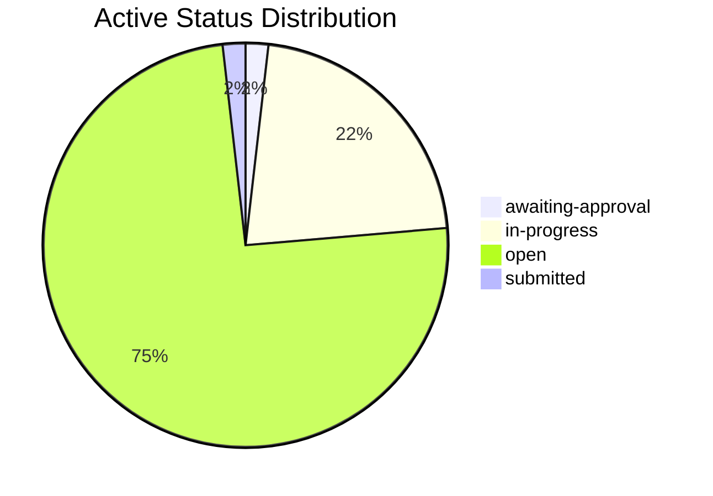
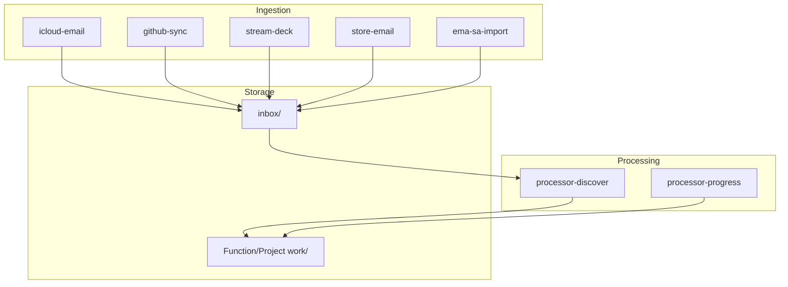

  <a href="README.md" style="display:inline-block; background-color:#f1f3f4; color:#3c4043; padding:6px 14px; text-decoration:none; border-radius:16px; font-weight:500; font-size:14px; margin-right:6px;">📖 RTRM</a>
  <a href="dashboard.md" style="display:inline-block; background-color:#e8f0fe; color:#1967d2; padding:6px 14px; text-decoration:none; border-radius:16px; font-weight:bold; font-size:14px; margin-right:6px;">📊 Dashboard</a>
  <a href="Accounts/dashboard.md" style="display:inline-block; background-color:#f1f3f4; color:#3c4043; padding:6px 14px; text-decoration:none; border-radius:16px; font-weight:500; font-size:14px; margin-right:6px;">📒 Accounts</a>
  <a href="Compliance/dashboard.md" style="display:inline-block; background-color:#f1f3f4; color:#3c4043; padding:6px 14px; text-decoration:none; border-radius:16px; font-weight:500; font-size:14px; margin-right:6px;">⚖️ Compliance</a>
  <a href="Operations/dashboard.md" style="display:inline-block; background-color:#f1f3f4; color:#3c4043; padding:6px 14px; text-decoration:none; border-radius:16px; font-weight:500; font-size:14px; margin-right:6px;">🧑‍💻 Operations</a>
  <a href="People/dashboard.md" style="display:inline-block; background-color:#f1f3f4; color:#3c4043; padding:6px 14px; text-decoration:none; border-radius:16px; font-weight:500; font-size:14px; margin-right:6px;">👥 People</a>
  <a href="Services/dashboard.md" style="display:inline-block; background-color:#f1f3f4; color:#3c4043; padding:6px 14px; text-decoration:none; border-radius:16px; font-weight:500; font-size:14px; ">🔌 Services</a>

  <a href="_pipeline/index.md">Pipeline</a> <a href="_pipeline/reports/tick-1036.md" style="font-size:11px; color:#5f6368;">#1036</a> · <a href="_tools/README.md">Tools</a> · <a href="_knowledge/roadmap.md">Roadmap</a> · <a href="_knowledge/philosophy.md">Philosophy</a> · <a href="_knowledge/research/README.md">Research</a>

  <a href="#last-tick" style="color: #1a73e8; text-decoration: none; margin-right: 8px;">Last Tick</a> · 
  <a href="#service-activity" style="color: #1a73e8; text-decoration: none; margin-right: 8px; margin-left: 8px;">Services</a> · 
  <a href="#health" style="color: #1a73e8; text-decoration: none; margin-right: 8px; margin-left: 8px;">Health</a> · 
  <a href="#attention" style="color: #1a73e8; text-decoration: none; margin-right: 8px; margin-left: 8px;">Attention</a> · 
  <a href="#detail" style="color: #1a73e8; text-decoration: none; margin-right: 8px; margin-left: 8px;">Pipeline & Detail</a> · 
  <a href="#projects" style="color: #1a73e8; text-decoration: none; margin-left: 8px;">Projects</a>

# Dashboard

> Auto-updated by pipeline. Do not edit manually.

## Last Tick

**[Tick #1036](_pipeline/reports/tick-1036.md)** · 2026-08-29 11:21 UTC · manual · **Diagnostics**: normal · **Historical rescan**: no

### Work Items

- No durable work-item changes in this tick.

Inspected without change (19)

- [A.005](Accounts/_work/A.005-privacy-screen-protector.md) — A.005-privacy-screen-protector
- [A.011](Accounts/_work/A.011-Retail-Receipt.md) — A.011-Retail-Receipt
- [A.014](Accounts/_work/A.014-Google-One-Subscription-Receipt.md) — A.014-Google-One-Subscription-Receipt
- [A.016](Accounts/_work/A.016-Processing-fuel-receipt-for-business-travel.md) — A.016-Processing-fuel-receipt-for-business-travel
- [A.017](Accounts/_work/A.017-incorporation-expense.md) — A.017-incorporation-expense
- [A.018](Accounts/_work/A.018-ico-data-protection-fee.md) — A.018-ico-data-protection-fee
- [A.019](Accounts/_work/A.019-google-play-subscription-may.md) — A.019-google-play-subscription-may
- [C.036](Compliance/_work/C.036-LLM-processing-of-personal-data-risk.md) — C.036-LLM-processing-of-personal-data-risk
- [C.037](Compliance/_work/C.037-Anonymous-User-Experience-and-Contract-Framework.md) — C.037-Anonymous-User-Experience-and-Contract-Framework
- [O.424](Operations/_work/O.424-attention-event-experiment.md) — O.424-attention-event-experiment
- [O.430](Operations/_work/O.430-stream-deck-attention-mode.md) — O.430-stream-deck-attention-mode
- [O.437](Operations/_work/O.437-build-conversational-initiative-path.md) — O.437-build-conversational-initiative-path
- [O.439](Operations/_work/O.439-build-contract-support-loop.md) — O.439-build-contract-support-loop
- [O.447](Operations/_work/O.447-refine-cloud-connect-direction.md) — O.447-refine-cloud-connect-direction
- [O.449](Operations/_work/O.449-AI-Agent-Development-Platforms-consultation.md) — O.449-AI-Agent-Development-Platforms-consultation
- [O.458](Operations/_work/O.458-Supply-chain-constraints-on-hardware-procurement.md) — O.458-Supply-chain-constraints-on-hardware-procurement
- [O.462](Operations/_work/O.462-Wire-Cortex-local-inference-path.md) — O.462-Wire-Cortex-local-inference-path
- [O.463](Operations/_work/O.463-Inference-tier-field-and-tier-grouped-execution.md) — O.463-Inference-tier-field-and-tier-grouped-execution
- [O.468](Operations/_work/O.468-Register-for-St-James-AI-Tech-Related-event.md) — O.468-Register-for-St-James-AI-Tech-Related-event

### Company In Progress

- 🧭 [O.440](Operations/_work/O.440-contract-support-seed-crystallisation.md) — **Contract Support: Seed Crystallisation** · `authorized-awaiting-application`
  - Apply the existing Director decision recorded through [O.452-Review-seed-crystallisation-support-amendment](Operations/_work/O.452-Review-seed-crystallisation-support-amendment.md) through the normal approval lifecycle. Do not ask for the same authorization again. Compilation, data repair, supervised trial and resumption remain separately gated.
- 🧭 [O.449](Operations/_work/O.449-AI-Agent-Development-Platforms-consultation.md) — **Set Up Paid Consulting Engagement — AlphaSights**
  - Use the source correspondence to bootstrap the consulting-engagement process. Obtain the client legal entity, billing details, purchase-order or engagement paperwork and service date before preparing the final sales order or invoice. Drafts remain under Mandip's control; do not send or accept external terms automatically.
- 🧭 [O.465](Operations/_work/O.465-research-corpus-residual-repair.md) — **Research Corpus Residual Repair**
  - Continue the company-owned turn.

## Service Activity

| When | Contract | Availability | Imported | Duplicate | Deferred | Failed | Trial |
|---|---|---|---:|---:|---:|---:|---|
| 2026-08-29 12:30 | Voice Note Import Contract | available | 1 | 8 | 3 | 0 | blocked |
| 2026-08-28 21:38 | Voice Note Import Contract | available | 0 | 8 | 1 | 0 | blocked |
| 2026-08-28 21:36 | Voice Note Import Contract | available | 5 | 3 | 0 | 0 | blocked |
| 2026-08-28 21:35 | Voice Note Import Contract | available | 0 | 3 | 5 | 0 | blocked |

## Agency

- **Waiting on you**: 0
- **Company obligations**: 4
- **Raw unsettled records**: 7
- **Latest move at**: 2026-08-29T11:25:39.090098+00:00
- **Latest move**: You approved the Documentation Synthesis Contract.
- **Latest move evidence**: Yeah, approved. Yeah, I approve it.
- **Latest move tick**: 1036

### Waiting on You (0)

Nothing presented and unanswered.

### Company Owes (4)

| Since | Obligation | Records | Company next action |
|---|---|---:|---|
| 2026-08-29T11:25:39.090098+00:00 | [Documentation Synthesis Contract](Operations/_work/approvals/contract-proposal-documentation-synthesis-contract.md) | 1 | Apply the approved proposal, record the outcome, and settle the obligation. |
| 2026-08-26T18:12:56.073931+00:00 | [Turn reconciliation — G.001](_pipeline/turns/replay-2026-08-26-18-55-27.md) | 1 | Attach this instruction to G.001 and present the matched proposal for Director review. |
| 2026-08-25T10:16:21.736285+00:00 | [Review seed crystallisation support amendment](Operations/_work/O.453-Review-seed-crystallisation-support-amendment.md) | 4 | Reconcile the response and settle the obligation. |
| 2026-08-25T08:02:18.159899+00:00 | [Set Up Paid Consulting Engagement — AlphaSights](Operations/_work/O.449-AI-Agent-Development-Platforms-consultation.md) | 1 | Use the source correspondence to bootstrap the consulting-engagement process. Obtain the client legal entity, billing details, purchase-order or engagement paperwork and service date before preparing the final sales order or invoice. Drafts remain under Mandip's control; do not send or accept external terms automatically. |

### Activity Since Latest Move (0 ticks)

| Tick | Compute | Inspected | Created | Progressed | LLM tokens |
|---:|---:|---:|---:|---:|---:|

## Health

| Function | Status | Active | Waiting | Done |
|----------|--------|--------|---------|------|
| [Accounts](Accounts/dashboard.md) | 🔄 | 2 | 0 | 13 |
| [Compliance](Compliance/dashboard.md) | ⏸️ | 9 | 1 | 13 |
| [Operations](Operations/dashboard.md) | ⚠️ | 36 | 0 | 453 |
| [People](People/dashboard.md) | ⚠️ | 6 | 0 | 1 |
| [Services](Services/dashboard.md) | 🔄 | 1 | 0 | 11 |
| **Total** | | **54** | **1** | **491** |

### Work Item Distribution

### Status Distribution

## Attention

### Decisions Waiting (25)

Blocked on a human answer — not staleness.

| Kind | Subject | Detail | Link |
|------|---------|--------|------|
| Contract proposal | Communication Archival Services Agreement | Blocked — missing prerequisites — `../Compliance/privacy.README.md`, `../Compliance/confidentiality.README.md` | [View](Operations/_work/approvals/contract-proposal-communication-archival-services-agreement.md) |
| Contract proposal | Documentation Synthesis Contract | Awaiting approval | [View](Operations/_work/approvals/contract-proposal-documentation-synthesis-contract.md) |
| Contract proposal | Hardware and Software Procurement Services Agreement | Blocked — missing prerequisites — `../HR/README.md`, `../Operations/_data/assets.md` | [View](Operations/_work/approvals/contract-proposal-hardware-and-software-procurement-services-agreement.md) |
| Contract proposal | LLM Harvesting and Corpus Evaluation Services Agreem | Blocked — missing prerequisites — `pipeline.README.md`, `../Compliance/README.md`, `../Inbox/README.md` | [View](Operations/_work/approvals/contract-proposal-llm-harvesting-and-corpus-evaluation-services-agreement.md) |
| Contract proposal | Project Documentation and Reporting Services Agreeme | Blocked — missing prerequisites — `../Accounts/README.md`, `../Operations/_contracts/director-resolution.README.md` | [View](Operations/_work/approvals/contract-proposal-project-documentation-and-reporting-services-agreement.md) |
| Contract proposal | Property Data Integration Services Agreement | Awaiting approval | [View](Operations/_work/approvals/contract-proposal-property-data-integration-services-agreement.md) |
| Contract proposal | PSC-Identity-Verification.README.md | Awaiting approval | [View](Operations/_work/approvals/contract-proposal-psc-identity-verification-readme-md.md) |
| Contract proposal | Purchase Order Processing Services Agreement | Blocked — missing prerequisites — `pipeline.README.md`, `../Services/README.md`, `../Accounts/tax-compliance.README.md`, `../Accounts/README.md` | [View](Operations/_work/approvals/contract-proposal-purchase-order-processing-services-agreement.md) |
| Contract proposal | Sales Workflow Formalization | Awaiting approval | [View](Operations/_work/approvals/contract-proposal-sales-workflow-formalization.md) |
| Contract proposal | SDLC Process Review Services Agreement | Awaiting approval | [View](Operations/_work/approvals/contract-proposal-sdlc-process-review-services-agreement.md) |
| Contract proposal | Support Amendment — Seed Crystallisation | Awaiting approval | [View](Operations/_work/approvals/contract-proposal-seed_crystallisation-support-amendment.md) |
| Contract proposal | WhatsApp Digest Processing Services Agreement | Blocked — missing prerequisites — `../People/_data/people.md` | [View](Operations/_work/approvals/contract-proposal-whatsapp-digest-processing-services-agreement.md) |
| Review point | pipeline RP-5 | Contract proposals bypass the canonical attention stream | [View](Operations/_contracts/pipeline.REVIEW.md) |
| Review point | pipeline RP-2 | The company turn has no completion criterion | [View](Operations/_contracts/pipeline.REVIEW.md) |
| Review point | pipeline RP-3 | Support wrappers are created without an idempotency check | [View](Operations/_contracts/pipeline.REVIEW.md) |
| Review point | pipeline RP-4 | Human response reconciliation waits for the schedule | [View](Operations/_contracts/pipeline.REVIEW.md) |
| Review point | seed-crystallisation RP-1 | Require a no-op for unchanged inputs | [View](Operations/_contracts/seed-crystallisation.REVIEW.md) |
| Review point | seed-crystallisation RP-2 | Validate source provenance before mutation | [View](Operations/_contracts/seed-crystallisation.REVIEW.md) |
| Review point | seed-crystallisation RP-3 | Exclude generated outputs from research inputs | [View](Operations/_contracts/seed-crystallisation.REVIEW.md) |
| Review point | seed-crystallisation RP-4 | Implement inductive analysis as contracted | [View](Operations/_contracts/seed-crystallisation.REVIEW.md) |
| Review point | seed-crystallisation RP-8 | Index seed counts do not match the themes | [View](Operations/_contracts/seed-crystallisation.REVIEW.md) |
| Review point | seed-crystallisation RP-9 | Theme files grow without bound | [View](Operations/_contracts/seed-crystallisation.REVIEW.md) |
| Review point | seed-crystallisation RP-5 | Bound autonomous mutation | [View](Operations/_contracts/seed-crystallisation.REVIEW.md) |
| Review point | seed-crystallisation RP-6 | Replace retry-on-breach with containment | [View](Operations/_contracts/seed-crystallisation.REVIEW.md) |
| Review point | seed-crystallisation RP-7 | Define supervised trial and promotion evidence | [View](Operations/_contracts/seed-crystallisation.REVIEW.md) |

### Stale Work Items

| Function | Item | Reason | Link |
|----------|------|--------|------|
| Accounts | The Fox & Hounds, Whittlebury — Business | Open 94 days | [A.011](Accounts/_work/A.011-Retail-Receipt.md) |
| Compliance | Register for Corporation Tax | Open 106 days | [C.004.1](Compliance/_work/C.004.1-Register-for-corporation-tax.md) |
| Compliance | Assess VAT registration requirement | Open 106 days | [C.004.2](Compliance/_work/C.004.2-Assess-VAT-registration.md) |
| Compliance | virtual-office-service-address.md | Open 98 days | [C.015](Compliance/_work/C.015-virtual-office-service-addressmd.md) |
| Compliance | ICO Data Protection Fee Direct Debit Con | Open 66 days | [C.017](Compliance/_work/C.017-ICO-Data-Protection-Fee-Direct-Debit-Confirmation.md) |
| Compliance | BYOD Policy Review and Compliance | Open 64 days | [C.021](Compliance/_work/C.021-BYOD-Policy-Review-and-Compliance.md) |
| Compliance | Health and Safety compliance process imp | Open 61 days | [C.028](Compliance/_work/C.028-Health-and-Safety-compliance-process-implementation.md) |
| Compliance | EU AI Act Article 52 Compliance | Open 61 days | [C.029](Compliance/_work/C.029-EU-AI-Act-Article-52-Compliance.md) |
| Compliance | Compliance: Employment Rights Act s.1 co | Open 61 days | [C.034](Compliance/_work/C.034-Compliance-Employment-Rights-Act-s1-contract.md) |
| Compliance | Anonymous User Experience and Contract F | Awaiting input | [C.037](Compliance/_work/C.037-Anonymous-User-Experience-and-Contract-Framework.md) |
| Operations | WhatsApp digest: Jatin/Mandip/Kash (2026 | Open 16 days | [I.004](Operations/_work/I.004-WhatsApp-digest-JatinMandipKash-2026-08-12.md) |
| Operations | InstantID tool exploration | Open 15 days | [I.005](Operations/_work/I.005-InstantID-tool-exploration.md) |
| Operations | Apple Developer Program Enrollment | Open 54 days | [O.008](Operations/_work/O.008-Apple-Developer-Program-Enrollment.md) |
| Operations | Migrate Winston app to Ema Next | Open 50 days | [O.009](Operations/_work/O.009-Migrate-Winston-app-to-Ema-Next.md) |
| Operations | Integration of courier services into SPI | Open 32 days | [P.003](Operations/_work/P.003-Integration-of-courier-services-into-SPINE.md) |
| Operations | RightStore Nimbus Proposal V2 Review | Open 29 days | [P.004](Operations/_work/P.004-RightStore-Nimbus-Proposal-V2-Review.md) |
| Operations | RightStore by Nimbus deck development | Open 29 days | [P.005](Operations/_work/P.005-RightStore-by-Nimbus-deck-development.md) |
| Operations | IBIS system overview for Christie & Co | Open 25 days | [P.006](Operations/_work/P.006-IBIS-system-overview-for-Christie-Co.md) |
| Operations | Project prioritization and competitor re | Open 25 days | [P.007](Operations/_work/P.007-Project-prioritization-and-competitor-research.md) |
| People | H.002 — Tech Toast Attendee Outreach | Open 53 days | [H.002](People/_work/H.002-tech-toast-attendee-outreach.md) |
| People | Review compensation and workload distrib | Open 50 days | [H.003](People/_work/H.003-Review-compensation-and-workload-distribution.md) |
| People | People Development and Learning Framewor | Open 46 days | [H.004](People/_work/H.004-People-Development-and-Learning-Framework.md) |
| People | Onboarding and Integration of James Lowm | Open 45 days | [H.005](People/_work/H.005-Onboarding-and-Integration-of-James-Lowman-CEO.md) |
| People | CEO recruitment update: James Lowman wit | Open 30 days | [H.006](People/_work/H.006-CEO-recruitment-update-James-Lowman-withdrawal.md) |
| People | Potential CEO candidate: Ilann Hepworth | Open 30 days | [H.007](People/_work/H.007-Potential-CEO-candidate-Ilann-Hepworth.md) |
| Services | Nimbus platform access and subscription  | Open 61 days | [S.018](Services/_work/S.018-Nimbus-platform-access-and-subscription-management.md) |

## Detail

### Pipeline

**Total Ticks**: 1036

| Source | Enabled | Status | Last Run | Detail |
|--------|---------|--------|----------|--------|
| icloud-email | 🟢 Yes | ✅ ok | 2026-08-29 12:21 | 19 new, 19 synced |
| github-sync | 🟢 Yes | ✅ ok | 2026-08-29 12:21 | 0 synced |
| stream-deck | ⚪ No | — | — | — |
| processor-discover | 🟢 Yes | ✅ ok | — | 32 processed, 2 created |
| processor-progress | 🟢 Yes | ✅ ok | — | 0 progressed |
| whatsapp | 🟢 Yes | ✅ ok | 2026-08-29 12:22 | 0 processed, 0 failed |
| companies-house | ⚪ No | — | — | — |
| hostinger | ⚪ No | — | — | — |
| store-email | 🟢 Yes | — | — | — |
| ema-sa-import | 🟢 Yes | — | — | — |
| antigravity-brain | ⚪ No | — | — | — |

### Recent Pipeline Runs

| Run | Duration | icloud-email | github-sync | processor-discover | processor-progress | Cost | Carbon |
|-----|----------|--------------|-------------|--------------------|--------------------|------|--------|
| [2026-08-29 12:21](_pipeline/logs/2026-08-29_12-21-21.md) | 542s | [✓](_pipeline/logs/2026-08-29_12-21-21.md#icloud-email) 19 new, 19 synced | [✓](_pipeline/logs/2026-08-29_12-21-21.md#github-sync) 0 synced | [✓](_pipeline/logs/2026-08-29_12-21-21.md#processor-discover) 32 processed, 2 created | [✓](_pipeline/logs/2026-08-29_12-21-21.md#processor-progress) 0 progressed | $0.0000 | ~0.226g |
| [2026-08-28 21:38](_pipeline/logs/2026-08-28_21-38.md) | 6s | — | — | — | [✓](_pipeline/logs/2026-08-28_21-38.md#processor-progress) 0 progressed | $0.0000 | ~0.003g |
| [2026-08-28 14:25](_pipeline/logs/2026-08-28_14-25.md) | 160s | [✓](_pipeline/logs/2026-08-28_14-25.md#icloud-email) 5 new, 5 synced | [✓](_pipeline/logs/2026-08-28_14-25.md#github-sync) 0 synced | [✓](_pipeline/logs/2026-08-28_14-25.md#processor-discover) 14 processed, 1 created | [✓](_pipeline/logs/2026-08-28_14-25.md#processor-progress) 0 progressed | $0.0000 | ~0.067g |
| [2026-08-26 21:00](_pipeline/logs/2026-08-26_21-00.md) | 48s | [✓](_pipeline/logs/2026-08-26_21-00.md#icloud-email) 0 new, 0 synced | [✓](_pipeline/logs/2026-08-26_21-00.md#github-sync) 0 synced | [✓](_pipeline/logs/2026-08-26_21-00.md#processor-discover) 0 processed, 0 created | [✓](_pipeline/logs/2026-08-26_21-00.md#processor-progress) 0 progressed | $0.0000 | ~0.020g |
| [2026-08-26 20:57](_pipeline/logs/2026-08-26_20-57.md) | 119s | [✓](_pipeline/logs/2026-08-26_20-57.md#icloud-email) 0 new, 0 synced | [✓](_pipeline/logs/2026-08-26_20-57.md#github-sync) 0 synced | [✓](_pipeline/logs/2026-08-26_20-57.md#processor-discover) 0 processed, 0 created | [✓](_pipeline/logs/2026-08-26_20-57.md#processor-progress) 0 progressed | $0.0000 | ~0.050g |

### Source Topology

### Contracts

| Contract | Function | Cadence | Last Run | Compiled |
|----------|----------|---------|----------|----------|
| [Consulting Engagement Administration](Operations/_contracts/consulting-engagement-administration.README.md) | Operations | on-demand | — | ⚪ No |
| [Conversational Initiative](Operations/_contracts/conversational-initiative.README.md) | Operations | on-demand | — | ⚪ No |
| [Creative Asset Production](Operations/_contracts/creative-asset-production.README.md) | Operations | on-demand | — | ⚪ No |
| [Github Issue Sync](Operations/_contracts/github-issue-sync.README.md) | Operations | per-tick | — | ⚪ No |
| [Icloud Email Import](Operations/_contracts/icloud-email-import.README.md) | Operations | per-tick | — | ⚪ No |
| [Impact Cascade](Operations/_contracts/impact-cascade.README.md) | Operations | per-tick | 2026-08-25 11:40 | ⚪ No |
| [Information Triage](Operations/_contracts/information-triage.README.md) | Operations | per-tick | 2026-08-29 12:24 | 🟢 Yes |
| [Mailroom](Operations/_contracts/mailroom.README.md) | Operations | per-tick | 2026-08-29 12:24 | 🟢 Yes |
| [Seed Crystallisation](Operations/_contracts/seed-crystallisation.README.md) | Operations | per-tick | 2026-08-24 15:27 | 🟢 Yes |
| [Stack Improvement](Operations/_contracts/stack-improvement.README.md) | Operations | weekly | — | ⚪ No |
| [Voice Note Import Contract](Operations/_contracts/voice-note-import-contract.README.md) | Operations | per-tick | 2026-08-29 12:24 | 🟢 Yes |
| [Whatsapp Import](Operations/_contracts/whatsapp-import.README.md) | Operations | per-tick | — | ⚪ No |

### Projects

| Project | Status | Active | Waiting | Done |
|---------|--------|--------|---------|------|
| [5et.aiguy.cloud](projects/5et.aiguy.cloud/README.md) | ✅ | 0 | 0 | 0 |
| [5et.uk](projects/5et.uk/README.md) | ✅ | 0 | 0 | 0 |
| [ai-course](projects/ai-course/README.md) | ✅ | 0 | 0 | 0 |
| [bekame-collab](projects/bekame-collab/README.md) | ✅ | 0 | 0 | 0 |
| [blockvey](projects/blockvey/README.md) | ✅ | 0 | 0 | 0 |
| [car-personality](projects/car-personality/README.md) | ✅ | 0 | 0 | 0 |
| [chess](projects/chess/README.md) | ⚠️ | 4 | 0 | 0 |
| [cv-builder](projects/cv-builder/README.md) | ✅ | 0 | 0 | 0 |
| [ema-sa](projects/ema-sa/README.md) | ⏸️ | 27 | 1 | 0 |
| [game](projects/game/README.md) | 🔄 | 1 | 0 | 0 |
| [golf](projects/golf/README.md) | ✅ | 0 | 0 | 0 |
| [home-information-pack](projects/home-information-pack/README.md) | ✅ | 0 | 0 | 0 |
| [hyperscaler](projects/hyperscaler/README.md) | ✅ | 0 | 0 | 0 |
| [irontec](projects/irontec/README.md) | ✅ | 0 | 0 | 0 |
| [legal-system-research](projects/legal-system-research/README.md) | ✅ | 0 | 0 | 0 |
| [mylang](projects/mylang/README.md) | 🔄 | 1 | 0 | 0 |
| [myos](projects/myos/README.md) | ✅ | 0 | 0 | 0 |
| [nature-app](projects/nature-app/README.md) | ✅ | 0 | 0 | 0 |
| [open-contracts](projects/open-contracts/README.md) | ⚠️ | 5 | 0 | 0 |
| [push-to-talk](projects/push-to-talk/README.md) | ✅ | 0 | 0 | 0 |
| [right-store](projects/right-store/README.md) | ✅ | 0 | 0 | 0 |
| [sole-trader-saas](projects/sole-trader-saas/README.md) | ✅ | 0 | 0 | 0 |
| [store-dash](projects/store-dash/README.md) | ⏸️ | 28 | 2 | 184 |

### Knowledge

| Metric | Value |
|--------|-------|
| Notes | 1221 |
| Themes | 22 |
| Coverage | 10.9% |

📊 [Full Knowledge Report](_knowledge/research/report.md)

### Gate Tracks (3)

| Case | Phase | Item | # | Gate |
|---|---|---|---:|---|
| seed_crystallisation | authorized-awaiting-application | [O.440](Operations/_work/O.440-contract-support-seed-crystallisation.md) | 1 | Verify recovery through the governed supervised trial before proposing resumption. |
| pipeline — commit scope | verify | [O.459](Operations/_work/O.459-pipeline-commit-scope.md) | 1 | Observe three real ticks before narrowing the prefix list |
| pipeline — commit scope | verify | [O.459](Operations/_work/O.459-pipeline-commit-scope.md) | 2 | Audit Phases 1–5 writers for explicit staging; record which rely on prefix staging |
| pipeline — commit scope | verify | [O.459](Operations/_work/O.459-pipeline-commit-scope.md) | 3 | Verify across three real ticks before removing any prefix |
| pipeline — commit scope | verify | [O.459](Operations/_work/O.459-pipeline-commit-scope.md) | 4 | Open IE.002 once verified, and resolve RP-1 |
| pipeline — ingest materiality | verify | [O.460](Operations/_work/O.460-ingest-filter-discarded-order-confirmation.md) | 1 | Review `_pipeline/skipped.jsonl` after three business days for wrongly skipped material mail |
| pipeline — ingest materiality | verify | [O.460](Operations/_work/O.460-ingest-filter-discarded-order-confirmation.md) | 2 | Audit the store-dash mailbox filter for the same inverted `noreply@` rule |
| pipeline — ingest materiality | verify | [O.460](Operations/_work/O.460-ingest-filter-discarded-order-confirmation.md) | 3 | Backfill check — search the mailbox for transactional mail dropped before this fix |
| pipeline — ingest materiality | verify | [O.460](Operations/_work/O.460-ingest-filter-discarded-order-confirmation.md) | 4 | Consider the same materiality test for the WhatsApp and drop-folder paths |

### Agency Log (8)

| At | Who | Event |
|---|---|---|
| 2026-08-29 11:25 | you | Responded · contract |
| 2026-08-29 11:24 | company | Cue published · contract |
| 2026-08-29 11:24 | company | Question prepared · contract |
| 2026-08-28 13:25 | company | Turn settled · contract |
| 2026-08-26 20:04 | you | Responded · contract |
| 2026-08-26 19:43 | company | Cue published · contract |
| 2026-08-26 19:43 | company | Question prepared · contract |
| 2026-08-26 19:40 | company | Turn settled · contract |
