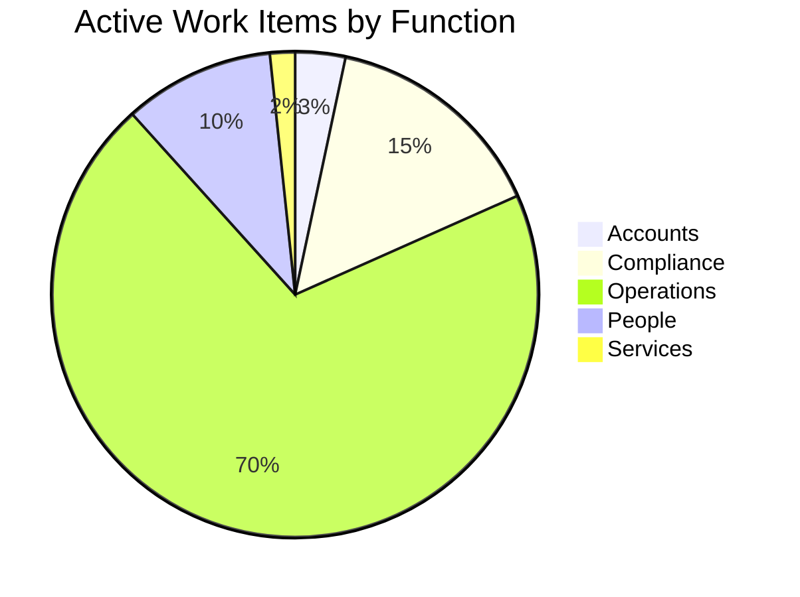
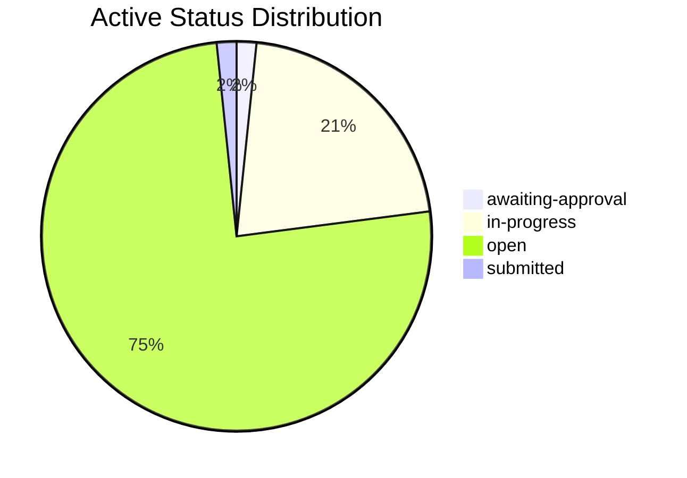
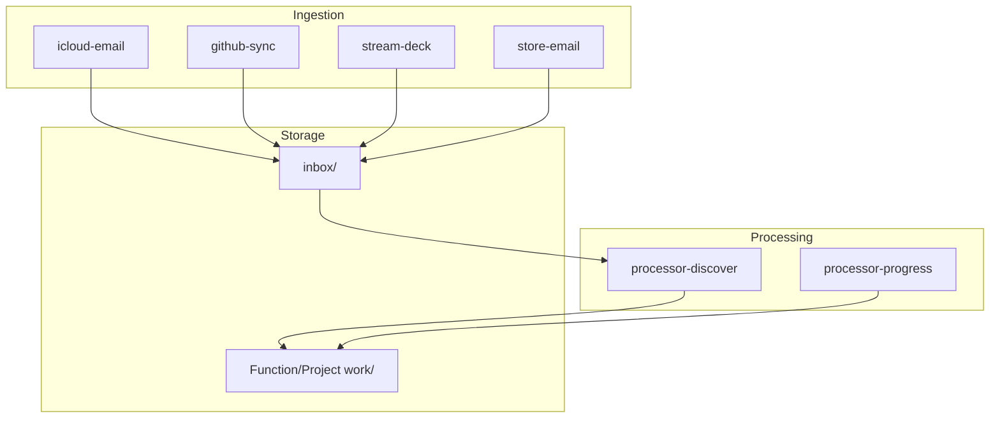

  <a href="README.md" style="display:inline-block; background-color:#f1f3f4; color:#3c4043; padding:6px 14px; text-decoration:none; border-radius:16px; font-weight:500; font-size:14px; margin-right:6px;">📖 RTRM</a>
  <a href="dashboard.md" style="display:inline-block; background-color:#e8f0fe; color:#1967d2; padding:6px 14px; text-decoration:none; border-radius:16px; font-weight:bold; font-size:14px; margin-right:6px;">📊 Dashboard</a>
  <a href="Accounts/dashboard.md" style="display:inline-block; background-color:#f1f3f4; color:#3c4043; padding:6px 14px; text-decoration:none; border-radius:16px; font-weight:500; font-size:14px; margin-right:6px;">📒 Accounts</a>
  <a href="Compliance/dashboard.md" style="display:inline-block; background-color:#f1f3f4; color:#3c4043; padding:6px 14px; text-decoration:none; border-radius:16px; font-weight:500; font-size:14px; margin-right:6px;">⚖️ Compliance</a>
  <a href="Operations/dashboard.md" style="display:inline-block; background-color:#f1f3f4; color:#3c4043; padding:6px 14px; text-decoration:none; border-radius:16px; font-weight:500; font-size:14px; margin-right:6px;">🧑‍💻 Operations</a>
  <a href="People/dashboard.md" style="display:inline-block; background-color:#f1f3f4; color:#3c4043; padding:6px 14px; text-decoration:none; border-radius:16px; font-weight:500; font-size:14px; margin-right:6px;">👥 People</a>
  <a href="Services/dashboard.md" style="display:inline-block; background-color:#f1f3f4; color:#3c4043; padding:6px 14px; text-decoration:none; border-radius:16px; font-weight:500; font-size:14px; ">🔌 Services</a>

  <a href="_pipeline/index.md">Pipeline</a> <a href="_pipeline/reports/tick-1250.md" style="font-size:11px; color:#5f6368;">#1250</a> · <a href="_tools/README.md">Tools</a> · <a href="_knowledge/roadmap.md">Roadmap</a> · <a href="_knowledge/philosophy.md">Philosophy</a> · <a href="_knowledge/research/README.md">Research</a>

  <a href="#unit-dashboards" style="color: #1a73e8; text-decoration: none; margin-right: 8px;">Units</a> · 
  <a href="#last-tick" style="color: #1a73e8; text-decoration: none; margin-right: 8px;">Last Tick</a> · 
  <a href="#service-activity" style="color: #1a73e8; text-decoration: none; margin-right: 8px; margin-left: 8px;">Services</a> · 
  <a href="#health" style="color: #1a73e8; text-decoration: none; margin-right: 8px; margin-left: 8px;">Health</a> · 
  <a href="#attention" style="color: #1a73e8; text-decoration: none; margin-right: 8px; margin-left: 8px;">Attention</a> · 
  <a href="#detail" style="color: #1a73e8; text-decoration: none; margin-right: 8px; margin-left: 8px;">Pipeline & Detail</a> · 
  <a href="#projects" style="color: #1a73e8; text-decoration: none; margin-left: 8px;">Projects</a>

# Dashboard

> Auto-updated by pipeline. Do not edit manually.

## Unit dashboards

One hop from company scope to a unit or nested dashboard. Omitted when no `projects/**/dashboard.md` exists.

| Unit | Dashboard | Kind |
|------|-----------|------|
| [BOTTA Face](projects/botta/README.md) | [botta](projects/botta/dashboard.md) | tick |
| [Chess ♟️](projects/chess/README.md) | [chess](projects/chess/dashboard.md) | manual |
| [Ema Solutions Architect](projects/ema-sa/README.md) | [ema-sa](projects/ema-sa/dashboard.md) | tick |
| [Irontec](projects/irontec/README.md) | [irontec](projects/irontec/dashboard.md) | manual |
| [Irontec › Irontec Marketing](projects/irontec/Marketing/README.md) | [irontec/Marketing](projects/irontec/Marketing/dashboard.md) | nested |
| [Open Contracts](projects/open-contracts/README.md) | [open-contracts](projects/open-contracts/dashboard.md) | manual |
| [Push to Talk](projects/push-to-talk/README.md) | [push-to-talk](projects/push-to-talk/dashboard.md) | manual |
| [store-dash](projects/store-dash/README.md) | [store-dash](projects/store-dash/dashboard.md) | partial |

## Last Tick

**[Tick #1250](_pipeline/reports/tick-1250.md)** · 2026-09-10 08:38 UTC · scheduled · **Diagnostics**: normal · **Historical rescan**: no

### Work Items

- No durable work-item changes in this tick.

### Company In Progress

- 🧭 [O.440](Operations/_work/O.440-contract-support-seed-crystallisation.md) — **Contract Support: Seed Crystallisation** · `authorized-awaiting-application`
  - Apply the existing Director decision recorded through [O.452-Review-seed-crystallisation-support-amendment](Operations/_work/O.452-Review-seed-crystallisation-support-amendment.md) through the normal approval lifecycle. Do not ask for the same authorization again. Compilation, data repair, supervised trial and resumption remain separately gated.
- 🧭 [O.449](Operations/_work/O.449-AI-Agent-Development-Platforms-consultation.md) — **Set Up Paid Consulting Engagement — AlphaSights**
  - Use the source correspondence to bootstrap the consulting-engagement process. Obtain the client legal entity, billing details, purchase-order or engagement paperwork and service date before preparing the final sales order or invoice. Drafts remain under Mandip's control; do not send or accept external terms automatically.
- 🧭 [O.465](Operations/_work/O.465-research-corpus-residual-repair.md) — **Research Corpus Residual Repair**
  - Continue the company-owned turn.

## Service Activity

| When | Contract | Availability | Imported | Duplicate | Deferred | Failed | Trial |
|---|---|---|---:|---:|---:|---:|---|
| 2026-08-29 13:26 | Voice Note Import Contract | unavailable | 0 | 0 | 0 | 0 | blocked |
| 2026-08-29 12:30 | Voice Note Import Contract | available | 1 | 8 | 3 | 0 | blocked |
| 2026-08-28 21:38 | Voice Note Import Contract | available | 0 | 8 | 1 | 0 | blocked |
| 2026-08-28 21:36 | Voice Note Import Contract | available | 5 | 3 | 0 | 0 | blocked |
| 2026-08-28 21:35 | Voice Note Import Contract | available | 0 | 3 | 5 | 0 | blocked |

## Agency

- **Waiting on you**: 0
- **Company obligations**: 4
- **Raw unsettled records**: 5
- **Latest move at**: 2026-09-07T10:23:40.354071+00:00
- **Latest move**: You responded to Review: Voice Note Import Services Agreement.
- **Latest move evidence**: Yeah, there's got a little recommendation on this as well.
- **Latest move tick**: 1191

### Since Your Last Turn

- **Turn at**: 2026-09-07T10:23:40.354071+00:00
- **Turn tick**: 1155
- **Turn commit**: 9bfb5a29
- **Window**: 95 ticks · 2 d 22 h
- **Evidence**: dashboards + tick reports
- **Your threads**: 7
- **Elsewhere**: 4
- **Beneath**: 0 progressed, 3 created, 475 inspected without change

| Scope | Tick | Item | What happened |
|---|---:|---|---|
| yours | 1231 | [Partnership Engagement Services Agreement](Operations/_work/approvals/contract-proposal-partnership-engagement-services-agreement.md) | Raised for your decision. |
| yours | 1213 | [hubspot-import RP-2](projects/ema-sa/_contracts/hubspot-import.REVIEW.md) | Raised for your decision. No longer waiting on a decision. |
| yours | 1213 | [hubspot-import RP-1](projects/ema-sa/_contracts/hubspot-import.REVIEW.md) | Raised for your decision. No longer waiting on a decision. |
| yours | 1213 | [deal-page RP-1](projects/ema-sa/_contracts/deal-page.REVIEW.md) | Raised for your decision. |
| yours | 1202 | [seed-crystallisation RP-11](Operations/_contracts/seed-crystallisation.REVIEW.md) | Raised for your decision. |
| yours | 1202 | [seed-crystallisation RP-10](Operations/_contracts/seed-crystallisation.REVIEW.md) | Raised for your decision. |
| yours | 1201 | [botta RP-1](projects/botta/_contracts/botta.REVIEW.md) | Raised for your decision. |
| elsewhere | 1231 | [Call with SearchLand regarding partnership](projects/store-dash/_work/SD.327-Call-with-SearchLand-regarding-partnership.md) | Created. |
| elsewhere | 1200 | [Searchland API Trial and Partnership Coordination](projects/store-dash/_work/SD.326-Searchland-API-Trial-and-Partnership-Coordination.md) | Created. |
| elsewhere | 1168 | [Operations](Operations/dashboard.md) | Load 41 → 42 active. |
| elsewhere | 1168 | [St. James AI Networking Event Attendance](Operations/_work/P.013-St-James-AI-Networking-Event-Attendance.md) | Created. |

### Waiting on You (0)

Nothing presented and unanswered.

### Company Owes (4)

| Since | Obligation | Records | Company next action |
|---|---|---:|---|
| 2026-09-07T15:01:30.441306+00:00 | [Turn reconciliation — EA.001](_pipeline/turns/2026-09-07-15-00-13-chief-of-staff-call.md) | 1 | Monitor repository commits for evidence of Ema integration to determine if a specific task needs to be opened or appended to existing Ema-related work items. |
| 2026-09-07T10:23:40.354071+00:00 | [Review: Voice Note Import Services Agreement](Operations/_contracts/voice-note-import-contract.REVIEW.md) | 2 | Reconcile Mandip's complete response against the canonical task and improve the work before asking again. |
| 2026-09-07T08:52:56.745898+00:00 | [Review: Model Evaluation Services Agreement](Operations/_contracts/model-selection.REVIEW.md) | 1 | Reconcile Mandip's complete response against the canonical task and improve the work before asking again. |
| 2026-08-26T18:12:56.073931+00:00 | [Turn reconciliation — G.001](_pipeline/turns/replay-2026-08-26-18-55-27.md) | 1 | Attach this instruction to G.001 and present the matched proposal for Director review. |

### Activity Since Latest Move (60 ticks)

| Tick | Compute | Inspected | Created | Progressed | LLM tokens |
|---:|---:|---:|---:|---:|---:|
| [#1191](_pipeline/reports/tick-1191.md) | 6.2s | 0 | 0 | 0 | 0 |
| [#1192](_pipeline/reports/tick-1192.md) | 2959.8s | 19 | 0 | 0 | 827 |
| [#1193](_pipeline/reports/tick-1193.md) | 109.5s | 19 | 0 | 0 | 0 |
| [#1194](_pipeline/reports/tick-1194.md) | 6.2s | 0 | 0 | 0 | 0 |
| [#1195](_pipeline/reports/tick-1195.md) | 5.8s | 0 | 0 | 0 | 0 |
| [#1196](_pipeline/reports/tick-1196.md) | 6.5s | 0 | 0 | 0 | 0 |
| [#1197](_pipeline/reports/tick-1197.md) | 90.5s | 19 | 0 | 0 | 0 |
| [#1198](_pipeline/reports/tick-1198.md) | 6.2s | 0 | 0 | 0 | 0 |
| [#1199](_pipeline/reports/tick-1199.md) | 6.0s | 0 | 0 | 0 | 0 |
| [#1200](_pipeline/reports/tick-1200.md) | 18.8s | 0 | 1 | 0 | 802 |
| [#1201](_pipeline/reports/tick-1201.md) | 94.5s | 19 | 0 | 0 | 0 |
| [#1202](_pipeline/reports/tick-1202.md) | 6.5s | 0 | 0 | 0 | 0 |
| [#1203](_pipeline/reports/tick-1203.md) | 6.0s | 0 | 0 | 0 | 0 |
| [#1204](_pipeline/reports/tick-1204.md) | 5.9s | 0 | 0 | 0 | 0 |
| [#1205](_pipeline/reports/tick-1205.md) | 131.1s | 19 | 0 | 0 | 0 |
| [#1206](_pipeline/reports/tick-1206.md) | 6.3s | 0 | 0 | 0 | 0 |
| [#1207](_pipeline/reports/tick-1207.md) | 6.8s | 0 | 0 | 0 | 0 |
| [#1208](_pipeline/reports/tick-1208.md) | 6.4s | 0 | 0 | 0 | 0 |
| [#1209](_pipeline/reports/tick-1209.md) | 108.1s | 19 | 0 | 0 | 0 |
| [#1210](_pipeline/reports/tick-1210.md) | 6.9s | 0 | 0 | 0 | 0 |
| [#1211](_pipeline/reports/tick-1211.md) | 6.9s | 0 | 0 | 0 | 0 |
| [#1212](_pipeline/reports/tick-1212.md) | 9.6s | 0 | 0 | 0 | 0 |
| [#1213](_pipeline/reports/tick-1213.md) | 1216.9s | 19 | 0 | 0 | 0 |
| [#1214](_pipeline/reports/tick-1214.md) | 6.9s | 0 | 0 | 0 | 0 |
| [#1215](_pipeline/reports/tick-1215.md) | 7.2s | 0 | 0 | 0 | 0 |
| [#1216](_pipeline/reports/tick-1216.md) | 120.3s | 19 | 0 | 0 | 0 |
| [#1217](_pipeline/reports/tick-1217.md) | 8.2s | 0 | 0 | 0 | 0 |
| [#1218](_pipeline/reports/tick-1218.md) | 7.5s | 0 | 0 | 0 | 0 |
| [#1219](_pipeline/reports/tick-1219.md) | 8.6s | 0 | 0 | 0 | 0 |
| [#1220](_pipeline/reports/tick-1220.md) | 127.5s | 19 | 0 | 0 | 0 |
| [#1221](_pipeline/reports/tick-1221.md) | 10.2s | 0 | 0 | 0 | 0 |
| [#1222](_pipeline/reports/tick-1222.md) | 8.0s | 0 | 0 | 0 | 0 |
| [#1223](_pipeline/reports/tick-1223.md) | 7.5s | 0 | 0 | 0 | 0 |
| [#1224](_pipeline/reports/tick-1224.md) | 97.2s | 19 | 0 | 0 | 0 |
| [#1225](_pipeline/reports/tick-1225.md) | 7.6s | 0 | 0 | 0 | 0 |
| [#1226](_pipeline/reports/tick-1226.md) | 7.7s | 0 | 0 | 0 | 0 |
| [#1227](_pipeline/reports/tick-1227.md) | 7.4s | 0 | 0 | 0 | 0 |
| [#1228](_pipeline/reports/tick-1228.md) | 95.0s | 19 | 0 | 0 | 0 |
| [#1229](_pipeline/reports/tick-1229.md) | 7.6s | 0 | 0 | 0 | 0 |
| [#1230](_pipeline/reports/tick-1230.md) | 7.2s | 0 | 0 | 0 | 0 |
| [#1231](_pipeline/reports/tick-1231.md) | 18.5s | 0 | 1 | 0 | 881 |
| [#1232](_pipeline/reports/tick-1232.md) | 76.4s | 19 | 0 | 0 | 0 |
| [#1233](_pipeline/reports/tick-1233.md) | 8.0s | 0 | 0 | 0 | 0 |
| [#1234](_pipeline/reports/tick-1234.md) | 7.8s | 0 | 0 | 0 | 0 |
| [#1235](_pipeline/reports/tick-1235.md) | 7.8s | 0 | 0 | 0 | 0 |
| [#1236](_pipeline/reports/tick-1236.md) | 85.3s | 19 | 0 | 0 | 0 |
| [#1237](_pipeline/reports/tick-1237.md) | 7.6s | 0 | 0 | 0 | 0 |
| [#1238](_pipeline/reports/tick-1238.md) | 7.4s | 0 | 0 | 0 | 0 |
| [#1239](_pipeline/reports/tick-1239.md) | 7.4s | 0 | 0 | 0 | 0 |
| [#1240](_pipeline/reports/tick-1240.md) | 107.0s | 19 | 0 | 0 | 0 |
| [#1241](_pipeline/reports/tick-1241.md) | 7.5s | 0 | 0 | 0 | 0 |
| [#1242](_pipeline/reports/tick-1242.md) | 8.0s | 0 | 0 | 0 | 0 |
| [#1243](_pipeline/reports/tick-1243.md) | 7.0s | 0 | 0 | 0 | 0 |
| [#1244](_pipeline/reports/tick-1244.md) | 97.0s | 19 | 0 | 0 | 0 |
| [#1245](_pipeline/reports/tick-1245.md) | 8.1s | 0 | 0 | 0 | 0 |
| [#1246](_pipeline/reports/tick-1246.md) | 12.4s | 0 | 0 | 0 | 813 |
| [#1247](_pipeline/reports/tick-1247.md) | 169.9s | 19 | 0 | 0 | 0 |
| [#1248](_pipeline/reports/tick-1248.md) | 7.6s | 0 | 0 | 0 | 0 |
| [#1249](_pipeline/reports/tick-1249.md) | 9.0s | 0 | 0 | 0 | 0 |
| [#1250](_pipeline/reports/tick-1250.md) | 7.0s | 0 | 0 | 0 | 0 |

## Health

| Function | Status | Active | Waiting | Done |
|----------|--------|--------|---------|------|
| [Accounts](Accounts/dashboard.md) | 🔄 | 2 | 0 | 13 |
| [Compliance](Compliance/dashboard.md) | ⏸️ | 9 | 1 | 13 |
| [Operations](Operations/dashboard.md) | ⚠️ | 42 | 0 | 454 |
| [People](People/dashboard.md) | ⚠️ | 6 | 0 | 1 |
| [Services](Services/dashboard.md) | 🔄 | 1 | 0 | 11 |
| **Total** | | **60** | **1** | **492** |

### Work Item Distribution

### Status Distribution

## Attention

### Decisions Waiting (26 of 48 need you)

Grouped by what each is waiting on. The first two groups are yours.

**Your choice (1)** — A real decision — alternatives are on the table

| Kind | Subject | Detail | Consequence | Link |
|------|---------|--------|-------------|------|
| Review point | voice-note-import-contract RP-3 | minor — New evidence reopens the cost basis on which RP-1 wa | blocks approval only | [View](Operations/_contracts/voice-note-import-contract.REVIEW.md) |

**Your review (25)** — One proposed action each — confirm or send back

| Kind | Subject | Detail | Consequence | Link |
|------|---------|--------|-------------|------|
| Contract proposal | Sales Workflow Formalization | Awaiting approval | blocks approval only | [View](Operations/_work/approvals/contract-proposal-sales-workflow-formalization.md) |
| Contract proposal | SDLC Process Review Services Agreement | Awaiting approval | blocks approval only | [View](Operations/_work/approvals/contract-proposal-sdlc-process-review-services-agreement.md) |
| Contract proposal | Support Amendment — Seed Crystallisation | Awaiting approval | blocks approval only | [View](Operations/_work/approvals/contract-proposal-seed_crystallisation-support-amendment.md) |
| Review point | calendar-import RP-1 | blocking — OAuth scopes | blocks approval only | [View](projects/ema-sa/_contracts/calendar-import.REVIEW.md) |
| Review point | pipeline RP-2 | blocking — The company turn has no completion criterion | blocks approval only | [View](Operations/_contracts/pipeline.REVIEW.md) |
| Review point | pipeline RP-3 | blocking — Support wrappers are created without an idempotency  | blocks approval only | [View](Operations/_contracts/pipeline.REVIEW.md) |
| Review point | pipeline RP-5 | blocking — Contract proposals bypass the canonical attention st | blocks approval only | [View](Operations/_contracts/pipeline.REVIEW.md) |
| Review point | pipeline RP-6 | blocking — Review points bypass the canonical attention stream | blocks approval only | [View](Operations/_contracts/pipeline.REVIEW.md) |
| Review point | pipeline RP-7 | blocking — Every open review point halts its contract, because  | blocks approval only | [View](Operations/_contracts/pipeline.REVIEW.md) |
| Review point | slack-import RP-1 | blocking — Implementation not started | blocks approval only | [View](projects/ema-sa/_contracts/slack-import.REVIEW.md) |
| Review point | slack-import RP-2 | blocking — Mandip Slack user ID | blocks approval only | [View](projects/ema-sa/_contracts/slack-import.REVIEW.md) |
| Review point | model-selection RP-2 | material — The resolution floor is specified but the deliverabl | blocks approval only | [View](Operations/_contracts/model-selection.REVIEW.md) |
| Review point | pipeline RP-4 | material — Human response reconciliation waits for the schedule | blocks approval only | [View](Operations/_contracts/pipeline.REVIEW.md) |
| Review point | seed-crystallisation RP-10 | material — Distilled conversation seeds vs bulk LLM harvest | blocks approval only | [View](Operations/_contracts/seed-crystallisation.REVIEW.md) |
| Review point | seed-crystallisation RP-11 | material — Shortcuts as propagation, not autonomous projects | blocks approval only | [View](Operations/_contracts/seed-crystallisation.REVIEW.md) |
| Review point | seed-crystallisation RP-8 | material — Index seed counts do not match the themes | blocks approval only | [View](Operations/_contracts/seed-crystallisation.REVIEW.md) |
| Review point | botta RP-1 | minor — No one at BOTTA has been named | blocks approval only | [View](projects/botta/_contracts/botta.REVIEW.md) |
| Review point | deal-page RP-1 | minor — Unit dashboard Deals columns | blocks approval only | [View](projects/ema-sa/_contracts/deal-page.REVIEW.md) |
| Review point | email-import RP-4 | minor — `gmail.imap` capability not yet registered | blocks approval only | [View](projects/ema-sa/_contracts/email-import.REVIEW.md) |
| Review point | email-import RP-5 | minor — Shadow compare against ema-mcp gold | blocks approval only | [View](projects/ema-sa/_contracts/email-import.REVIEW.md) |
| Review point | fathom-import RP-4 | minor — Partner routing and AI classification omitted | blocks approval only | [View](projects/ema-sa/_contracts/fathom-import.REVIEW.md) |
| Review point | fathom-import RP-6 | minor — `fathom.api` capability not yet registered | blocks approval only | [View](projects/ema-sa/_contracts/fathom-import.REVIEW.md) |
| Review point | granola-import RP-4 | minor — `granola.mcp` capability not yet registered | blocks approval only | [View](projects/ema-sa/_contracts/granola-import.REVIEW.md) |
| Review point | granola-import RP-5 | minor — Shadow compare against ema-mcp gold | blocks approval only | [View](projects/ema-sa/_contracts/granola-import.REVIEW.md) |
| Review point | llm-interaction-import RP-1 | minor — Catch-up volume vs max_per_run | blocks approval only | [View](Operations/_contracts/llm-interaction-import.REVIEW.md) |

**Waiting on a build (14)** — Decided already; no decision needed

| Kind | Subject | Detail | Consequence | Link |
|------|---------|--------|-------------|------|
| Contract proposal | Agent-Human Interaction Services Agreement | Blocked — missing prerequisites — `pipeline.README.md` | blocks approval only | [View](Operations/_work/approvals/contract-proposal-agent-human-interaction-services-agreement.md) |
| Contract proposal | Communication Archival Services Agreement | Blocked — missing prerequisites — `../Compliance/privacy.README.md`, `../Compliance/confidentiality.README.md` | blocks approval only | [View](Operations/_work/approvals/contract-proposal-communication-archival-services-agreement.md) |
| Contract proposal | Event Attendance Services Agreement | Blocked — missing prerequisites — `../Accounts/expenses.README.md`, `../Operations/partnerships.README.md` | blocks approval only | [View](Operations/_work/approvals/contract-proposal-event-attendance-services-agreement.md) |
| Contract proposal | Hardware and Software Procurement Services Agreement | Blocked — missing prerequisites — `../HR/README.md`, `../Operations/_data/assets.md` | blocks approval only | [View](Operations/_work/approvals/contract-proposal-hardware-and-software-procurement-services-agreement.md) |
| Contract proposal | LLM Harvesting and Corpus Evaluation Services Agreem | Blocked — missing prerequisites — `pipeline.README.md`, `../Compliance/README.md`, `../Inbox/README.md` | blocks approval only | [View](Operations/_work/approvals/contract-proposal-llm-harvesting-and-corpus-evaluation-services-agreement.md) |
| Contract proposal | Networking and Industry Engagement Services Agreemen | Blocked — missing prerequisites — `../Partnerships/README.md`, `../Procurement/README.md`, `../Knowledge/README.md` | blocks approval only | [View](Operations/_work/approvals/contract-proposal-networking-and-industry-engagement-services-agreement.md) |
| Contract proposal | Partnership Engagement Services Agreement | Blocked — missing prerequisites — `pipeline.README.md`, `../Operations/_contracts/governance.README.md` | blocks approval only | [View](Operations/_work/approvals/contract-proposal-partnership-engagement-services-agreement.md) |
| Contract proposal | Partnership Integration Services Agreement | Blocked — missing prerequisites — `pipeline.README.md`, `../Legal/README.md`, `../Accounts/README.md` | blocks approval only | [View](Operations/_work/approvals/contract-proposal-partnership-integration-services-agreement.md) |
| Contract proposal | Project Documentation and Reporting Services Agreeme | Blocked — missing prerequisites — `../Accounts/README.md`, `../Operations/_contracts/director-resolution.README.md` | blocks approval only | [View](Operations/_work/approvals/contract-proposal-project-documentation-and-reporting-services-agreement.md) |
| Contract proposal | Project Status Update Services Agreement | Blocked — missing prerequisites — `../Governance/project-governance.README.md` | blocks approval only | [View](Operations/_work/approvals/contract-proposal-project-status-update-services-agreement.md) |
| Contract proposal | Purchase Order Processing Services Agreement | Blocked — missing prerequisites — `pipeline.README.md`, `../Services/README.md`, `../Accounts/tax-compliance.README.md`, `../Accounts/README.md` | blocks approval only | [View](Operations/_work/approvals/contract-proposal-purchase-order-processing-services-agreement.md) |
| Contract proposal | Searchland Partnership Services Agreement | Blocked — missing prerequisites — `pipeline.README.md`, `../store-dash/_work/SD.326-Searchland-API-Trial-and-Partnership-Coordination.md` | blocks approval only | [View](Operations/_work/approvals/contract-proposal-searchland-partnership-services-agreement.md) |
| Contract proposal | WhatsApp Digest Processing Services Agreement | Blocked — missing prerequisites — `../People/_data/people.md` | blocks approval only | [View](Operations/_work/approvals/contract-proposal-whatsapp-digest-processing-services-agreement.md) |
| Review point | seed-crystallisation RP-4 | blocking — Implement inductive analysis as contracted | ⛔ halting seed-crystallisation | [View](Operations/_contracts/seed-crystallisation.REVIEW.md) |

**Waiting on a run (8)** — Remedied already; needs evidence, not a decision

| Kind | Subject | Detail | Consequence | Link |
|------|---------|--------|-------------|------|
| Review point | seed-crystallisation RP-1 | blocking — Require a no-op for unchanged inputs | ⛔ halting seed-crystallisation | [View](Operations/_contracts/seed-crystallisation.REVIEW.md) |
| Review point | seed-crystallisation RP-2 | blocking — Validate source provenance before mutation | ⛔ halting seed-crystallisation | [View](Operations/_contracts/seed-crystallisation.REVIEW.md) |
| Review point | seed-crystallisation RP-3 | blocking — Exclude generated outputs from research inputs | ⛔ halting seed-crystallisation | [View](Operations/_contracts/seed-crystallisation.REVIEW.md) |
| Review point | seed-crystallisation RP-5 | blocking — Bound autonomous mutation | ⛔ halting seed-crystallisation | [View](Operations/_contracts/seed-crystallisation.REVIEW.md) |
| Review point | seed-crystallisation RP-6 | blocking — Replace retry-on-breach with containment | ⛔ halting seed-crystallisation | [View](Operations/_contracts/seed-crystallisation.REVIEW.md) |
| Review point | seed-crystallisation RP-9 | blocking — Theme files grow without bound | ⛔ halting seed-crystallisation | [View](Operations/_contracts/seed-crystallisation.REVIEW.md) |
| Review point | pipeline RP-8 | blocking — A contract could report success while delivering not | blocks approval only | [View](Operations/_contracts/pipeline.REVIEW.md) |
| Review point | seed-crystallisation RP-7 | material — Define supervised trial and promotion evidence | blocks approval only | [View](Operations/_contracts/seed-crystallisation.REVIEW.md) |

### Stale Work Items

| Function | Item | Reason | Link |
|----------|------|--------|------|
| Accounts | The Fox & Hounds, Whittlebury — Business | Open 106 days | [A.011](Accounts/_work/A.011-Retail-Receipt.md) |
| Accounts | Record purchase order AOL223460870 | Open 16 days | [A.026](Accounts/_work/A.026-Record-purchase-order-AOL223460870.md) |
| Compliance | Register for Corporation Tax | Open 118 days | [C.004.1](Compliance/_work/C.004.1-Register-for-corporation-tax.md) |
| Compliance | Assess VAT registration requirement | Open 118 days | [C.004.2](Compliance/_work/C.004.2-Assess-VAT-registration.md) |
| Compliance | virtual-office-service-address.md | Open 110 days | [C.015](Compliance/_work/C.015-virtual-office-service-addressmd.md) |
| Compliance | ICO Data Protection Fee Direct Debit Con | Open 78 days | [C.017](Compliance/_work/C.017-ICO-Data-Protection-Fee-Direct-Debit-Confirmation.md) |
| Compliance | BYOD Policy Review and Compliance | Open 76 days | [C.021](Compliance/_work/C.021-BYOD-Policy-Review-and-Compliance.md) |
| Compliance | Health and Safety compliance process imp | Open 73 days | [C.028](Compliance/_work/C.028-Health-and-Safety-compliance-process-implementation.md) |
| Compliance | EU AI Act Article 52 Compliance | Open 73 days | [C.029](Compliance/_work/C.029-EU-AI-Act-Article-52-Compliance.md) |
| Compliance | Compliance: Employment Rights Act s.1 co | Open 73 days | [C.034](Compliance/_work/C.034-Compliance-Employment-Rights-Act-s1-contract.md) |
| Compliance | LLM processing of personal data — risk | Open 15 days | [C.036](Compliance/_work/C.036-LLM-processing-of-personal-data-risk.md) |
| Compliance | Anonymous User Experience and Contract F | Awaiting input | [C.037](Compliance/_work/C.037-Anonymous-User-Experience-and-Contract-Framework.md) |
| Operations | WhatsApp digest: Jatin/Mandip/Kash (2026 | Open 28 days | [I.004](Operations/_work/I.004-WhatsApp-digest-JatinMandipKash-2026-08-12.md) |
| Operations | InstantID tool exploration | Open 27 days | [I.005](Operations/_work/I.005-InstantID-tool-exploration.md) |
| Operations | WhatsApp digest: Jatin/Mandip/Kash (2026 | Open 16 days | [I.006](Operations/_work/I.006-WhatsApp-digest-JatinMandipKash-2026-08-25.md) |
| Operations | StoreDash WhatsApp digest (2026-08-26) | Open 15 days | [I.007](Operations/_work/I.007-StoreDash-WhatsApp-digest-2026-08-26.md) |
| Operations | WhatsApp digest: Jatin/Mandip/Kash (2026 | Open 15 days | [I.008](Operations/_work/I.008-WhatsApp-digest-JatinMandipKash-2026-08-26.md) |
| Operations | Apple Developer Program Enrollment | Open 66 days | [O.008](Operations/_work/O.008-Apple-Developer-Program-Enrollment.md) |
| Operations | Migrate Winston app to Ema Next | Open 62 days | [O.009](Operations/_work/O.009-Migrate-Winston-app-to-Ema-Next.md) |
| Operations | Review of new SDLC process flow | Open 20 days | [O.403](Operations/_work/O.403-Review-of-new-SDLC-process-flow.md) |
| Operations | Attention Event Experiment | Open 17 days | [O.424](Operations/_work/O.424-attention-event-experiment.md) |
| Operations | Stream Deck Attention Mode | Open 17 days | [O.430](Operations/_work/O.430-stream-deck-attention-mode.md) |
| Operations | Build Conversational Initiative Path | Open 17 days | [O.437](Operations/_work/O.437-build-conversational-initiative-path.md) |
| Operations | Build Contract Support Loop | Open 17 days | [O.439](Operations/_work/O.439-build-contract-support-loop.md) |
| Operations | Contract Support: Seed Crystallisation | Open 17 days | [O.440](Operations/_work/O.440-contract-support-seed-crystallisation.md) |
| Operations | Complete Contract-Support Loop | Open 16 days | [O.445](Operations/_work/O.445-complete-contract-support-loop.md) |
| Operations | Refine Cloud Connect Direction | Open 17 days | [O.447](Operations/_work/O.447-refine-cloud-connect-direction.md) |
| Operations | Set Up Paid Consulting Engagement — Alph | Open 16 days | [O.449](Operations/_work/O.449-AI-Agent-Development-Platforms-consultation.md) |
| Operations | Bootstrap Impact Cascade | Open 16 days | [O.456](Operations/_work/O.456-bootstrap-impact-cascade.md) |
| Operations | Supply chain constraints on hardware pro | Open 16 days | [O.458](Operations/_work/O.458-Supply-chain-constraints-on-hardware-procurement.md) |
| Operations | Pipeline commits only its own work | Open 16 days | [O.459](Operations/_work/O.459-pipeline-commit-scope.md) |
| Operations | Ingest filter discarded an order confirm | Open 16 days | [O.460](Operations/_work/O.460-ingest-filter-discarded-order-confirmation.md) |
| Operations | Who reviews contracts | Open 16 days | [O.461](Operations/_work/O.461-contract-review-capacity.md) |
| Operations | Wire Cortex local inference path | Open 15 days | [O.462](Operations/_work/O.462-Wire-Cortex-local-inference-path.md) |
| Operations | Inference tier field and tier-grouped ex | Open 15 days | [O.463](Operations/_work/O.463-Inference-tier-field-and-tier-grouped-execution.md) |
| Operations | Confidential computing index | Open 15 days | [O.464](Operations/_work/O.464-Confidential-computing-index.md) |
| Operations | Research Corpus Residual Repair | Open 15 days | [O.465](Operations/_work/O.465-research-corpus-residual-repair.md) |
| Operations | Make dashboard.md the sole frame input | Open 15 days | [O.466](Operations/_work/O.466-make-dashboard-the-sole-frame-input.md) |
| Operations | Record durable human moves from agent se | Open 15 days | [O.467](Operations/_work/O.467-record-durable-human-moves-from-agent-sessions.md) |
| Operations | Integration of courier services into SPI | Open 44 days | [P.003](Operations/_work/P.003-Integration-of-courier-services-into-SPINE.md) |
| Operations | RightStore Nimbus Proposal V2 Review | Open 41 days | [P.004](Operations/_work/P.004-RightStore-Nimbus-Proposal-V2-Review.md) |
| Operations | RightStore by Nimbus deck development | Open 41 days | [P.005](Operations/_work/P.005-RightStore-by-Nimbus-deck-development.md) |
| Operations | IBIS system overview for Christie & Co | Open 37 days | [P.006](Operations/_work/P.006-IBIS-system-overview-for-Christie-Co.md) |
| Operations | Project prioritization and competitor re | Open 37 days | [P.007](Operations/_work/P.007-Project-prioritization-and-competitor-research.md) |
| Operations | StoreDash client and investment coordina | Open 21 days | [P.008](Operations/_work/P.008-StoreDash-client-and-investment-coordination.md) |
| Operations | StoreDash project documentation and repo | Open 15 days | [P.009](Operations/_work/P.009-StoreDash-project-documentation-and-report-updates.md) |
| Operations | SPINE development and hardware procureme | Open 15 days | [P.010](Operations/_work/P.010-SPINE-development-and-hardware-procurement.md) |
| People | H.002 — Tech Toast Attendee Outreach | Open 65 days | [H.002](People/_work/H.002-tech-toast-attendee-outreach.md) |
| People | Review compensation and workload distrib | Open 62 days | [H.003](People/_work/H.003-Review-compensation-and-workload-distribution.md) |
| People | People Development and Learning Framewor | Open 58 days | [H.004](People/_work/H.004-People-Development-and-Learning-Framework.md) |
| People | Onboarding and Integration of James Lowm | Open 57 days | [H.005](People/_work/H.005-Onboarding-and-Integration-of-James-Lowman-CEO.md) |
| People | CEO recruitment update: James Lowman wit | Open 42 days | [H.006](People/_work/H.006-CEO-recruitment-update-James-Lowman-withdrawal.md) |
| People | Potential CEO candidate: Ilann Hepworth | Open 42 days | [H.007](People/_work/H.007-Potential-CEO-candidate-Ilann-Hepworth.md) |
| Services | Nimbus platform access and subscription  | Open 73 days | [S.018](Services/_work/S.018-Nimbus-platform-access-and-subscription-management.md) |

## Detail

### Pipeline

**Total Ticks**: 1250

| Source | Enabled | Status | Last Run | Detail |
|--------|---------|--------|----------|--------|
| icloud-email | 🟢 Yes | ✅ ok | 2026-09-10 09:38 | 0 new, 0 synced |
| github-sync | 🟢 Yes | ✅ ok | 2026-09-10 08:49 | 0 synced |
| stream-deck | 🟢 Yes | ✅ ok | 2026-09-10 08:49 | 0 copied, 0 noise, 0 hal |
| processor-discover | 🟢 Yes | ✅ ok | — | 0 processed, 0 created |
| processor-progress | 🟢 Yes | ✅ ok | — | 0 progressed |
| whatsapp | 🟢 Yes | ✅ ok | 2026-09-10 08:49 | 0 processed, 0 failed |
| companies-house | ⚪ No | — | — | — |
| hostinger | ⚪ No | — | — | — |
| store-email | 🟢 Yes | — | — | — |
| llm-interaction-import | ⚪ No | ✅ ok | 2026-09-08 14:51 | 50 seeds (7354 new / 7354 scanned) |

### Recent Pipeline Runs

| Run | Duration | icloud-email | github-sync | processor-discover | processor-progress | Cost | Carbon |
|-----|----------|--------------|-------------|--------------------|--------------------|------|--------|
| [2026-09-10 09:38](_pipeline/logs/2026-09-10_09-38-43.md) | 7s | [✓](_pipeline/logs/2026-09-10_09-38-43.md#icloud-email) 0 new, 0 synced | — | — | — | $0.0000 | ~0.003g |
| [2026-09-10 09:23](_pipeline/logs/2026-09-10_09-23-07.md) | 9s | [✓](_pipeline/logs/2026-09-10_09-23-07.md#icloud-email) 0 new, 0 synced | — | [✓](_pipeline/logs/2026-09-10_09-23-07.md#processor-discover) 0 processed, 0 created | — | $0.0000 | ~0.004g |
| [2026-09-10 09:07](_pipeline/logs/2026-09-10_09-07-34.md) | 8s | [✓](_pipeline/logs/2026-09-10_09-07-34.md#icloud-email) 0 new, 0 synced | — | [✓](_pipeline/logs/2026-09-10_09-07-34.md#processor-discover) 0 processed, 0 created | — | $0.0000 | ~0.003g |
| [2026-09-10 08:49](_pipeline/logs/2026-09-10_08-49-18.md) | 170s | [✓](_pipeline/logs/2026-09-10_08-49-18.md#icloud-email) 1 new, 1 synced | [✓](_pipeline/logs/2026-09-10_08-49-18.md#github-sync) 0 synced | [✓](_pipeline/logs/2026-09-10_08-49-18.md#processor-discover) 1 processed, 0 created | [✓](_pipeline/logs/2026-09-10_08-49-18.md#processor-progress) 0 progressed | $0.0000 | ~0.071g |
| [2026-09-09 17:49](_pipeline/logs/2026-09-09_17-49-53.md) | 12s | [✓](_pipeline/logs/2026-09-09_17-49-53.md#icloud-email) 0 new, 0 synced | — | [✓](_pipeline/logs/2026-09-09_17-49-53.md#processor-discover) 1 processed, 0 created | — | $0.0001 | ~0.222g |

### Source Topology

### Contracts

| Contract | Function | Cadence | Last Run | Compiled |
|----------|----------|---------|----------|----------|
| [Code Documentation](Operations/_contracts/code-documentation.README.md) | Operations | weekly | — | ⚪ No |
| [Consulting Engagement Administration](Operations/_contracts/consulting-engagement-administration.README.md) | Operations | on-demand | — | ⚪ No |
| [Conversational Initiative](Operations/_contracts/conversational-initiative.README.md) | Operations | on-demand | — | ⚪ No |
| [Creative Asset Production](Operations/_contracts/creative-asset-production.README.md) | Operations | on-demand | — | ⚪ No |
| [Github Issue Sync](Operations/_contracts/github-issue-sync.README.md) | Operations | per-tick | — | ⚪ No |
| [Icloud Email Import](Operations/_contracts/icloud-email-import.README.md) | Operations | per-tick | — | ⚪ No |
| [Impact Cascade](Operations/_contracts/impact-cascade.README.md) | Operations | per-tick | 2026-08-25 11:40 | ⚪ No |
| [Information Triage](Operations/_contracts/information-triage.README.md) | Operations | per-tick | 2026-09-10 08:51 | 🟢 Yes |
| [Seed Crystallisation](Operations/_contracts/seed-crystallisation.README.md) | Operations | per-tick | 2026-08-24 15:27 | 🟢 Yes |
| [Stack Improvement](Operations/_contracts/stack-improvement.README.md) | Operations | weekly | — | ⚪ No |
| [Voice Note Import Contract](Operations/_contracts/voice-note-import-contract.README.md) | Operations | per-tick | 2026-08-29 13:23 | 🟢 Yes |
| [Whatsapp Import](Operations/_contracts/whatsapp-import.README.md) | Operations | per-tick | — | ⚪ No |

### Projects

| Project | Status | Active | Waiting | Done |
|---------|--------|--------|---------|------|
| [5et.aiguy.cloud](projects/5et.aiguy.cloud/README.md) | ✅ | 0 | 0 | 0 |
| [5et.uk](projects/5et.uk/README.md) | ✅ | 0 | 0 | 0 |
| [_old](projects/_old/README.md) | ✅ | 0 | 0 | 0 |
| [ai-course](projects/ai-course/README.md) | ✅ | 0 | 0 | 0 |
| [bekame-collab](projects/bekame-collab/README.md) | ✅ | 0 | 0 | 0 |
| [blockvey](projects/blockvey/README.md) | ✅ | 0 | 0 | 0 |
| [botta](projects/botta/README.md) | ✅ | 0 | 0 | 0 |
| [car-personality](projects/car-personality/README.md) | ✅ | 0 | 0 | 0 |
| [chess](projects/chess/README.md) | ⚠️ | 4 | 0 | 0 |
| [cv-builder](projects/cv-builder/README.md) | ✅ | 0 | 0 | 0 |
| [ema-sa](projects/ema-sa/README.md) | ✅ | 0 | 0 | 0 |
| [game](projects/game/README.md) | 🔄 | 2 | 0 | 0 |
| [golf](projects/golf/README.md) | ✅ | 0 | 0 | 0 |
| [home-information-pack](projects/home-information-pack/README.md) | ✅ | 0 | 0 | 0 |
| [hyperscaler](projects/hyperscaler/README.md) | ✅ | 0 | 0 | 0 |
| [irontec](projects/irontec/README.md) | ✅ | 0 | 0 | 0 |
| [legal-system-research](projects/legal-system-research/README.md) | ✅ | 0 | 0 | 0 |
| [mylang](projects/mylang/README.md) | 🔄 | 1 | 0 | 0 |
| [myos](projects/myos/README.md) | ✅ | 0 | 0 | 0 |
| [nature-app](projects/nature-app/README.md) | ✅ | 0 | 0 | 0 |
| [open-contracts](projects/open-contracts/README.md) | ⚠️ | 5 | 0 | 0 |
| [push-to-talk](projects/push-to-talk/README.md) | ✅ | 0 | 0 | 0 |
| [right-store](projects/right-store/README.md) | ✅ | 0 | 0 | 0 |
| [sole-trader-saas](projects/sole-trader-saas/README.md) | ✅ | 0 | 0 | 0 |
| [store-dash](projects/store-dash/README.md) | ⏸️ | 31 | 3 | 184 |

### Knowledge

| Metric | Value |
|--------|-------|
| Notes | 1476 |
| Themes | 22 |
| Coverage | 10.9% |

📊 [Full Knowledge Report](_knowledge/research/report.md)

### Gate Tracks (3)

| Case | Phase | Item | # | Gate |
|---|---|---|---:|---|
| seed_crystallisation | authorized-awaiting-application | [O.440](Operations/_work/O.440-contract-support-seed-crystallisation.md) | 1 | Verify recovery through the governed supervised trial before proposing resumption. |
| pipeline — commit scope | verify | [O.459](Operations/_work/O.459-pipeline-commit-scope.md) | 1 | Observe three real ticks before narrowing the prefix list |
| pipeline — commit scope | verify | [O.459](Operations/_work/O.459-pipeline-commit-scope.md) | 2 | Audit Phases 1–5 writers for explicit staging; record which rely on prefix staging |
| pipeline — commit scope | verify | [O.459](Operations/_work/O.459-pipeline-commit-scope.md) | 3 | Verify across three real ticks before removing any prefix |
| pipeline — commit scope | verify | [O.459](Operations/_work/O.459-pipeline-commit-scope.md) | 4 | Open IE.002 once verified, and resolve RP-1 |
| pipeline — ingest materiality | verify | [O.460](Operations/_work/O.460-ingest-filter-discarded-order-confirmation.md) | 1 | Review `_pipeline/skipped.jsonl` after three business days for wrongly skipped material mail |
| pipeline — ingest materiality | verify | [O.460](Operations/_work/O.460-ingest-filter-discarded-order-confirmation.md) | 2 | Audit the store-dash mailbox filter for the same inverted `noreply@` rule |
| pipeline — ingest materiality | verify | [O.460](Operations/_work/O.460-ingest-filter-discarded-order-confirmation.md) | 3 | Backfill check — search the mailbox for transactional mail dropped before this fix |
| pipeline — ingest materiality | verify | [O.460](Operations/_work/O.460-ingest-filter-discarded-order-confirmation.md) | 4 | Consider the same materiality test for the WhatsApp and drop-folder paths |

### Agency Log (8)

| At | Who | Event |
|---|---|---|
| 2026-09-07 10:23 | you | Responded · voice |
| 2026-09-07 10:22 | company | Cue published · voice |
| 2026-09-07 10:22 | company | Question prepared · voice |
| 2026-09-07 09:59 | you | Responded · voice |
| 2026-09-07 09:21 | company | Cue published · voice |
| 2026-09-07 09:21 | company | Question prepared · voice |
| 2026-09-07 08:52 | you | Responded · model |
| 2026-09-07 08:19 | company | Cue published · model |
