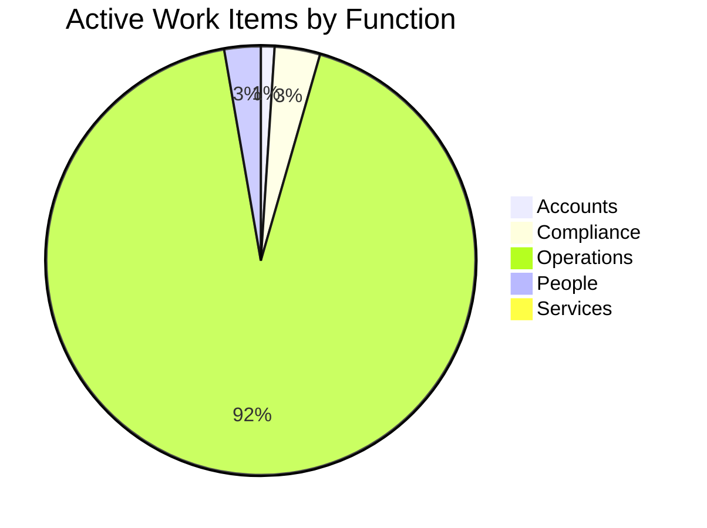
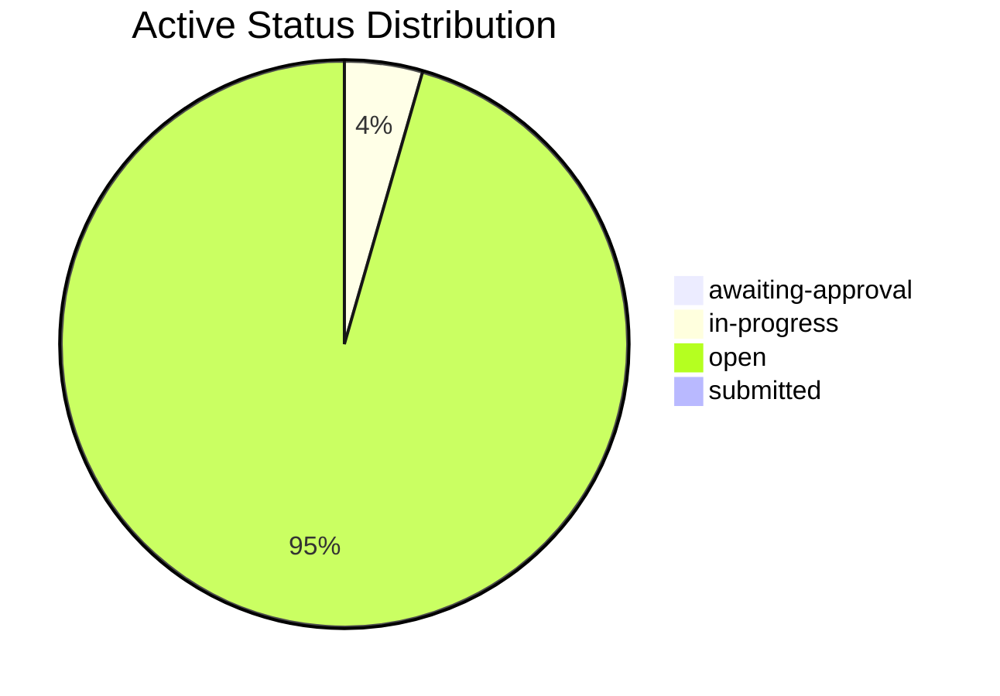
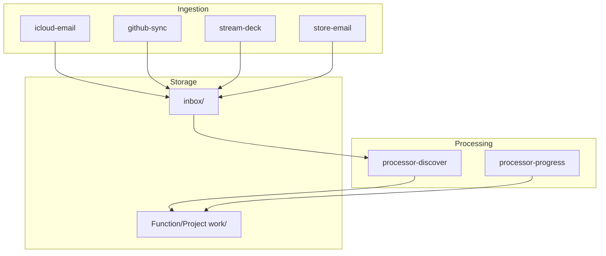

  <a href="README.md" style="display:inline-block; background-color:#f1f3f4; color:#3c4043; padding:6px 14px; text-decoration:none; border-radius:16px; font-weight:500; font-size:14px; margin-right:6px;">📖 RTRM</a>
  <a href="dashboard.md" style="display:inline-block; background-color:#e8f0fe; color:#1967d2; padding:6px 14px; text-decoration:none; border-radius:16px; font-weight:bold; font-size:14px; margin-right:6px;">📊 Dashboard</a>
  <a href="Accounts/dashboard.md" style="display:inline-block; background-color:#f1f3f4; color:#3c4043; padding:6px 14px; text-decoration:none; border-radius:16px; font-weight:500; font-size:14px; margin-right:6px;">📒 Accounts</a>
  <a href="Compliance/dashboard.md" style="display:inline-block; background-color:#f1f3f4; color:#3c4043; padding:6px 14px; text-decoration:none; border-radius:16px; font-weight:500; font-size:14px; margin-right:6px;">⚖️ Compliance</a>
  <a href="Operations/dashboard.md" style="display:inline-block; background-color:#f1f3f4; color:#3c4043; padding:6px 14px; text-decoration:none; border-radius:16px; font-weight:500; font-size:14px; margin-right:6px;">🧑‍💻 Operations</a>
  <a href="People/dashboard.md" style="display:inline-block; background-color:#f1f3f4; color:#3c4043; padding:6px 14px; text-decoration:none; border-radius:16px; font-weight:500; font-size:14px; margin-right:6px;">👥 People</a>
  <a href="Services/dashboard.md" style="display:inline-block; background-color:#f1f3f4; color:#3c4043; padding:6px 14px; text-decoration:none; border-radius:16px; font-weight:500; font-size:14px; ">🔌 Services</a>

  <a href="_pipeline/index.md">Pipeline</a> <a href="_pipeline/reports/tick-1550.md" style="font-size:11px; color:#5f6368;">#1550</a> · <a href="_tools/README.md">Tools</a> · <a href="_knowledge/roadmap.md">Roadmap</a> · <a href="_knowledge/philosophy.md">Philosophy</a> · <a href="_knowledge/research/README.md">Research</a>

  <a href="#unit-dashboards" style="color: #1a73e8; text-decoration: none; margin-right: 8px;">Units</a> · 
  <a href="#last-tick" style="color: #1a73e8; text-decoration: none; margin-right: 8px;">Last Tick</a> · 
  <a href="#service-activity" style="color: #1a73e8; text-decoration: none; margin-right: 8px; margin-left: 8px;">Services</a> · 
  <a href="#health" style="color: #1a73e8; text-decoration: none; margin-right: 8px; margin-left: 8px;">Health</a> · 
  <a href="#attention" style="color: #1a73e8; text-decoration: none; margin-right: 8px; margin-left: 8px;">Attention</a> · 
  <a href="#detail" style="color: #1a73e8; text-decoration: none; margin-right: 8px; margin-left: 8px;">Pipeline & Detail</a> · 
  <a href="#projects" style="color: #1a73e8; text-decoration: none; margin-left: 8px;">Projects</a>

# Dashboard

> Auto-updated by pipeline. Do not edit manually.

## Unit dashboards

One hop from company scope to a unit or nested dashboard. Omitted when no `projects/**/dashboard.md` exists.

| Unit | Dashboard | Kind |
|------|-----------|------|
| [BOTTA Face](projects/botta/README.md) | [botta](projects/botta/dashboard.md) | tick |
| [Chess ♟️](projects/chess/README.md) | [chess](projects/chess/dashboard.md) | manual |
| [Ema Solutions Architect](projects/ema-sa/README.md) | [ema-sa](projects/ema-sa/dashboard.md) | tick |
| [Enigma](projects/enigma/README.md) | [enigma](projects/enigma/dashboard.md) | manual |
| [Irontec](projects/irontec/README.md) | [irontec](projects/irontec/dashboard.md) | manual |
| [Irontec › Irontec Marketing](projects/irontec/Marketing/README.md) | [irontec/Marketing](projects/irontec/Marketing/dashboard.md) | nested |
| [Open Contracts](projects/open-contracts/README.md) | [open-contracts](projects/open-contracts/dashboard.md) | manual |
| [Push to Talk](projects/push-to-talk/README.md) | [push-to-talk](projects/push-to-talk/dashboard.md) | manual |
| [store-dash](projects/store-dash/README.md) | [store-dash](projects/store-dash/dashboard.md) | partial |

## Last Tick

**[Tick #1550](_pipeline/reports/tick-1550.md)** · 2026-10-02 11:24 UTC · scheduled · **Diagnostics**: normal · **Historical rescan**: no

### Work Items

- No durable work-item changes in this tick.

Inspected without change (298)

- [A.005](Accounts/_work/A.005-privacy-screen-protector.md) — A.005-privacy-screen-protector
- [A.011](Accounts/_work/A.011-Retail-Receipt.md) — A.011-Retail-Receipt
- [A.014](Accounts/_work/A.014-Google-One-Subscription-Receipt.md) — A.014-Google-One-Subscription-Receipt
- [A.016](Accounts/_work/A.016-Processing-fuel-receipt-for-business-travel.md) — A.016-Processing-fuel-receipt-for-business-travel
- [A.017](Accounts/_work/A.017-incorporation-expense.md) — A.017-incorporation-expense
- [A.018](Accounts/_work/A.018-ico-data-protection-fee.md) — A.018-ico-data-protection-fee
- [A.019](Accounts/_work/A.019-google-play-subscription-may.md) — A.019-google-play-subscription-may
- [A.026](Accounts/_work/A.026-Record-purchase-order-AOL223460870.md) — A.026-Record-purchase-order-AOL223460870
- [A.027](Accounts/_work/A.027-year-end-tax-planning.md) — A.027-year-end-tax-planning
- [C.015](Compliance/_work/C.015-virtual-office-service-addressmd.md) — C.015-virtual-office-service-addressmd
- [C.017](Compliance/_work/C.017-ICO-Data-Protection-Fee-Direct-Debit-Confirmation.md) — C.017-ICO-Data-Protection-Fee-Direct-Debit-Confirmation
- [C.021](Compliance/_work/C.021-BYOD-Policy-Review-and-Compliance.md) — C.021-BYOD-Policy-Review-and-Compliance
- [C.028](Compliance/_work/C.028-Health-and-Safety-compliance-process-implementation.md) — C.028-Health-and-Safety-compliance-process-implementation
- [C.029](Compliance/_work/C.029-EU-AI-Act-Article-52-Compliance.md) — C.029-EU-AI-Act-Article-52-Compliance
- [C.034](Compliance/_work/C.034-Compliance-Employment-Rights-Act-s1-contract.md) — C.034-Compliance-Employment-Rights-Act-s1-contract
- [C.036](Compliance/_work/C.036-LLM-processing-of-personal-data-risk.md) — C.036-LLM-processing-of-personal-data-risk
- [C.037](Compliance/_work/C.037-Anonymous-User-Experience-and-Contract-Framework.md) — C.037-Anonymous-User-Experience-and-Contract-Framework
- [C.038](Compliance/_work/C.038-Request-for-PSC-code-for-Blocvey-Ltd-confirmation-statement.md) — C.038-Request-for-PSC-code-for-Blocvey-Ltd-confirmation-statement
- [I.004](Operations/_work/I.004-WhatsApp-digest-JatinMandipKash-2026-08-12.md) — I.004-WhatsApp-digest-JatinMandipKash-2026-08-12
- [I.005](Operations/_work/I.005-InstantID-tool-exploration.md) — I.005-InstantID-tool-exploration
- [I.006](Operations/_work/I.006-WhatsApp-digest-JatinMandipKash-2026-08-25.md) — I.006-WhatsApp-digest-JatinMandipKash-2026-08-25
- [I.007](Operations/_work/I.007-StoreDash-WhatsApp-digest-2026-08-26.md) — I.007-StoreDash-WhatsApp-digest-2026-08-26
- [I.008](Operations/_work/I.008-WhatsApp-digest-JatinMandipKash-2026-08-26.md) — I.008-WhatsApp-digest-JatinMandipKash-2026-08-26
- [I.009](Operations/_work/I.009-Networking-event-invitation-AI-FinTech-drinks.md) — I.009-Networking-event-invitation-AI-FinTech-drinks
- [I.010](Operations/_work/I.010-WhatsApp-digest-for-Kash-Khera.md) — I.010-WhatsApp-digest-for-Kash-Khera
- [I.011](Operations/_work/I.011-Idea-Codify-processes-into-the-stack.md) — I.011-Idea-Codify-processes-into-the-stack
- [I.012](Operations/_work/I.012-Disk-graph-vs-Finder-recent-view-pattern.md) — I.012-Disk-graph-vs-Finder-recent-view-pattern
- [I.013](Operations/_work/I.013-Meeting-Transcript-Mandip-Jody-Belron-Demo-Videos.md) — I.013-Meeting-Transcript-Mandip-Jody-Belron-Demo-Videos
- [I.014](Operations/_work/I.014-Incomplete-note-on-meeting-recording.md) — I.014-Incomplete-note-on-meeting-recording
- [I.015](Operations/_work/I.015-Stream-Deck-voice-recording-observation.md) — I.015-Stream-Deck-voice-recording-observation
- [I.016](Operations/_work/I.016-AI-employee-slide-intro-should-not-be-silent.md) — I.016-AI-employee-slide-intro-should-not-be-silent
- [I.017](Operations/_work/I.017-Observation-Intro-duration-and-sound-characteristics.md) — I.017-Observation-Intro-duration-and-sound-characteristics
- [I.018](Operations/_work/I.018-Indexed-Model-vs-LLM-Muse-Glimmer.md) — I.018-Indexed-Model-vs-LLM-Muse-Glimmer
- [I.019](Operations/_work/I.019-Manager-Demo-Flow-and-Audio-Observations.md) — I.019-Manager-Demo-Flow-and-Audio-Observations
- [I.020](Operations/_work/I.020-Observation-Reduce-call-pauses-for-better-flow.md) — I.020-Observation-Reduce-call-pauses-for-better-flow
- [I.021](Operations/_work/I.021-Upstream-and-Downstream-Integrations-Concept.md) — I.021-Upstream-and-Downstream-Integrations-Concept
- [I.022](Operations/_work/I.022-Record-of-RightStore-3-Bootstrap-Command.md) — I.022-Record-of-RightStore-3-Bootstrap-Command
- [O.008](Operations/_work/O.008-Apple-Developer-Program-Enrollment.md) — O.008-Apple-Developer-Program-Enrollment
- [O.009](Operations/_work/O.009-Migrate-Winston-app-to-Ema-Next.md) — O.009-Migrate-Winston-app-to-Ema-Next
- [O.403](Operations/_work/O.403-Review-of-new-SDLC-process-flow.md) — O.403-Review-of-new-SDLC-process-flow
- [O.424](Operations/_work/O.424-attention-event-experiment.md) — O.424-attention-event-experiment
- [O.430](Operations/_work/O.430-stream-deck-attention-mode.md) — O.430-stream-deck-attention-mode
- [O.437](Operations/_work/O.437-build-conversational-initiative-path.md) — O.437-build-conversational-initiative-path
- [O.439](Operations/_work/O.439-build-contract-support-loop.md) — O.439-build-contract-support-loop
- [O.440](Operations/_work/O.440-contract-support-seed-crystallisation.md) — O.440-contract-support-seed-crystallisation
- [O.445](Operations/_work/O.445-complete-contract-support-loop.md) — O.445-complete-contract-support-loop
- [O.447](Operations/_work/O.447-refine-cloud-connect-direction.md) — O.447-refine-cloud-connect-direction
- [O.449](Operations/_work/O.449-AI-Agent-Development-Platforms-consultation.md) — O.449-AI-Agent-Development-Platforms-consultation
- [O.456](Operations/_work/O.456-bootstrap-impact-cascade.md) — O.456-bootstrap-impact-cascade
- [O.458](Operations/_work/O.458-Supply-chain-constraints-on-hardware-procurement.md) — O.458-Supply-chain-constraints-on-hardware-procurement
- [O.459](Operations/_work/O.459-pipeline-commit-scope.md) — O.459-pipeline-commit-scope
- [O.460](Operations/_work/O.460-ingest-filter-discarded-order-confirmation.md) — O.460-ingest-filter-discarded-order-confirmation
- [O.461](Operations/_work/O.461-contract-review-capacity.md) — O.461-contract-review-capacity
- [O.462](Operations/_work/O.462-Wire-Cortex-local-inference-path.md) — O.462-Wire-Cortex-local-inference-path
- [O.463](Operations/_work/O.463-Inference-tier-field-and-tier-grouped-execution.md) — O.463-Inference-tier-field-and-tier-grouped-execution
- [O.464](Operations/_work/O.464-Confidential-computing-index.md) — O.464-Confidential-computing-index
- [O.465](Operations/_work/O.465-research-corpus-residual-repair.md) — O.465-research-corpus-residual-repair
- [O.466](Operations/_work/O.466-make-dashboard-the-sole-frame-input.md) — O.466-make-dashboard-the-sole-frame-input
- [O.467](Operations/_work/O.467-record-durable-human-moves-from-agent-sessions.md) — O.467-record-durable-human-moves-from-agent-sessions
- [O.468](Operations/_work/O.468-Register-for-St-James-AI-Tech-Related-event.md) — O.468-Register-for-St-James-AI-Tech-Related-event
- [O.471](Operations/_work/O.471-Automated-contract-review-phase.md) — O.471-Automated-contract-review-phase
- [O.472](Operations/_work/O.472-harden-attention-reconciliation-and-pipeline-throughput.md) — O.472-harden-attention-reconciliation-and-pipeline-throughput
- [O.473](Operations/_work/O.473-Bootstrap-bionic-ingest-pipeline.md) — O.473-Bootstrap-bionic-ingest-pipeline
- [O.474](Operations/_work/O.474-Your-Flow-Pro-access-ends-soon.md) — O.474-Your-Flow-Pro-access-ends-soon
- [O.475](Operations/_work/O.475-Just-scheduled-THE-GARAGE-BAND-Bromsgrove-Sports-Club---Tkts.md) — O.475-Just-scheduled-THE-GARAGE-BAND-Bromsgrove-Sports-Club---Tkts
- [O.476](Operations/_work/O.476-Welcome-to-BrumAI---Birmingham-Artificial-Intelligence-Meetu.md) — O.476-Welcome-to-BrumAI---Birmingham-Artificial-Intelligence-Meetu
- [O.477](Operations/_work/O.477-WhatsApp-digest-StoreDash-Discussions-2026-09-07.md) — O.477-WhatsApp-digest-StoreDash-Discussions-2026-09-07
- [O.478](Operations/_work/O.478-WhatsApp-digest-JatinMandipKash-2026-09-08.md) — O.478-WhatsApp-digest-JatinMandipKash-2026-09-08
- [O.479](Operations/_work/O.479-WhatsApp-digest-JatinMandipKash-2026-09-09.md) — O.479-WhatsApp-digest-JatinMandipKash-2026-09-09
- [O.480](Operations/_work/O.480-WhatsApp-digest-JatinMandipKash-2026-09-10.md) — O.480-WhatsApp-digest-JatinMandipKash-2026-09-10
- [O.481](Operations/_work/O.481-WhatsApp-digest-JatinMandipKash-2026-09-11.md) — O.481-WhatsApp-digest-JatinMandipKash-2026-09-11
- [O.482](Operations/_work/O.482-One-click-Postgres-major-version-upgrades-email-forwarding-f.md) — O.482-One-click-Postgres-major-version-upgrades-email-forwarding-f
- [O.483](Operations/_work/O.483-I-actually-like-this-mech-mechanism-I.md) — O.483-I-actually-like-this-mech-mechanism-I
- [O.484](Operations/_work/O.484-WhatsApp-digest-Kash-Khera-2026-09-12.md) — O.484-WhatsApp-digest-Kash-Khera-2026-09-12
- [O.485](Operations/_work/O.485-WhatsApp-digest-StoreDash-Discussions-2026-09-12.md) — O.485-WhatsApp-digest-StoreDash-Discussions-2026-09-12
- [O.486](Operations/_work/O.486-Your-new-group-is-waiting-for-you.md) — O.486-Your-new-group-is-waiting-for-you
- [O.487](Operations/_work/O.487-WhatsApp-digest-Kōdo-Engineering-2026-09-13.md) — O.487-WhatsApp-digest-Kōdo-Engineering-2026-09-13
- [O.488](Operations/_work/O.488-BlackEyeCollective-has-invited-you-to-be-their-account-succe.md) — O.488-BlackEyeCollective-has-invited-you-to-be-their-account-succe
- [O.489](Operations/_work/O.489-WhatsApp-digest-Jatin-Blocvey-2026-09-14.md) — O.489-WhatsApp-digest-Jatin-Blocvey-2026-09-14
- [O.490](Operations/_work/O.490-WhatsApp-digest-JatinMandipKash-2026-09-14.md) — O.490-WhatsApp-digest-JatinMandipKash-2026-09-14
- [O.491](Operations/_work/O.491-2026-09-14-11-07-59-voice-notegpt-4o-audio.md) — O.491-2026-09-14-11-07-59-voice-notegpt-4o-audio
- [O.492](Operations/_work/O.492-2026-09-14-13-20-08-voice-notegpt-4o-audio.md) — O.492-2026-09-14-13-20-08-voice-notegpt-4o-audio
- [O.493](Operations/_work/O.493-2026-09-14-13-57-41-a531c837md.md) — O.493-2026-09-14-13-57-41-a531c837md
- [O.494](Operations/_work/O.494-2026-09-14-13-57-28-0da07365md.md) — O.494-2026-09-14-13-57-28-0da07365md
- [O.495](Operations/_work/O.495-2026-09-14-13-56-36-cdb3fbd2md.md) — O.495-2026-09-14-13-56-36-cdb3fbd2md
- [O.496](Operations/_work/O.496-2026-09-14-13-55-52-e9b1a2c9md.md) — O.496-2026-09-14-13-55-52-e9b1a2c9md
- [O.497](Operations/_work/O.497-2026-09-14-13-55-27-a58accb9md.md) — O.497-2026-09-14-13-55-27-a58accb9md
- [O.498](Operations/_work/O.498-2026-09-14-13-54-06-79b5ead7md.md) — O.498-2026-09-14-13-54-06-79b5ead7md
- [O.499](Operations/_work/O.499-2026-09-14-13-53-24-e85a2d31md.md) — O.499-2026-09-14-13-53-24-e85a2d31md
- [O.500](Operations/_work/O.500-2026-09-14-14-06-04-9233e465md.md) — O.500-2026-09-14-14-06-04-9233e465md
- [O.501](Operations/_work/O.501-2026-09-14-14-37-02-abecf09bmd.md) — O.501-2026-09-14-14-37-02-abecf09bmd
- [O.502](Operations/_work/O.502-Markdown-link-fails-to-open-RP3-file.md) — O.502-Markdown-link-fails-to-open-RP3-file
- [O.503](Operations/_work/O.503-2026-09-14-14-32-16-7808c39bmd.md) — O.503-2026-09-14-14-32-16-7808c39bmd
- [O.504](Operations/_work/O.504-2026-09-14-14-30-23-1b190419md.md) — O.504-2026-09-14-14-30-23-1b190419md
- [O.505](Operations/_work/O.505-2026-09-14-14-26-16-78ad097emd.md) — O.505-2026-09-14-14-26-16-78ad097emd
- [O.506](Operations/_work/O.506-2026-09-14-14-26-11-3d7f0c06md.md) — O.506-2026-09-14-14-26-11-3d7f0c06md
- [O.507](Operations/_work/O.507-Field-Ops-Demo-Script-Review-and-Preparation.md) — O.507-Field-Ops-Demo-Script-Review-and-Preparation
- [O.508](Operations/_work/O.508-2026-09-14-14-25-25-4f7b7101md.md) — O.508-2026-09-14-14-25-25-4f7b7101md
- [O.509](Operations/_work/O.509-2026-09-14-15-09-43-1f6b1fd6md.md) — O.509-2026-09-14-15-09-43-1f6b1fd6md
- [O.510](Operations/_work/O.510-2026-09-14-15-08-47-09c87c26md.md) — O.510-2026-09-14-15-08-47-09c87c26md
- [O.511](Operations/_work/O.511-2026-09-14-15-08-29-d93558d3md.md) — O.511-2026-09-14-15-08-29-d93558d3md
- [O.512](Operations/_work/O.512-2026-09-14-14-58-09-10d48828md.md) — O.512-2026-09-14-14-58-09-10d48828md
- [O.513](Operations/_work/O.513-2026-09-14-14-58-00-12c3b400md.md) — O.513-2026-09-14-14-58-00-12c3b400md
- [O.514](Operations/_work/O.514-2026-09-14-14-57-08-545724c2md.md) — O.514-2026-09-14-14-57-08-545724c2md
- [O.515](Operations/_work/O.515-2026-09-14-14-56-29-33c5a852md.md) — O.515-2026-09-14-14-56-29-33c5a852md
- [O.516](Operations/_work/O.516-2026-09-14-14-54-20-f73e69a6md.md) — O.516-2026-09-14-14-54-20-f73e69a6md
- [O.517](Operations/_work/O.517-Directives-for-internal-work-and-commit-process.md) — O.517-Directives-for-internal-work-and-commit-process
- [O.518](Operations/_work/O.518-2026-09-14-14-51-15-b0673b57md.md) — O.518-2026-09-14-14-51-15-b0673b57md
- [O.519](Operations/_work/O.519-2026-09-14-14-50-57-4f46c57fmd.md) — O.519-2026-09-14-14-50-57-4f46c57fmd
- [O.520](Operations/_work/O.520-Defect-tracking-and-contractual-classification.md) — O.520-Defect-tracking-and-contractual-classification
- [O.521](Operations/_work/O.521-2026-09-14-14-46-14-00421f96md.md) — O.521-2026-09-14-14-46-14-00421f96md
- [O.522](Operations/_work/O.522-2026-09-14-14-44-28-a69bda7cmd.md) — O.522-2026-09-14-14-44-28-a69bda7cmd
- [O.523](Operations/_work/O.523-Repo-review-pipeline-build-planning-architecture.md) — O.523-Repo-review-pipeline-build-planning-architecture
- [O.524](Operations/_work/O.524-2026-09-14-14-40-55-35c2124emd.md) — O.524-2026-09-14-14-40-55-35c2124emd
- [O.525](Operations/_work/O.525-2026-09-14-14-38-50-14af50ebmd.md) — O.525-2026-09-14-14-38-50-14af50ebmd
- [O.526](Operations/_work/O.526-2026-09-14-15-34-17-50a49d79md.md) — O.526-2026-09-14-15-34-17-50a49d79md
- [O.527](Operations/_work/O.527-2026-09-14-15-34-06-606352e6md.md) — O.527-2026-09-14-15-34-06-606352e6md
- [O.528](Operations/_work/O.528-2026-09-14-15-33-49-b4a9a1f2md.md) — O.528-2026-09-14-15-33-49-b4a9a1f2md
- [O.529](Operations/_work/O.529-2026-09-14-15-32-53-d4aa7b87md.md) — O.529-2026-09-14-15-32-53-d4aa7b87md
- [O.530](Operations/_work/O.530-2026-09-14-15-25-32-77856fd5md.md) — O.530-2026-09-14-15-25-32-77856fd5md
- [O.531](Operations/_work/O.531-2026-09-14-15-23-41-60ce737emd.md) — O.531-2026-09-14-15-23-41-60ce737emd
- [O.532](Operations/_work/O.532-2026-09-14-15-22-20-e6138bf7md.md) — O.532-2026-09-14-15-22-20-e6138bf7md
- [O.533](Operations/_work/O.533-2026-09-14-15-19-02-dd928abcmd.md) — O.533-2026-09-14-15-19-02-dd928abcmd
- [O.534](Operations/_work/O.534-Critical-Video-Audio-Missing.md) — O.534-Critical-Video-Audio-Missing
- [O.535](Operations/_work/O.535-2026-09-14-16-14-44-voice-notegpt-4o-audio.md) — O.535-2026-09-14-16-14-44-voice-notegpt-4o-audio
- [O.536](Operations/_work/O.536-2026-09-14-16-28-11-voice-notegpt-4o-audio.md) — O.536-2026-09-14-16-28-11-voice-notegpt-4o-audio
- [O.537](Operations/_work/O.537-2026-09-14-17-30-29-ff08dbb0md.md) — O.537-2026-09-14-17-30-29-ff08dbb0md
- [O.538](Operations/_work/O.538-2026-09-14-17-13-27-404ab3eamd.md) — O.538-2026-09-14-17-13-27-404ab3eamd
- [O.539](Operations/_work/O.539-2026-09-14-17-27-40-379a5e92md.md) — O.539-2026-09-14-17-27-40-379a5e92md
- [O.540](Operations/_work/O.540-2026-09-14-17-27-33-1d6b1af1md.md) — O.540-2026-09-14-17-27-33-1d6b1af1md
- [O.541](Operations/_work/O.541-2026-09-14-17-27-32-175ef9f6md.md) — O.541-2026-09-14-17-27-32-175ef9f6md
- [O.542](Operations/_work/O.542-2026-09-14-17-26-53-aff8cb94md.md) — O.542-2026-09-14-17-26-53-aff8cb94md
- [O.543](Operations/_work/O.543-2026-09-14-17-25-18-5948d846md.md) — O.543-2026-09-14-17-25-18-5948d846md
- [O.544](Operations/_work/O.544-2026-09-14-17-24-49-b2f5908fmd.md) — O.544-2026-09-14-17-24-49-b2f5908fmd
- [O.545](Operations/_work/O.545-2026-09-14-17-24-20-7d67b376md.md) — O.545-2026-09-14-17-24-20-7d67b376md
- [O.546](Operations/_work/O.546-2026-09-14-17-22-30-1a1b6b2dmd.md) — O.546-2026-09-14-17-22-30-1a1b6b2dmd
- [O.547](Operations/_work/O.547-2026-09-14-17-21-27-26bf14b6md.md) — O.547-2026-09-14-17-21-27-26bf14b6md
- [O.548](Operations/_work/O.548-2026-09-14-17-21-14-9bdc24a4md.md) — O.548-2026-09-14-17-21-14-9bdc24a4md
- [O.549](Operations/_work/O.549-2026-09-14-17-16-44-4f8292f6md.md) — O.549-2026-09-14-17-16-44-4f8292f6md
- [O.550](Operations/_work/O.550-2026-09-14-17-04-30-2a416d60md.md) — O.550-2026-09-14-17-04-30-2a416d60md
- [O.551](Operations/_work/O.551-2026-09-14-16-57-59-c0de2f21md.md) — O.551-2026-09-14-16-57-59-c0de2f21md
- [O.552](Operations/_work/O.552-WhatsApp-digest-Kōdo-Engineering-2026-09-15.md) — O.552-WhatsApp-digest-Kōdo-Engineering-2026-09-15
- [O.553](Operations/_work/O.553-no-subject.md) — O.553-no-subject
- [O.554](Operations/_work/O.554-2026-09-15-08-39-26-80a65a72md.md) — O.554-2026-09-15-08-39-26-80a65a72md
- [O.555](Operations/_work/O.555-2026-09-15-08-36-27-6aec9b57md.md) — O.555-2026-09-15-08-36-27-6aec9b57md
- [O.556](Operations/_work/O.556-2026-09-15-08-35-37-a44a931amd.md) — O.556-2026-09-15-08-35-37-a44a931amd
- [O.557](Operations/_work/O.557-2026-09-15-08-31-47-ce50b626md.md) — O.557-2026-09-15-08-31-47-ce50b626md
- [O.558](Operations/_work/O.558-2026-09-15-08-31-47-9f6caeb7md.md) — O.558-2026-09-15-08-31-47-9f6caeb7md
- [O.559](Operations/_work/O.559-2026-09-15-09-36-17-d72c85b0md.md) — O.559-2026-09-15-09-36-17-d72c85b0md
- [O.560](Operations/_work/O.560-2026-09-15-09-27-58-974a0357md.md) — O.560-2026-09-15-09-27-58-974a0357md
- [O.561](Operations/_work/O.561-2026-09-15-09-59-51-0795b880md.md) — O.561-2026-09-15-09-59-51-0795b880md
- [O.562](Operations/_work/O.562-2026-09-15-09-57-39-a749bcd2md.md) — O.562-2026-09-15-09-57-39-a749bcd2md
- [O.563](Operations/_work/O.563-2026-09-15-09-48-03-79e307f0md.md) — O.563-2026-09-15-09-48-03-79e307f0md
- [O.564](Operations/_work/O.564-Build-HR-Policy-Assistant-with-Compliance-Check.md) — O.564-Build-HR-Policy-Assistant-with-Compliance-Check
- [O.565](Operations/_work/O.565-2026-09-15-09-44-45-b17e694fmd.md) — O.565-2026-09-15-09-44-45-b17e694fmd
- [O.566](Operations/_work/O.566-2026-09-15-09-40-38-53cf2085md.md) — O.566-2026-09-15-09-40-38-53cf2085md
- [O.567](Operations/_work/O.567-2026-09-15-10-38-45-73150acamd.md) — O.567-2026-09-15-10-38-45-73150acamd
- [O.568](Operations/_work/O.568-2026-09-15-10-36-12-fe16f053md.md) — O.568-2026-09-15-10-36-12-fe16f053md
- [O.569](Operations/_work/O.569-2026-09-15-10-34-15-6c15eb36md.md) — O.569-2026-09-15-10-34-15-6c15eb36md
- [O.570](Operations/_work/O.570-2026-09-15-10-25-17-bb48d25emd.md) — O.570-2026-09-15-10-25-17-bb48d25emd
- [O.571](Operations/_work/O.571-2026-09-15-10-22-43-af63c79fmd.md) — O.571-2026-09-15-10-22-43-af63c79fmd
- [O.572](Operations/_work/O.572-2026-09-15-11-03-57-96460087md.md) — O.572-2026-09-15-11-03-57-96460087md
- [O.573](Operations/_work/O.573-2026-09-15-11-03-11-a4a706b5md.md) — O.573-2026-09-15-11-03-11-a4a706b5md
- [O.574](Operations/_work/O.574-2026-09-15-11-02-41-b5051b12md.md) — O.574-2026-09-15-11-02-41-b5051b12md
- [O.575](Operations/_work/O.575-2026-09-15-11-01-28-c86892a5md.md) — O.575-2026-09-15-11-01-28-c86892a5md
- [O.576](Operations/_work/O.576-2026-09-15-10-53-52-b4ac653bmd.md) — O.576-2026-09-15-10-53-52-b4ac653bmd
- [O.577](Operations/_work/O.577-2026-09-15-10-47-59-b68b3916md.md) — O.577-2026-09-15-10-47-59-b68b3916md
- [O.578](Operations/_work/O.578-2026-09-15-10-44-57-b838782emd.md) — O.578-2026-09-15-10-44-57-b838782emd
- [O.579](Operations/_work/O.579-Email-reply-and-access-management-decision.md) — O.579-Email-reply-and-access-management-decision
- [O.580](Operations/_work/O.580-2026-09-15-10-42-18-8c5679c1md.md) — O.580-2026-09-15-10-42-18-8c5679c1md
- [O.581](Operations/_work/O.581-2026-09-15-10-39-45-6cfd6e2cmd.md) — O.581-2026-09-15-10-39-45-6cfd6e2cmd
- [O.582](Operations/_work/O.582-Edit-Rodrigo-Sanchez-calls-recording.md) — O.582-Edit-Rodrigo-Sanchez-calls-recording
- [O.583](Operations/_work/O.583-BlackEyeCollective-invited-you-to-BlackEyeCollectiveRightSto.md) — O.583-BlackEyeCollective-invited-you-to-BlackEyeCollectiveRightSto
- [O.584](Operations/_work/O.584-2026-09-15-11-14-02-221abe06md.md) — O.584-2026-09-15-11-14-02-221abe06md
- [O.585](Operations/_work/O.585-2026-09-15-11-13-46-315f8eafmd.md) — O.585-2026-09-15-11-13-46-315f8eafmd
- [O.586](Operations/_work/O.586-Missing-GitHub-Organization-Access.md) — O.586-Missing-GitHub-Organization-Access
- [O.587](Operations/_work/O.587-2026-09-15-11-10-41-a82848e6md.md) — O.587-2026-09-15-11-10-41-a82848e6md
- [O.588](Operations/_work/O.588-2026-09-15-11-10-16-3e4f69a4md.md) — O.588-2026-09-15-11-10-16-3e4f69a4md
- [O.589](Operations/_work/O.589-2026-09-15-11-05-19-6ceba73fmd.md) — O.589-2026-09-15-11-05-19-6ceba73fmd
- [O.590](Operations/_work/O.590-RightStore-D2S-integration-architecture-proposal.md) — O.590-RightStore-D2S-integration-architecture-proposal
- [O.591](Operations/_work/O.591-WhatsApp-digest-Jatin-Blocvey-2026-09-15.md) — O.591-WhatsApp-digest-Jatin-Blocvey-2026-09-15
- [O.592](Operations/_work/O.592-2026-09-15-11-41-48-641de69bmd.md) — O.592-2026-09-15-11-41-48-641de69bmd
- [O.593](Operations/_work/O.593-SSL-upload-error-with-Beatrice.md) — O.593-SSL-upload-error-with-Beatrice
- [O.594](Operations/_work/O.594-2026-09-15-11-27-29-a47113c9md.md) — O.594-2026-09-15-11-27-29-a47113c9md
- [O.595](Operations/_work/O.595-2026-09-15-12-19-16-d7a3095fmd.md) — O.595-2026-09-15-12-19-16-d7a3095fmd
- [O.596](Operations/_work/O.596-2026-09-15-12-17-22-ab501841md.md) — O.596-2026-09-15-12-17-22-ab501841md
- [O.597](Operations/_work/O.597-2026-09-15-11-52-37-252c9cf4md.md) — O.597-2026-09-15-11-52-37-252c9cf4md
- [O.598](Operations/_work/O.598-2026-09-15-11-49-16-91be49abmd.md) — O.598-2026-09-15-11-49-16-91be49abmd
- [O.599](Operations/_work/O.599-2026-09-15-11-48-45-5a55fe30md.md) — O.599-2026-09-15-11-48-45-5a55fe30md
- [O.600](Operations/_work/O.600-2026-09-15-11-48-13-3a70a4a6md.md) — O.600-2026-09-15-11-48-13-3a70a4a6md
- [O.601](Operations/_work/O.601-AI-agent-help-for-new-repo-understanding.md) — O.601-AI-agent-help-for-new-repo-understanding
- [O.602](Operations/_work/O.602-2026-09-15-12-38-22-60d58a56md.md) — O.602-2026-09-15-12-38-22-60d58a56md
- [O.603](Operations/_work/O.603-2026-09-15-12-37-41-c682ed94md.md) — O.603-2026-09-15-12-37-41-c682ed94md
- [O.604](Operations/_work/O.604-2026-09-15-12-34-38-b2da0d1fmd.md) — O.604-2026-09-15-12-34-38-b2da0d1fmd
- [O.605](Operations/_work/O.605-2026-09-15-12-36-38-c79b1fc4md.md) — O.605-2026-09-15-12-36-38-c79b1fc4md
- [O.606](Operations/_work/O.606-2026-09-15-12-34-15-ad0bfed2md.md) — O.606-2026-09-15-12-34-15-ad0bfed2md
- [O.607](Operations/_work/O.607-2026-09-15-12-33-33-46841c7fmd.md) — O.607-2026-09-15-12-33-33-46841c7fmd
- [O.608](Operations/_work/O.608-2026-09-15-12-32-27-a67f7913md.md) — O.608-2026-09-15-12-32-27-a67f7913md
- [O.609](Operations/_work/O.609-2026-09-15-12-30-51-8863a685md.md) — O.609-2026-09-15-12-30-51-8863a685md
- [O.610](Operations/_work/O.610-2026-09-15-12-25-41-0a49aaa5md.md) — O.610-2026-09-15-12-25-41-0a49aaa5md
- [O.611](Operations/_work/O.611-2026-09-15-12-56-56-7712519emd.md) — O.611-2026-09-15-12-56-56-7712519emd
- [O.612](Operations/_work/O.612-2026-09-15-12-50-16-049f4977md.md) — O.612-2026-09-15-12-50-16-049f4977md
- [O.613](Operations/_work/O.613-Mac-security-warning-Python-310-unverified.md) — O.613-Mac-security-warning-Python-310-unverified
- [O.614](Operations/_work/O.614-2026-09-15-13-38-00-cfd13788md.md) — O.614-2026-09-15-13-38-00-cfd13788md
- [O.615](Operations/_work/O.615-2026-09-15-13-35-27-63801b2amd.md) — O.615-2026-09-15-13-35-27-63801b2amd
- [O.616](Operations/_work/O.616-2026-09-15-13-34-47-d681ccfbmd.md) — O.616-2026-09-15-13-34-47-d681ccfbmd
- [O.617](Operations/_work/O.617-2026-09-15-13-33-22-41ef592amd.md) — O.617-2026-09-15-13-33-22-41ef592amd
- [O.618](Operations/_work/O.618-2026-09-15-13-25-28-1149784emd.md) — O.618-2026-09-15-13-25-28-1149784emd
- [O.619](Operations/_work/O.619-2026-09-15-13-42-41-bc5c52a0md.md) — O.619-2026-09-15-13-42-41-bc5c52a0md
- [O.620](Operations/_work/O.620-Review-generated-playbook-against-pipeline-output.md) — O.620-Review-generated-playbook-against-pipeline-output
- [O.621](Operations/_work/O.621-Cloudflare-AI-bot-control-updates.md) — O.621-Cloudflare-AI-bot-control-updates
- [O.622](Operations/_work/O.622-WhatsApp-digest-JatinMandipKash-2026-09-16.md) — O.622-WhatsApp-digest-JatinMandipKash-2026-09-16
- [O.623](Operations/_work/O.623-Book-Your-Place-On-The-Lunch-Attendee-Sheet-For-Mayfair-AI-T.md) — O.623-Book-Your-Place-On-The-Lunch-Attendee-Sheet-For-Mayfair-AI-T
- [O.624](Operations/_work/O.624-WhatsApp-digest-JatinMandipKash-2026-09-16.md) — O.624-WhatsApp-digest-JatinMandipKash-2026-09-16
- [O.625](Operations/_work/O.625-GitHub-PAT-5et-mobile-intake-expiring-soon.md) — O.625-GitHub-PAT-5et-mobile-intake-expiring-soon
- [O.626](Operations/_work/O.626-WhatsApp-digest-JatinMandipKash-2026-09-18.md) — O.626-WhatsApp-digest-JatinMandipKash-2026-09-18
- [O.627](Operations/_work/O.627-WhatsApp-digest-Kōdo-Engineering-2026-09-18.md) — O.627-WhatsApp-digest-Kōdo-Engineering-2026-09-18
- [O.628](Operations/_work/O.628-WhatsApp-digest-Jatin-Blocvey-2026-09-18.md) — O.628-WhatsApp-digest-Jatin-Blocvey-2026-09-18
- [O.629](Operations/_work/O.629-BrumAI---Birmingham-Artificial-Intelligence-Meetup-Waitlist.md) — O.629-BrumAI---Birmingham-Artificial-Intelligence-Meetup-Waitlist
- [O.630](Operations/_work/O.630-WhatsApp-digest-Kash-Khera-2026-09-18.md) — O.630-WhatsApp-digest-Kash-Khera-2026-09-18
- [O.631](Operations/_work/O.631-WhatsApp-digest-Kōdo-Engineering-2026-09-18.md) — O.631-WhatsApp-digest-Kōdo-Engineering-2026-09-18
- [O.632](Operations/_work/O.632-Railway-mobile-app-improvements.md) — O.632-Railway-mobile-app-improvements
- [O.633](Operations/_work/O.633-Railway-Sandboxes-use-your-ChatGPT-subscription-with-Railway.md) — O.633-Railway-Sandboxes-use-your-ChatGPT-subscription-with-Railway
- [O.634](Operations/_work/O.634-Security-alert-for-mandipgoshalgmailcom.md) — O.634-Security-alert-for-mandipgoshalgmailcom
- [O.635](Operations/_work/O.635-Secure-Your-Place-On-The-Lunch-Attendee-Sheet-for-September.md) — O.635-Secure-Your-Place-On-The-Lunch-Attendee-Sheet-for-September
- [O.636](Operations/_work/O.636-WhatsApp-digest-JatinMandipKash-2026-09-20.md) — O.636-WhatsApp-digest-JatinMandipKash-2026-09-20
- [O.637](Operations/_work/O.637-WhatsApp-digest-JatinMandipKash-2026-09-21.md) — O.637-WhatsApp-digest-JatinMandipKash-2026-09-21
- [O.638](Operations/_work/O.638-WhatsApp-digest-JatinMandipKash-2026-09-21.md) — O.638-WhatsApp-digest-JatinMandipKash-2026-09-21
- [O.639](Operations/_work/O.639-WhatsApp-digest-Jatin-Blocvey-2026-09-21.md) — O.639-WhatsApp-digest-Jatin-Blocvey-2026-09-21
- [O.640](Operations/_work/O.640-WhatsApp-digest-Jatin-Blocvey-2026-09-21.md) — O.640-WhatsApp-digest-Jatin-Blocvey-2026-09-21
- [O.641](Operations/_work/O.641-Final-Call-To-Book-Your-Place-On-The-Attendee-Sheet-This-Thu.md) — O.641-Final-Call-To-Book-Your-Place-On-The-Attendee-Sheet-This-Thu
- [O.642](Operations/_work/O.642-WhatsApp-digest-JatinMandipKash-2026-09-22.md) — O.642-WhatsApp-digest-JatinMandipKash-2026-09-22
- [O.643](Operations/_work/O.643-WhatsApp-digest-Kash-Khera-2026-09-22.md) — O.643-WhatsApp-digest-Kash-Khera-2026-09-22
- [O.644](Operations/_work/O.644-Final-Call-To-Book-Your-Place-On-Thursdays-Guest-Sheet-for-L.md) — O.644-Final-Call-To-Book-Your-Place-On-Thursdays-Guest-Sheet-for-L
- [O.645](Operations/_work/O.645-GitHub-Your-fine-grained-personal-access-token-is-about-to-e.md) — O.645-GitHub-Your-fine-grained-personal-access-token-is-about-to-e
- [O.646](Operations/_work/O.646-Customer-account-confirmation.md) — O.646-Customer-account-confirmation
- [O.647](Operations/_work/O.647-Notice-for-Security-Camera.md) — O.647-Notice-for-Security-Camera
- [O.648](Operations/_work/O.648-Verify-Your-Email-for-a-New-Account.md) — O.648-Verify-Your-Email-for-a-New-Account
- [O.649](Operations/_work/O.649-WhatsApp-digest-JatinMandipKash-2026-09-22.md) — O.649-WhatsApp-digest-JatinMandipKash-2026-09-22
- [O.650](Operations/_work/O.650-WhatsApp-digest-Kōdo-Engineering-2026-09-22.md) — O.650-WhatsApp-digest-Kōdo-Engineering-2026-09-22
- [O.651](Operations/_work/O.651-Trial-Plan-Alert.md) — O.651-Trial-Plan-Alert
- [O.652](Operations/_work/O.652-WhatsApp-digest-JatinMandipKash-2026-09-23.md) — O.652-WhatsApp-digest-JatinMandipKash-2026-09-23
- [O.653](Operations/_work/O.653-WhatsApp-digest-JatinMandipKash-2026-09-23.md) — O.653-WhatsApp-digest-JatinMandipKash-2026-09-23
- [O.654](Operations/_work/O.654-WhatsApp-digest-JatinMandipKash-2026-09-24.md) — O.654-WhatsApp-digest-JatinMandipKash-2026-09-24
- [O.655](Operations/_work/O.655-WhatsApp-digest-JatinMandipKash-2026-09-24.md) — O.655-WhatsApp-digest-JatinMandipKash-2026-09-24
- [O.656](Operations/_work/O.656-WhatsApp-digest-Jatin-Blocvey-2026-09-24.md) — O.656-WhatsApp-digest-Jatin-Blocvey-2026-09-24
- [O.657](Operations/_work/O.657-WhatsApp-digest-Kōdo-Engineering-2026-09-24.md) — O.657-WhatsApp-digest-Kōdo-Engineering-2026-09-24
- [O.658](Operations/_work/O.658-WhatsApp-digest-JatinMandipKash-2026-09-25.md) — O.658-WhatsApp-digest-JatinMandipKash-2026-09-25
- [O.659](Operations/_work/O.659-WhatsApp-digest-Jatin-Blocvey-2026-09-25.md) — O.659-WhatsApp-digest-Jatin-Blocvey-2026-09-25
- [O.660](Operations/_work/O.660-WhatsApp-digest-JatinMandipKash-2026-09-25.md) — O.660-WhatsApp-digest-JatinMandipKash-2026-09-25
- [O.661](Operations/_work/O.661-WhatsApp-digest-Kash-Khera-2026-09-25.md) — O.661-WhatsApp-digest-Kash-Khera-2026-09-25
- [O.662](Operations/_work/O.662-Final-Call-To-Book-Your-Place-On-The-Attendee-Sheet-This-Thu.md) — O.662-Final-Call-To-Book-Your-Place-On-The-Attendee-Sheet-This-Thu
- [O.663](Operations/_work/O.663-Mandip-up-your-Android-game.md) — O.663-Mandip-up-your-Android-game
- [O.664](Operations/_work/O.664-WhatsApp-digest-Kash-Khera-2026-09-25.md) — O.664-WhatsApp-digest-Kash-Khera-2026-09-25
- [O.665](Operations/_work/O.665-Free-VMs-without-an-account-tracing-OpenCode-on-Cloud-Agents.md) — O.665-Free-VMs-without-an-account-tracing-OpenCode-on-Cloud-Agents
- [O.666](Operations/_work/O.666-WhatsApp-digest-JatinMandipKash-2026-09-26.md) — O.666-WhatsApp-digest-JatinMandipKash-2026-09-26
- [O.667](Operations/_work/O.667-WhatsApp-digest-Kōdo-Engineering-2026-09-26.md) — O.667-WhatsApp-digest-Kōdo-Engineering-2026-09-26
- [O.668](Operations/_work/O.668-Final-Call-To-Book-Your-Place-On-Wednesdays-Lunch-Attendee-S.md) — O.668-Final-Call-To-Book-Your-Place-On-Wednesdays-Lunch-Attendee-S
- [O.669](Operations/_work/O.669-GitHub-Your-personal-access-token-classic-is-about-to-expire.md) — O.669-GitHub-Your-personal-access-token-classic-is-about-to-expire
- [O.670](Operations/_work/O.670-WhatsApp-digest-JatinMandipKash-2026-09-27.md) — O.670-WhatsApp-digest-JatinMandipKash-2026-09-27
- [O.671](Operations/_work/O.671-WhatsApp-digest-Kōdo-Engineering-2026-09-27.md) — O.671-WhatsApp-digest-Kōdo-Engineering-2026-09-27
- [O.672](Operations/_work/O.672-WhatsApp-digest-JatinMandipKash-2026-09-28.md) — O.672-WhatsApp-digest-JatinMandipKash-2026-09-28
- [O.673](Operations/_work/O.673-Final-Call-To-Secure-Your-Place-On-The-Attendee-Sheet-This-T.md) — O.673-Final-Call-To-Secure-Your-Place-On-The-Attendee-Sheet-This-T
- [O.674](Operations/_work/O.674-WhatsApp-digest-JatinMandipKash-2026-09-28.md) — O.674-WhatsApp-digest-JatinMandipKash-2026-09-28
- [O.675](Operations/_work/O.675-Final-Call-To-Book-Your-Place-On-Next-Thursdays-Breakfast-Gu.md) — O.675-Final-Call-To-Book-Your-Place-On-Next-Thursdays-Breakfast-Gu
- [O.676](Operations/_work/O.676-WhatsApp-digest-JatinMandipKash-2026-09-29.md) — O.676-WhatsApp-digest-JatinMandipKash-2026-09-29
- [O.677](Operations/_work/O.677-WhatsApp-digest-JatinMandipKash-2026-09-30.md) — O.677-WhatsApp-digest-JatinMandipKash-2026-09-30
- [O.678](Operations/_work/O.678-WhatsApp-digest-JatinMandipKash-2026-09-30.md) — O.678-WhatsApp-digest-JatinMandipKash-2026-09-30
- [O.679](Operations/_work/O.679-GitHub-Claude-is-requesting-updated-permissions.md) — O.679-GitHub-Claude-is-requesting-updated-permissions
- [O.680](Operations/_work/O.680-WhatsApp-digest-Kash-Khera-2026-10-01.md) — O.680-WhatsApp-digest-Kash-Khera-2026-10-01
- [O.681](Operations/_work/O.681-WhatsApp-digest-Kash-Khera-2026-10-01.md) — O.681-WhatsApp-digest-Kash-Khera-2026-10-01
- [O.682](Operations/_work/O.682-Important-updates-to-our-Terms-of-Service-and-Privacy-Policy.md) — O.682-Important-updates-to-our-Terms-of-Service-and-Privacy-Policy
- [O.683](Operations/_work/O.683-WhatsApp-digest-Kōdo-Engineering-2026-10-02.md) — O.683-WhatsApp-digest-Kōdo-Engineering-2026-10-02
- [P.003](Operations/_work/P.003-Integration-of-courier-services-into-SPINE.md) — P.003-Integration-of-courier-services-into-SPINE
- [P.004](Operations/_work/P.004-RightStore-Nimbus-Proposal-V2-Review.md) — P.004-RightStore-Nimbus-Proposal-V2-Review
- [P.005](Operations/_work/P.005-RightStore-by-Nimbus-deck-development.md) — P.005-RightStore-by-Nimbus-deck-development
- [P.006](Operations/_work/P.006-IBIS-system-overview-for-Christie-Co.md) — P.006-IBIS-system-overview-for-Christie-Co
- [P.007](Operations/_work/P.007-Project-prioritization-and-competitor-research.md) — P.007-Project-prioritization-and-competitor-research
- [P.008](Operations/_work/P.008-StoreDash-client-and-investment-coordination.md) — P.008-StoreDash-client-and-investment-coordination
- [P.009](Operations/_work/P.009-StoreDash-project-documentation-and-report-updates.md) — P.009-StoreDash-project-documentation-and-report-updates
- [P.010](Operations/_work/P.010-SPINE-development-and-hardware-procurement.md) — P.010-SPINE-development-and-hardware-procurement
- [P.011](Operations/_work/P.011-London-Crypto-Networking-Event-Attendance.md) — P.011-London-Crypto-Networking-Event-Attendance
- [P.012](Operations/_work/P.012-Update-on-Charities-project-status.md) — P.012-Update-on-Charities-project-status
- [P.013](Operations/_work/P.013-St-James-AI-Networking-Event-Attendance.md) — P.013-St-James-AI-Networking-Event-Attendance
- [P.014](Operations/_work/P.014-Project-roadmap-alignment-for-Christie.md) — P.014-Project-roadmap-alignment-for-Christie
- [P.015](Operations/_work/P.015-AIFinTech-Mayfair-Networking-Lunch.md) — P.015-AIFinTech-Mayfair-Networking-Lunch
- [P.016](Operations/_work/P.016-Import-Granola-Transcripts-for-Rasharp-Project.md) — P.016-Import-Granola-Transcripts-for-Rasharp-Project
- [P.017](Operations/_work/P.017-Bellron-Project-Cursor-Work-Pipeline-Git-Commits.md) — P.017-Bellron-Project-Cursor-Work-Pipeline-Git-Commits
- [P.018](Operations/_work/P.018-Kōdo-Engineering-Vision-Master-setup-and-dongle.md) — P.018-Kōdo-Engineering-Vision-Master-setup-and-dongle
- [H.002](People/_work/H.002-tech-toast-attendee-outreach.md) — H.002-tech-toast-attendee-outreach
- [H.003](People/_work/H.003-Review-compensation-and-workload-distribution.md) — H.003-Review-compensation-and-workload-distribution
- [H.004](People/_work/H.004-People-Development-and-Learning-Framework.md) — H.004-People-Development-and-Learning-Framework
- [H.005](People/_work/H.005-Onboarding-and-Integration-of-James-Lowman-CEO.md) — H.005-Onboarding-and-Integration-of-James-Lowman-CEO
- [H.006](People/_work/H.006-CEO-recruitment-update-James-Lowman-withdrawal.md) — H.006-CEO-recruitment-update-James-Lowman-withdrawal
- [H.007](People/_work/H.007-Potential-CEO-candidate-Ilann-Hepworth.md) — H.007-Potential-CEO-candidate-Ilann-Hepworth
- [H.008](People/_work/H.008-Streamlining-Manager-Role-in-HR-Processes.md) — H.008-Streamlining-Manager-Role-in-HR-Processes
- [H.009](People/_work/H.009-Paternity-Leave-Enquiry.md) — H.009-Paternity-Leave-Enquiry
- [S.018](Services/_work/S.018-Nimbus-platform-access-and-subscription-management.md) — S.018-Nimbus-platform-access-and-subscription-management

### Progression — ⛔ stalled

**No work item has been advanced for 93 consecutive ticks** — 1690 LLM call(s) failed; 216 item(s) blocked on approval or escalation.

First failure: `kie/gemini-2.5-flash: [422] The channel is not supported`

### Company-Owned Turns

- 🧭 [O.440](Operations/_work/O.440-contract-support-seed-crystallisation.md) — **Contract Support: Seed Crystallisation** · `authorized-awaiting-application`
  - Apply the existing Director decision recorded through [O.452-Review-seed-crystallisation-support-amendment](archive/O.452-Review-seed-crystallisation-support-amendment.md) through the normal approval lifecycle. Do not ask for the same authorization again. Compilation, data repair, supervised trial and resumption remain separately gated.
- 🧭 [O.449](Operations/_work/O.449-AI-Agent-Development-Platforms-consultation.md) — **Set Up Paid Consulting Engagement — AlphaSights**
  - Use the source correspondence to bootstrap the consulting-engagement process. Obtain the client legal entity, billing details, purchase-order or engagement paperwork and service date before preparing the final sales order or invoice. Drafts remain under Mandip's control; do not send or accept external terms automatically.
- 🧭 [O.465](Operations/_work/O.465-research-corpus-residual-repair.md) — **Research Corpus Residual Repair**
  - Continue the company-owned turn.

## Service Activity

| When | Contract | Availability | Imported | Duplicate | Deferred | Failed | Trial |
|---|---|---|---:|---:|---:|---:|---|
| 2026-08-29 13:26 | Voice Note Import Contract | unavailable | 0 | 0 | 0 | 0 | blocked |
| 2026-08-29 12:30 | Voice Note Import Contract | available | 1 | 8 | 3 | 0 | blocked |
| 2026-08-28 21:38 | Voice Note Import Contract | available | 0 | 8 | 1 | 0 | blocked |
| 2026-08-28 21:36 | Voice Note Import Contract | available | 5 | 3 | 0 | 0 | blocked |
| 2026-08-28 21:35 | Voice Note Import Contract | available | 0 | 3 | 5 | 0 | blocked |

## Agency

- **Waiting on you**: 0
- **Company obligations**: 4
- **Raw unsettled records**: 5
- **Latest move at**: 2026-09-07T10:23:40.354071+00:00
- **Latest move**: You responded to Review: Voice Note Import Services Agreement.
- **Latest move evidence**: Yeah, there's got a little recommendation on this as well.
- **Latest move tick**: 1491

### Since Your Last Turn

- **Turn at**: 2026-09-14T14:43:12.860222+00:00
- **Turn tick**: 1334
- **Turn commit**: 296b0346
- **Window**: 216 ticks · 17 d 20 h
- **Evidence**: dashboards + tick reports
- **Your threads**: 7
- **Elsewhere**: 128
- **Beneath**: 4 progressed, 136 created, 18493 inspected without change

| Scope | Tick | Item | Summary |
|---|---:|---|---|
| yours | 1486 | [Seed Crystallisation · RP-4](Operations/_contracts/seed-crystallisation.REVIEW.md#rp-4) | blocking — Implement inductive analysis as contracted — Amend the method if necessary, then compile and verify every obligation |
| yours | 1382 | [O 437 Build Conversational Initiative Path](Operations/_work/O.437-build-conversational-initiative-path.md) | Progressed. |
| yours | 1375 | [O 439 Build Contract Support Loop](Operations/_work/O.439-build-contract-support-loop.md) | Progressed. |
| yours | 1374 | [A 014 Google ONE Subscription Receipt](Accounts/_work/A.014-Google-One-Subscription-Receipt.md) | The company asked you about this. You answered. |
| yours | 1374 | [A 017 Incorporation Expense](Accounts/_work/A.017-incorporation-expense.md) | The company asked you about this. You answered. |
| yours | 1374 | [A 018 ICO Data Protection FEE](Accounts/_work/A.018-ico-data-protection-fee.md) | The company asked you about this. You answered. |
| yours | 1374 | [A 011 Retail Receipt](Accounts/_work/A.011-Retail-Receipt.md) | The company asked you about this. You answered. |
| elsewhere | 1548 | [Operations](Operations/dashboard.md) | Load 112 → 270 active. |
| elsewhere | 1548 | [An hour of your time on what we're building](projects/store-dash/_work/SD.339-An-hour-of-your-time-on-what-were-building.md) | Created. |
| elsewhere | 1548 | [Important updates to our Terms of Service and Privacy Policy](Operations/_work/O.682-Important-updates-to-our-Terms-of-Service-and-Privacy-Policy.md) | Created. |
| elsewhere | 1545 | [WhatsApp digest: Kash Khera (2026-10-01)](Operations/_work/O.680-WhatsApp-digest-Kash-Khera-2026-10-01.md) | Created. |
| elsewhere | 1541 | [WhatsApp digest: Jatin/Mandip/Kash (2026-09-30)](Operations/_work/O.677-WhatsApp-digest-JatinMandipKash-2026-09-30.md) | Created. |
| elsewhere | 1533 | [WhatsApp digest: Jatin/Mandip/Kash (2026-09-29)](Operations/_work/O.676-WhatsApp-digest-JatinMandipKash-2026-09-29.md) | Created. |
| elsewhere | 1529 | [Final Call To Book Your Place On Next Thursday's Breakfast Guest List A.I., F...](Operations/_work/O.675-Final-Call-To-Book-Your-Place-On-Next-Thursdays-Breakfast-Gu.md) | Created. |
| elsewhere | 1524 | [WhatsApp digest: Jatin/Mandip/Kash (2026-09-28)](Operations/_work/O.672-WhatsApp-digest-JatinMandipKash-2026-09-28.md) | Created. |
| elsewhere | 1518 | [Final Call To Secure Your Place On The Attendee Sheet This Thursday For](Operations/_work/O.673-Final-Call-To-Secure-Your-Place-On-The-Attendee-Sheet-This-T.md) | Created. |
| elsewhere | 1513 | [Free VMs without an account, tracing, OpenCode on Cloud Agents](Operations/_work/O.665-Free-VMs-without-an-account-tracing-OpenCode-on-Cloud-Agents.md) | Created. |
| elsewhere | 1513 | [WhatsApp digest: Jatin/Mandip/Kash (2026-09-26)](Operations/_work/O.666-WhatsApp-digest-JatinMandipKash-2026-09-26.md) | Created. |
| elsewhere | 1513 | [WhatsApp digest: Kōdo Engineering (2026-09-26)](Operations/_work/O.667-WhatsApp-digest-Kōdo-Engineering-2026-09-26.md) | Created. |
| elsewhere | 1513 | [Final Call To Book Your Place On Wednesday's Lunch Attendee Sheet for A.I., F...](Operations/_work/O.668-Final-Call-To-Book-Your-Place-On-Wednesdays-Lunch-Attendee-S.md) | Created. |
| elsewhere | 1513 | [RightStore, the full picture](projects/store-dash/_work/SD.337-RightStore-the-full-picture.md) | Created. |
| elsewhere | 1513 | [WhatsApp digest: Jatin/Mandip/Kash (2026-09-27)](Operations/_work/O.670-WhatsApp-digest-JatinMandipKash-2026-09-27.md) | Created. |
| elsewhere | 1513 | [WhatsApp digest: Kōdo Engineering (2026-09-27)](Operations/_work/O.671-WhatsApp-digest-Kōdo-Engineering-2026-09-27.md) | Created. |
| elsewhere | 1513 | [RightStore, where we are and what we need from you](projects/store-dash/_work/SD.338-RightStore-where-we-are-and-what-we-need-from-you.md) | Created. |
| elsewhere | 1511 | [WhatsApp digest: Kash Khera (2026-09-25)](Operations/_work/O.661-WhatsApp-digest-Kash-Khera-2026-09-25.md) | Created. |
| elsewhere | 1509 | [Final Call To Book Your Place On The Attendee Sheet This Thursday For](Operations/_work/O.662-Final-Call-To-Book-Your-Place-On-The-Attendee-Sheet-This-Thu.md) | Created. |
| elsewhere | 1509 | [Mandip, up your Android game](Operations/_work/O.663-Mandip-up-your-Android-game.md) | Created. |
| elsewhere | 1508 | [WhatsApp digest: Jatin/Mandip/Kash (2026-09-25)](Operations/_work/O.658-WhatsApp-digest-JatinMandipKash-2026-09-25.md) | Created. |
| elsewhere | 1504 | [WhatsApp digest: Jatin Blocvey (2026-09-25)](Operations/_work/O.659-WhatsApp-digest-Jatin-Blocvey-2026-09-25.md) | Created. |
| elsewhere | 1501 | [AI Session for OurCOOP](projects/store-dash/_work/SD.336-AI-Session-for-OurCOOP.md) | Created. |
| elsewhere | 1498 | [WhatsApp digest: Kōdo Engineering (2026-09-24)](Operations/_work/O.657-WhatsApp-digest-Kōdo-Engineering-2026-09-24.md) | Created. |
| elsewhere | 1496 | [WhatsApp digest: Jatin Blocvey (2026-09-24)](Operations/_work/O.656-WhatsApp-digest-Jatin-Blocvey-2026-09-24.md) | Created. |
| elsewhere | 1492 | [WhatsApp digest: Jatin/Mandip/Kash (2026-09-24)](Operations/_work/O.654-WhatsApp-digest-JatinMandipKash-2026-09-24.md) | Created. |
| elsewhere | 1492 | [Accounts](Accounts/dashboard.md) | Load 2 → 3 active. |
| elsewhere | 1379 | [GitHub PAT "5et-mobile-intake" expiring soon](Operations/_work/O.625-GitHub-PAT-5et-mobile-intake-expiring-soon.md) | Created. |
| elsewhere | 1372 | [WhatsApp digest: Jatin/Mandip/Kash (2026-09-16)](Operations/_work/O.622-WhatsApp-digest-JatinMandipKash-2026-09-16.md) | Created. |
| elsewhere | 1372 | [Retail Market Review 2026 | OUT NOW](projects/store-dash/_work/SD.332-Retail-Market-Review-2026-OUT-NOW.md) | Created. |
| elsewhere | 1369 | [C 036 LLM Processing OF Personal Data Risk](Compliance/_work/C.036-LLM-processing-of-personal-data-risk.md) | Progressed. |
| elsewhere | 1368 | [Book Your Place On The Lunch Attendee Sheet For Mayfair AI, Tech + Related](Operations/_work/O.623-Book-Your-Place-On-The-Lunch-Attendee-Sheet-For-Mayfair-AI-T.md) | Created. |
| elsewhere | 1365 | [Cloudflare AI bot control updates](Operations/_work/O.621-Cloudflare-AI-bot-control-updates.md) | Created. |
| elsewhere | 1358 | [Review generated playbook against pipeline output](Operations/_work/O.620-Review-generated-playbook-against-pipeline-output.md) | Created. |
| elsewhere | 1355 | [2026 09 15 13 42 41 Bc5c52a0](Operations/_work/O.619-2026-09-15-13-42-41-bc5c52a0md.md) | Created. |
| elsewhere | 1354 | [2026 09 15 13 38 00 Cfd13788](Operations/_work/O.614-2026-09-15-13-38-00-cfd13788md.md) | Created. |
| elsewhere | 1354 | [2026 09 15 13 35 27 63801b2a](Operations/_work/O.615-2026-09-15-13-35-27-63801b2amd.md) | Created. |
| elsewhere | 1354 | [2026 09 15 13 34 47 D681ccfb](Operations/_work/O.616-2026-09-15-13-34-47-d681ccfbmd.md) | Created. |
| elsewhere | 1354 | [2026 09 15 13 33 22 41ef592a](Operations/_work/O.617-2026-09-15-13-33-22-41ef592amd.md) | Created. |
| elsewhere | 1354 | [2026 09 15 13 25 28 1149784e](Operations/_work/O.618-2026-09-15-13-25-28-1149784emd.md) | Created. |
| elsewhere | 1352 | [2026 09 15 12 56 56 7712519e](Operations/_work/O.611-2026-09-15-12-56-56-7712519emd.md) | Created. |
| elsewhere | 1352 | [2026 09 15 12 50 16 049f4977](Operations/_work/O.612-2026-09-15-12-50-16-049f4977md.md) | Created. |
| elsewhere | 1352 | [Mac security warning: Python 3.10 unverified](Operations/_work/O.613-Mac-security-warning-Python-310-unverified.md) | Created. |
| elsewhere | 1351 | [2026 09 15 12 38 22 60d58a56](Operations/_work/O.602-2026-09-15-12-38-22-60d58a56md.md) | Created. |
| elsewhere | 1351 | [2026 09 15 12 37 41 C682ed94](Operations/_work/O.603-2026-09-15-12-37-41-c682ed94md.md) | Created. |
| elsewhere | 1351 | [2026 09 15 12 34 38 B2da0d1f](Operations/_work/O.604-2026-09-15-12-34-38-b2da0d1fmd.md) | Created. |
| elsewhere | 1351 | [2026 09 15 12 36 38 C79b1fc4](Operations/_work/O.605-2026-09-15-12-36-38-c79b1fc4md.md) | Created. |
| elsewhere | 1351 | [2026 09 15 12 34 15 Ad0bfed2](Operations/_work/O.606-2026-09-15-12-34-15-ad0bfed2md.md) | Created. |
| elsewhere | 1351 | [2026 09 15 12 33 33 46841c7f](Operations/_work/O.607-2026-09-15-12-33-33-46841c7fmd.md) | Created. |
| elsewhere | 1351 | [2026 09 15 12 32 27 A67f7913](Operations/_work/O.608-2026-09-15-12-32-27-a67f7913md.md) | Created. |
| elsewhere | 1351 | [2026 09 15 12 30 51 8863a685](Operations/_work/O.609-2026-09-15-12-30-51-8863a685md.md) | Created. |
| elsewhere | 1351 | [Record of RightStore-3 Bootstrap Command](Operations/_work/I.022-Record-of-RightStore-3-Bootstrap-Command.md) | Created. |
| elsewhere | 1351 | [2026 09 15 12 25 41 0a49aaa5](Operations/_work/O.610-2026-09-15-12-25-41-0a49aaa5md.md) | Created. |
| elsewhere | 1350 | [2026 09 15 12 19 16 D7a3095f](Operations/_work/O.595-2026-09-15-12-19-16-d7a3095fmd.md) | Created. |
| elsewhere | 1350 | [2026 09 15 12 17 22 Ab501841](Operations/_work/O.596-2026-09-15-12-17-22-ab501841md.md) | Created. |
| elsewhere | 1350 | [2026 09 15 11 52 37 252c9cf4](Operations/_work/O.597-2026-09-15-11-52-37-252c9cf4md.md) | Created. |
| elsewhere | 1350 | [2026 09 15 11 49 16 91be49ab](Operations/_work/O.598-2026-09-15-11-49-16-91be49abmd.md) | Created. |
| elsewhere | 1350 | [2026 09 15 11 48 45 5a55fe30](Operations/_work/O.599-2026-09-15-11-48-45-5a55fe30md.md) | Created. |
| elsewhere | 1350 | [2026 09 15 11 48 13 3a70a4a6](Operations/_work/O.600-2026-09-15-11-48-13-3a70a4a6md.md) | Created. |
| elsewhere | 1349 | [RightStore D2S integration architecture proposal](Operations/_work/O.590-RightStore-D2S-integration-architecture-proposal.md) | Created. |
| elsewhere | 1349 | [WhatsApp digest: Jatin Blocvey (2026-09-15)](Operations/_work/O.591-WhatsApp-digest-Jatin-Blocvey-2026-09-15.md) | Created. |
| elsewhere | 1349 | [2026 09 15 11 41 48 641de69b](Operations/_work/O.592-2026-09-15-11-41-48-641de69bmd.md) | Created. |
| elsewhere | 1349 | [SSL upload error with Beatrice](Operations/_work/O.593-SSL-upload-error-with-Beatrice.md) | Created. |
| elsewhere | 1349 | [2026 09 15 11 27 29 A47113c9](Operations/_work/O.594-2026-09-15-11-27-29-a47113c9md.md) | Created. |
| elsewhere | 1348 | [BlackEyeCollective invited you to BlackEyeCollective/RightStore-3](Operations/_work/O.583-BlackEyeCollective-invited-you-to-BlackEyeCollectiveRightSto.md) | Created. |
| elsewhere | 1348 | [2026 09 15 11 14 02 221abe06](Operations/_work/O.584-2026-09-15-11-14-02-221abe06md.md) | Created. |
| elsewhere | 1348 | [2026 09 15 11 13 46 315f8eaf](Operations/_work/O.585-2026-09-15-11-13-46-315f8eafmd.md) | Created. |
| elsewhere | 1348 | [Missing GitHub Organization Access](Operations/_work/O.586-Missing-GitHub-Organization-Access.md) | Created. |
| elsewhere | 1348 | [2026 09 15 11 10 41 A82848e6](Operations/_work/O.587-2026-09-15-11-10-41-a82848e6md.md) | Created. |
| elsewhere | 1348 | [2026 09 15 11 10 16 3e4f69a4](Operations/_work/O.588-2026-09-15-11-10-16-3e4f69a4md.md) | Created. |
| elsewhere | 1348 | [2026 09 15 11 05 19 6ceba73f](Operations/_work/O.589-2026-09-15-11-05-19-6ceba73fmd.md) | Created. |
| elsewhere | 1347 | [People](People/dashboard.md) | Load 6 → 8 active. |
| elsewhere | 1347 | [2026-09-15_11-03-57_96460087.md](Operations/_work/O.572-2026-09-15-11-03-57-96460087md.md) | Created. |
| elsewhere | 1347 | [2026 09 15 11 03 11 A4a706b5](Operations/_work/O.573-2026-09-15-11-03-11-a4a706b5md.md) | Created. |
| elsewhere | 1347 | [2026 09 15 11 02 41 B5051b12](Operations/_work/O.574-2026-09-15-11-02-41-b5051b12md.md) | Created. |
| elsewhere | 1347 | [2026 09 15 11 01 28 C86892a5](Operations/_work/O.575-2026-09-15-11-01-28-c86892a5md.md) | Created. |
| elsewhere | 1347 | [Paternity Leave Enquiry](People/_work/H.009-Paternity-Leave-Enquiry.md) | Created. |
| elsewhere | 1347 | [2026 09 15 10 53 52 B4ac653b](Operations/_work/O.576-2026-09-15-10-53-52-b4ac653bmd.md) | Created. |
| elsewhere | 1347 | [2026 09 15 10 47 59 B68b3916](Operations/_work/O.577-2026-09-15-10-47-59-b68b3916md.md) | Created. |
| elsewhere | 1347 | [2026 09 15 10 44 57 B838782e](Operations/_work/O.578-2026-09-15-10-44-57-b838782emd.md) | Created. |
| elsewhere | 1347 | [Email reply and access management decision](Operations/_work/O.579-Email-reply-and-access-management-decision.md) | Created. |
| elsewhere | 1347 | [2026 09 15 10 42 18 8c5679c1](Operations/_work/O.580-2026-09-15-10-42-18-8c5679c1md.md) | Created. |
| elsewhere | 1347 | [2026 09 15 10 39 45 6cfd6e2c](Operations/_work/O.581-2026-09-15-10-39-45-6cfd6e2cmd.md) | Created. |
| elsewhere | 1347 | [Edit Rodrigo Sanchez calls recording](Operations/_work/O.582-Edit-Rodrigo-Sanchez-calls-recording.md) | Created. |
| elsewhere | 1346 | [2026 09 15 10 38 45 73150aca](Operations/_work/O.567-2026-09-15-10-38-45-73150acamd.md) | Created. |
| elsewhere | 1346 | [2026 09 15 10 36 12 Fe16f053](Operations/_work/O.568-2026-09-15-10-36-12-fe16f053md.md) | Created. |
| elsewhere | 1346 | [2026 09 15 10 34 15 6c15eb36](Operations/_work/O.569-2026-09-15-10-34-15-6c15eb36md.md) | Created. |
| elsewhere | 1346 | [Upstream and Downstream Integrations Concept](Operations/_work/I.021-Upstream-and-Downstream-Integrations-Concept.md) | Created. |
| elsewhere | 1346 | [2026 09 15 10 25 17 Bb48d25e](Operations/_work/O.570-2026-09-15-10-25-17-bb48d25emd.md) | Created. |
| elsewhere | 1346 | [2026 09 15 10 22 43 Af63c79f](Operations/_work/O.571-2026-09-15-10-22-43-af63c79fmd.md) | Created. |
| elsewhere | 1344 | [Observation: Reduce call pauses for better flow](Operations/_work/I.020-Observation-Reduce-call-pauses-for-better-flow.md) | Created. |
| elsewhere | 1344 | [Build HR Policy Assistant with Compliance Check](Operations/_work/O.564-Build-HR-Policy-Assistant-with-Compliance-Check.md) | Created. |
| elsewhere | 1344 | [Streamlining Manager Role in HR Processes](People/_work/H.008-Streamlining-Manager-Role-in-HR-Processes.md) | Created. |
| elsewhere | 1343 | [2026 09 15 09 36 17 D72c85b0](Operations/_work/O.559-2026-09-15-09-36-17-d72c85b0md.md) | Created. |
| elsewhere | 1343 | [Manager Demo Flow and Audio Observations](Operations/_work/I.019-Manager-Demo-Flow-and-Audio-Observations.md) | Created. |
| elsewhere | 1343 | [2026 09 15 09 27 58 974a0357](Operations/_work/O.560-2026-09-15-09-27-58-974a0357md.md) | Created. |
| elsewhere | 1340 | [Compliance](Compliance/dashboard.md) | Load 9 → 10 active. |
| elsewhere | 1340 | [Kōdo Engineering: Vision Master setup and dongle](Operations/_work/P.018-Kōdo-Engineering-Vision-Master-setup-and-dongle.md) | Created. |
| elsewhere | 1340 | [Request for PSC code for Blocvey Ltd confirmation statement](Compliance/_work/C.038-Request-for-PSC-code-for-Blocvey-Ltd-confirmation-statement.md) | Created. |
| elsewhere | 1340 | [WhatsApp digest: Kōdo Engineering (2026-09-15)](Operations/_work/O.552-WhatsApp-digest-Kōdo-Engineering-2026-09-15.md) | Created. |
| elsewhere | 1340 | [(no subject)](Operations/_work/O.553-no-subject.md) | Created. |
| elsewhere | 1340 | [2026 09 15 08 39 26 80a65a72](Operations/_work/O.554-2026-09-15-08-39-26-80a65a72md.md) | Created. |
| elsewhere | 1340 | [2026 09 15 08 36 27 6aec9b57](Operations/_work/O.555-2026-09-15-08-36-27-6aec9b57md.md) | Created. |
| elsewhere | 1340 | [2026 09 15 08 35 37 A44a931a](Operations/_work/O.556-2026-09-15-08-35-37-a44a931amd.md) | Created. |
| elsewhere | 1340 | [2026 09 15 08 31 47 Ce50b626](Operations/_work/O.557-2026-09-15-08-31-47-ce50b626md.md) | Created. |
| elsewhere | 1340 | [2026 09 15 08 31 47 9f6caeb7](Operations/_work/O.558-2026-09-15-08-31-47-9f6caeb7md.md) | Created. |
| elsewhere | 1339 | [2026 09 14 17 30 29 Ff08dbb0](Operations/_work/O.537-2026-09-14-17-30-29-ff08dbb0md.md) | Created. |
| elsewhere | 1339 | [2026 09 14 17 13 27 404ab3ea](Operations/_work/O.538-2026-09-14-17-13-27-404ab3eamd.md) | Created. |
| elsewhere | 1339 | [2026 09 14 17 27 40 379a5e92](Operations/_work/O.539-2026-09-14-17-27-40-379a5e92md.md) | Created. |
| elsewhere | 1339 | [2026 09 14 17 27 33 1d6b1af1](Operations/_work/O.540-2026-09-14-17-27-33-1d6b1af1md.md) | Created. |
| elsewhere | 1339 | [2026 09 14 17 27 32 175ef9f6](Operations/_work/O.541-2026-09-14-17-27-32-175ef9f6md.md) | Created. |
| elsewhere | 1339 | [2026 09 14 17 26 53 Aff8cb94](Operations/_work/O.542-2026-09-14-17-26-53-aff8cb94md.md) | Created. |
| elsewhere | 1339 | [2026 09 14 17 25 18 5948d846](Operations/_work/O.543-2026-09-14-17-25-18-5948d846md.md) | Created. |
| elsewhere | 1339 | [2026 09 14 17 24 49 B2f5908f](Operations/_work/O.544-2026-09-14-17-24-49-b2f5908fmd.md) | Created. |
| elsewhere | 1339 | [2026 09 14 17 24 20 7d67b376](Operations/_work/O.545-2026-09-14-17-24-20-7d67b376md.md) | Created. |
| elsewhere | 1339 | [2026 09 14 17 22 30 1a1b6b2d](Operations/_work/O.546-2026-09-14-17-22-30-1a1b6b2dmd.md) | Created. |
| elsewhere | 1339 | [2026 09 14 17 21 27 26bf14b6](Operations/_work/O.547-2026-09-14-17-21-27-26bf14b6md.md) | Created. |
| elsewhere | 1339 | [2026 09 14 17 21 14 9bdc24a4](Operations/_work/O.548-2026-09-14-17-21-14-9bdc24a4md.md) | Created. |
| elsewhere | 1339 | [2026 09 14 17 16 44 4f8292f6](Operations/_work/O.549-2026-09-14-17-16-44-4f8292f6md.md) | Created. |
| elsewhere | 1339 | [2026 09 14 17 04 30 2a416d60](Operations/_work/O.550-2026-09-14-17-04-30-2a416d60md.md) | Created. |
| elsewhere | 1339 | [2026 09 14 16 57 59 C0de2f21](Operations/_work/O.551-2026-09-14-16-57-59-c0de2f21md.md) | Created. |
| elsewhere | 1338 | [AI employee slide intro should not be silent](Operations/_work/I.016-AI-employee-slide-intro-should-not-be-silent.md) | Created. |
| elsewhere | 1338 | [Observation: Intro duration and sound characteristics](Operations/_work/I.017-Observation-Intro-duration-and-sound-characteristics.md) | Created. |
| elsewhere | 1338 | [Indexed Model vs. LLM: Muse-Glimmer](Operations/_work/I.018-Indexed-Model-vs-LLM-Muse-Glimmer.md) | Created. |
| elsewhere | 1337 | [2026 09 14 16 14 44 Voice Note GPT 4o Audio](Operations/_work/O.535-2026-09-14-16-14-44-voice-notegpt-4o-audio.md) | Created. |
| elsewhere | 1337 | [2026 09 14 16 28 11 Voice Note GPT 4o Audio](Operations/_work/O.536-2026-09-14-16-28-11-voice-notegpt-4o-audio.md) | Created. |
| elsewhere | 1336 | [Stream Deck voice recording observation](Operations/_work/I.015-Stream-Deck-voice-recording-observation.md) | Created. |
| elsewhere | 1335 | [Critical Video Audio Missing](Operations/_work/O.534-Critical-Video-Audio-Missing.md) | Created. |

### Waiting on You (0)

Nothing presented and unanswered.

### Company Owes (4)

| Since | Obligation | Records | Company next action |
|---|---|---:|---|
| 2026-09-07T15:01:30.441306+00:00 | [Turn reconciliation — EA.001](_pipeline/turns/2026-09-07-15-00-13-chief-of-staff-call.md) | 1 | Monitor repository commits for evidence of Ema integration to determine if a specific task needs to be opened or appended to existing Ema-related work items. |
| 2026-09-07T10:23:40.354071+00:00 | [Review: Voice Note Import Services Agreement](Operations/_contracts/voice-note-import-contract.REVIEW.md) | 2 | Reconcile Mandip's complete response against the canonical task and improve the work before asking again. |
| 2026-09-07T08:52:56.745898+00:00 | [Review: Model Evaluation Services Agreement](Operations/_contracts/model-selection.REVIEW.md) | 1 | Reconcile Mandip's complete response against the canonical task and improve the work before asking again. |
| 2026-08-26T18:12:56.073931+00:00 | [Turn reconciliation — G.001](_pipeline/turns/replay-2026-08-26-18-55-27.md) | 1 | Attach this instruction to G.001 and present the matched proposal for Director review. |

### Activity Since Latest Move (60 ticks)

| Tick | Compute | Inspected | Created | Progressed | LLM tokens |
|---:|---:|---:|---:|---:|---:|
| [#1491](_pipeline/reports/tick-1491.md) | 29.3s | 0 | 0 | 0 | 0 |
| [#1492](_pipeline/reports/tick-1492.md) | 1477.1s | 271 | 1 | 0 | 0 |
| [#1493](_pipeline/reports/tick-1493.md) | 80.6s | 0 | 0 | 0 | 0 |
| [#1494](_pipeline/reports/tick-1494.md) | 1544.6s | 272 | 0 | 0 | 0 |
| [#1495](_pipeline/reports/tick-1495.md) | 8.6s | 0 | 0 | 0 | 0 |
| [#1496](_pipeline/reports/tick-1496.md) | 1592.3s | 273 | 1 | 0 | 0 |
| [#1497](_pipeline/reports/tick-1497.md) | 61.1s | 0 | 0 | 0 | 0 |
| [#1498](_pipeline/reports/tick-1498.md) | 2109.5s | 274 | 1 | 0 | 0 |
| [#1499](_pipeline/reports/tick-1499.md) | 76.2s | 0 | 0 | 0 | 0 |
| [#1500](_pipeline/reports/tick-1500.md) | 3352.7s | 274 | 0 | 0 | 0 |
| [#1501](_pipeline/reports/tick-1501.md) | 55957.1s | 274 | 1 | 0 | 0 |
| [#1502](_pipeline/reports/tick-1502.md) | 1799.9s | 274 | 0 | 0 | 0 |
| [#1503](_pipeline/reports/tick-1503.md) | 20.4s | 0 | 0 | 0 | 0 |
| [#1504](_pipeline/reports/tick-1504.md) | 2017.2s | 276 | 2 | 0 | 0 |
| [#1505](_pipeline/reports/tick-1505.md) | 19.3s | 0 | 0 | 0 | 0 |
| [#1506](_pipeline/reports/tick-1506.md) | 1840.3s | 276 | 0 | 0 | 0 |
| [#1507](_pipeline/reports/tick-1507.md) | 67.2s | 0 | 0 | 0 | 0 |
| [#1508](_pipeline/reports/tick-1508.md) | 3752.6s | 277 | 1 | 0 | 0 |
| [#1509](_pipeline/reports/tick-1509.md) | 1971.0s | 280 | 3 | 0 | 0 |
| [#1510](_pipeline/reports/tick-1510.md) | 34.5s | 0 | 0 | 0 | 0 |
| [#1511](_pipeline/reports/tick-1511.md) | 2645.3s | 281 | 1 | 0 | 0 |
| [#1512](_pipeline/reports/tick-1512.md) | 72275.9s | 281 | 0 | 0 | 0 |
| [#1513](_pipeline/reports/tick-1513.md) | 2037.4s | 289 | 10 | 0 | 0 |
| [#1514](_pipeline/reports/tick-1514.md) | 7.2s | 0 | 0 | 0 | 0 |
| [#1515](_pipeline/reports/tick-1515.md) | 2899.7s | 289 | 0 | 0 | 0 |
| [#1516](_pipeline/reports/tick-1516.md) | 2353.4s | 289 | 0 | 0 | 0 |
| [#1517](_pipeline/reports/tick-1517.md) | 2089.1s | 289 | 0 | 0 | 0 |
| [#1518](_pipeline/reports/tick-1518.md) | 2098.1s | 290 | 1 | 0 | 0 |
| [#1519](_pipeline/reports/tick-1519.md) | 6.2s | 0 | 0 | 0 | 0 |
| [#1520](_pipeline/reports/tick-1520.md) | 2097.8s | 290 | 0 | 0 | 0 |
| [#1521](_pipeline/reports/tick-1521.md) | 7.3s | 0 | 0 | 0 | 0 |
| [#1522](_pipeline/reports/tick-1522.md) | 2236.6s | 290 | 0 | 0 | 0 |
| [#1523](_pipeline/reports/tick-1523.md) | 2162.6s | 290 | 0 | 0 | 0 |
| [#1524](_pipeline/reports/tick-1524.md) | 4385.0s | 291 | 1 | 0 | 0 |
| [#1525](_pipeline/reports/tick-1525.md) | 2369.5s | 291 | 0 | 0 | 0 |
| [#1526](_pipeline/reports/tick-1526.md) | 2468.7s | 291 | 0 | 0 | 0 |
| [#1527](_pipeline/reports/tick-1527.md) | 2426.5s | 291 | 0 | 0 | 0 |
| [#1528](_pipeline/reports/tick-1528.md) | 2509.6s | 291 | 0 | 0 | 0 |
| [#1529](_pipeline/reports/tick-1529.md) | 5370.8s | 292 | 1 | 0 | 0 |
| [#1530](_pipeline/reports/tick-1530.md) | 2627.4s | 292 | 0 | 0 | 0 |
| [#1531](_pipeline/reports/tick-1531.md) | 2598.4s | 292 | 0 | 0 | 0 |
| [#1532](_pipeline/reports/tick-1532.md) | 2755.8s | 292 | 0 | 0 | 0 |
| [#1533](_pipeline/reports/tick-1533.md) | 3150.0s | 293 | 1 | 0 | 0 |
| [#1534](_pipeline/reports/tick-1534.md) | 2897.8s | 294 | 1 | 0 | 0 |
| [#1535](_pipeline/reports/tick-1535.md) | 3231.2s | 294 | 0 | 0 | 0 |
| [#1536](_pipeline/reports/tick-1536.md) | 2768.0s | 294 | 0 | 0 | 0 |
| [#1537](_pipeline/reports/tick-1537.md) | 4756.8s | 294 | 0 | 0 | 0 |
| [#1538](_pipeline/reports/tick-1538.md) | 3397.8s | 294 | 0 | 0 | 0 |
| [#1539](_pipeline/reports/tick-1539.md) | 3372.5s | 294 | 0 | 0 | 0 |
| [#1540](_pipeline/reports/tick-1540.md) | 3031.2s | 294 | 0 | 0 | 0 |
| [#1541](_pipeline/reports/tick-1541.md) | 3949.0s | 297 | 3 | 0 | 0 |
| [#1542](_pipeline/reports/tick-1542.md) | 2971.0s | 297 | 0 | 0 | 0 |
| [#1543](_pipeline/reports/tick-1543.md) | 3500.2s | 297 | 0 | 0 | 0 |
| [#1544](_pipeline/reports/tick-1544.md) | 5123.4s | 297 | 0 | 0 | 0 |
| [#1545](_pipeline/reports/tick-1545.md) | 3108.4s | 298 | 1 | 0 | 0 |
| [#1546](_pipeline/reports/tick-1546.md) | 4064.5s | 298 | 0 | 0 | 0 |
| [#1547](_pipeline/reports/tick-1547.md) | 56542.4s | 298 | 0 | 0 | 0 |
| [#1548](_pipeline/reports/tick-1548.md) | 3464.6s | 299 | 2 | 0 | 0 |
| [#1549](_pipeline/reports/tick-1549.md) | 3461.6s | 299 | 0 | 0 | 0 |
| [#1550](_pipeline/reports/tick-1550.md) | 10982.7s | 300 | 1 | 0 | 0 |

## Health

| Function | Status | Active | Waiting | Done |
|----------|--------|--------|---------|------|
| [Accounts](Accounts/dashboard.md) | 🔄 | 3 | 0 | 13 |
| [Compliance](Compliance/dashboard.md) | ⏸️ | 10 | 1 | 13 |
| [Operations](Operations/dashboard.md) | ⚠️ | 271 | 0 | 454 |
| [People](People/dashboard.md) | ⚠️ | 8 | 0 | 1 |
| [Services](Services/dashboard.md) | 🔄 | 1 | 0 | 11 |
| **Total** | | **293** | **1** | **492** |

### Work Item Distribution

```mermaid
pie title Active Work Items by Function
    "Accounts" : 3
    "Compliance" : 10
    "Operations" : 271
    "People" : 8
    "Services" : 1
```

### Status Distribution

```mermaid
pie title Active Status Distribution
    "awaiting-approval" : 1
    "in-progress" : 13
    "open" : 279
    "submitted" : 1
```

## Attention

### Decisions Waiting (37 of 60 need you)

Grouped by what each is waiting on. The first two groups are yours.

**Your choice (1)** — A real decision — alternatives are on the table

| Kind | Subject | Detail | Consequence | Link |
|------|---------|--------|-------------|------|
| Review point | voice-note-import-contract RP-3 | minor — New evidence reopens the cost basis on which RP-1 wa | blocks approval only | [View](Operations/_contracts/voice-note-import-contract.REVIEW.md) |

**Your review (36)** — One proposed action each — confirm or send back

| Kind | Subject | Detail | Consequence | Link |
|------|---------|--------|-------------|------|
| Contract proposal | Sales Workflow Formalization | Awaiting approval | blocks approval only | [View](Operations/_work/approvals/contract-proposal-sales-workflow-formalization.md) |
| Contract proposal | SDLC Process Review Services Agreement | Awaiting approval | blocks approval only | [View](Operations/_work/approvals/contract-proposal-sdlc-process-review-services-agreement.md) |
| Contract proposal | Support Amendment — Seed Crystallisation | Awaiting approval | blocks approval only | [View](Operations/_work/approvals/contract-proposal-seed_crystallisation-support-amendment.md) |
| Review point | seed-crystallisation RP-4 | blocking — Implement inductive analysis as contracted — Amend the method if necessary, then compile and verify every obligation  | ⛔ halting seed-crystallisation | [View](Operations/_contracts/seed-crystallisation.REVIEW.md) |
| Review point | calendar-import RP-1 | blocking — OAuth scopes | blocks approval only | [View](projects/ema-sa/_contracts/calendar-import.REVIEW.md) |
| Review point | disk-graph RP-1 | blocking — Root is the company disk, not the kernel disk | blocks approval only | [View](Operations/_contracts/disk-graph.REVIEW.md) |
| Review point | disk-graph RP-2 | blocking — Schedule | blocks approval only | [View](Operations/_contracts/disk-graph.REVIEW.md) |
| Review point | disk-graph RP-3 | blocking — Semantics without a model | blocks approval only | [View](Operations/_contracts/disk-graph.REVIEW.md) |
| Review point | disk-graph RP-4 | blocking — Recents is the useful Finder pattern | blocks approval only | [View](Operations/_contracts/disk-graph.REVIEW.md) |
| Review point | granola-sync RP-2 | blocking — Granola subscription / trial | blocks approval only | [View](projects/ema-sa/_contracts/granola-sync.REVIEW.md) |
| Review point | pipeline RP-2 | blocking — The company turn has no completion criterion — Give the company turn a terminal condition in three parts. | blocks approval only | [View](Operations/_contracts/pipeline.REVIEW.md) |
| Review point | pipeline RP-3 | blocking — Support wrappers are created without an idempotency  — Before creating a support wrapper, reject creation where an unsettled | blocks approval only | [View](Operations/_contracts/pipeline.REVIEW.md) |
| Review point | pipeline RP-5 | blocking — Contract proposals bypass the canonical attention st — Make one committed proposal at a time enter the canonical attention | blocks approval only | [View](Operations/_contracts/pipeline.REVIEW.md) |
| Review point | pipeline RP-6 | blocking — Review points bypass the canonical attention stream — Generalise the presentation path RP-5 opens rather than adding a second | blocks approval only | [View](Operations/_contracts/pipeline.REVIEW.md) |
| Review point | pipeline RP-7 | blocking — Every open review point halts its contract, because  — Add a materiality field to the review point format — blocking, material, | blocks approval only | [View](Operations/_contracts/pipeline.REVIEW.md) |
| Review point | slack-import RP-1 | blocking — Implementation not started — Re-render `slack-pipeline.py` flat landing; shadow compare channel-day c | blocks approval only | [View](projects/ema-sa/_contracts/slack-import.REVIEW.md) |
| Review point | slack-import RP-2 | blocking — Mandip Slack user ID — Record in integration README after first successful `users.lookupByEmail | blocks approval only | [View](projects/ema-sa/_contracts/slack-import.REVIEW.md) |
| Review point | learn-the-user RP-1 | material — Catch-up writes Schedule A onto older personal notes — recommendation deferred (π) | blocks approval only | [View](Operations/_contracts/learn-the-user.REVIEW.md) |
| Review point | model-selection RP-2 | material — The resolution floor is specified but the deliverabl — require the report to group candidates that are indistinguishable within | blocks approval only | [View](Operations/_contracts/model-selection.REVIEW.md) |
| Review point | pipeline RP-4 | material — Human response reconciliation waits for the schedule — Separate the input budget from the simulation budget, as an | blocks approval only | [View](Operations/_contracts/pipeline.REVIEW.md) |
| Review point | seed-crystallisation RP-10 | material — Distilled conversation seeds vs bulk LLM harvest — Keep bulk harvest sources out of crystallisation. Land operator-distille | blocks approval only | [View](Operations/_contracts/seed-crystallisation.REVIEW.md) |
| Review point | seed-crystallisation RP-11 | material — Shortcuts as propagation, not autonomous projects — Amend section 5 so a mature cluster that is an *activity* (not only a th | blocks approval only | [View](Operations/_contracts/seed-crystallisation.REVIEW.md) |
| Review point | seed-crystallisation RP-8 | material — Index seed counts do not match the themes — count seed rows structurally (rows inside the Seeds table only), and | blocks approval only | [View](Operations/_contracts/seed-crystallisation.REVIEW.md) |
| Review point | botta RP-1 | minor — No one at BOTTA has been named — When Mandip names the contact, add `People/_network/` and an outbound co | blocks approval only | [View](projects/botta/_contracts/botta.REVIEW.md) |
| Review point | deal-artifact RP-2 | minor — deal-page playbook index — Amend [deal-page](deal-page.README.md) Schedule A when implementation | blocks approval only | [View](projects/ema-sa/_contracts/deal-artifact.REVIEW.md) |
| Review point | deal-artifact RP-3 | minor — Template bootstrap — One-time copy from ema-mcp templates on implementation; commit into 5et. | blocks approval only | [View](projects/ema-sa/_contracts/deal-artifact.REVIEW.md) |
| Review point | deal-artifact RP-4 | minor — Gold artifact promotion — Human promotes selected files into `artifacts/` once; pipeline versions | blocks approval only | [View](projects/ema-sa/_contracts/deal-artifact.REVIEW.md) |
| Review point | deal-page RP-1 | minor — Unit dashboard Deals columns — After [revenue-playbook](revenue-playbook.README.md) writes a snapshot,  | blocks approval only | [View](projects/ema-sa/_contracts/deal-page.REVIEW.md) |
| Review point | email-import RP-4 | minor — `gmail.imap` capability not yet registered — Register at compile time. Does not block supervised trial. | blocks approval only | [View](projects/ema-sa/_contracts/email-import.REVIEW.md) |
| Review point | email-import RP-5 | minor — Shadow compare against ema-mcp gold — After first live supervised trial with imports. | blocks approval only | [View](projects/ema-sa/_contracts/email-import.REVIEW.md) |
| Review point | fathom-import RP-4 | minor — Partner routing and AI classification omitted — None required for approval. Progression or taxonomy, if needed, is a lat | blocks approval only | [View](projects/ema-sa/_contracts/fathom-import.REVIEW.md) |
| Review point | fathom-import RP-6 | minor — `fathom.api` capability not yet registered — Register `fathom.api` adapter during compile (Engineer task). Does not b | blocks approval only | [View](projects/ema-sa/_contracts/fathom-import.REVIEW.md) |
| Review point | granola-import RP-4 | minor — `granola.mcp` capability not yet registered — Register during compile. Does not block drafting or supervised trial. | blocks approval only | [View](projects/ema-sa/_contracts/granola-import.REVIEW.md) |
| Review point | granola-import RP-5 | minor — Shadow compare against ema-mcp gold — Run after first live supervised trial with notes content. | blocks approval only | [View](projects/ema-sa/_contracts/granola-import.REVIEW.md) |
| Review point | granola-sync RP-1 | minor — `granola.mcp` capability registration | blocks approval only | [View](projects/ema-sa/_contracts/granola-sync.REVIEW.md) |
| Review point | llm-interaction-import RP-1 | minor — Catch-up volume vs max_per_run — Keep 50 for trial. Raise after the first debug_tick if the remaining cou | blocks approval only | [View](Operations/_contracts/llm-interaction-import.REVIEW.md) |

**Waiting on a build (15)** — Decided already; no decision needed

| Kind | Subject | Detail | Consequence | Link |
|------|---------|--------|-------------|------|
| Contract proposal | Agent-Human Interaction Services Agreement | Blocked — missing prerequisites — `pipeline.README.md` | blocks approval only | [View](Operations/_work/approvals/contract-proposal-agent-human-interaction-services-agreement.md) |
| Contract proposal | Clipboard Import Services Agreement | Blocked — missing prerequisites — `../Compliance/_contracts/ai-observability.README.md`, `../ema-sa/_contracts/granola-ui-transcripts-import.README.md`, `../Operations/_contracts/execution.README.md` | blocks approval only | [View](Operations/_work/approvals/contract-proposal-clipboard-import-services-agreement.md) |
| Contract proposal | Communication Archival Services Agreement | Blocked — missing prerequisites — `../Compliance/privacy.README.md`, `../Compliance/confidentiality.README.md` | blocks approval only | [View](Operations/_work/approvals/contract-proposal-communication-archival-services-agreement.md) |
| Contract proposal | Event Attendance Services Agreement | Blocked — missing prerequisites — `../Accounts/expenses.README.md`, `../Operations/partnerships.README.md` | blocks approval only | [View](Operations/_work/approvals/contract-proposal-event-attendance-services-agreement.md) |
| Contract proposal | Hardware and Software Procurement Services Agreement | Blocked — missing prerequisites — `../HR/README.md`, `../Operations/_data/assets.md` | blocks approval only | [View](Operations/_work/approvals/contract-proposal-hardware-and-software-procurement-services-agreement.md) |
| Contract proposal | LLM Harvesting and Corpus Evaluation Services Agreem | Blocked — missing prerequisites — `pipeline.README.md`, `../Compliance/README.md`, `../Inbox/README.md` | blocks approval only | [View](Operations/_work/approvals/contract-proposal-llm-harvesting-and-corpus-evaluation-services-agreement.md) |
| Contract proposal | Networking and Industry Engagement Services Agreemen | Blocked — missing prerequisites — `../Partnerships/README.md`, `../Procurement/README.md`, `../Knowledge/README.md` | blocks approval only | [View](Operations/_work/approvals/contract-proposal-networking-and-industry-engagement-services-agreement.md) |
| Contract proposal | Partnership Engagement Services Agreement | Blocked — missing prerequisites — `pipeline.README.md`, `../Operations/_contracts/governance.README.md` | blocks approval only | [View](Operations/_work/approvals/contract-proposal-partnership-engagement-services-agreement.md) |
| Contract proposal | Partnership Integration Services Agreement | Blocked — missing prerequisites — `pipeline.README.md`, `../Legal/README.md`, `../Accounts/README.md` | blocks approval only | [View](Operations/_work/approvals/contract-proposal-partnership-integration-services-agreement.md) |
| Contract proposal | Project Documentation and Reporting Services Agreeme | Blocked — missing prerequisites — `../Accounts/README.md`, `../Operations/_contracts/director-resolution.README.md` | blocks approval only | [View](Operations/_work/approvals/contract-proposal-project-documentation-and-reporting-services-agreement.md) |
| Contract proposal | Project Status Update Services Agreement | Blocked — missing prerequisites — `../Governance/project-governance.README.md` | blocks approval only | [View](Operations/_work/approvals/contract-proposal-project-status-update-services-agreement.md) |
| Contract proposal | Purchase Order Processing Services Agreement | Blocked — missing prerequisites — `pipeline.README.md`, `../Services/README.md`, `../Accounts/tax-compliance.README.md`, `../Accounts/README.md` | blocks approval only | [View](Operations/_work/approvals/contract-proposal-purchase-order-processing-services-agreement.md) |
| Contract proposal | Searchland Partnership Services Agreement | Blocked — missing prerequisites — `pipeline.README.md`, `../store-dash/_work/SD.326-Searchland-API-Trial-and-Partnership-Coordination.md` | blocks approval only | [View](Operations/_work/approvals/contract-proposal-searchland-partnership-services-agreement.md) |
| Contract proposal | WhatsApp Digest Processing Services Agreement | Blocked — missing prerequisites — `../People/_data/people.md` | blocks approval only | [View](Operations/_work/approvals/contract-proposal-whatsapp-digest-processing-services-agreement.md) |
| Contract proposal | Year-End Tax Planning Services Agreement | Blocked — director approval. Every money decision in this contract is a human gate (WWMD: tax always escalates) | blocks approval only | [View](Operations/_work/approvals/contract-proposal-year-end-tax-planning-services-agreement.md) |

**Waiting on a run (8)** — Remedied already; needs evidence, not a decision

| Kind | Subject | Detail | Consequence | Link |
|------|---------|--------|-------------|------|
| Review point | seed-crystallisation RP-1 | blocking — Require a no-op for unchanged inputs | ⛔ halting seed-crystallisation | [View](Operations/_contracts/seed-crystallisation.REVIEW.md) |
| Review point | seed-crystallisation RP-2 | blocking — Validate source provenance before mutation | ⛔ halting seed-crystallisation | [View](Operations/_contracts/seed-crystallisation.REVIEW.md) |
| Review point | seed-crystallisation RP-3 | blocking — Exclude generated outputs from research inputs | ⛔ halting seed-crystallisation | [View](Operations/_contracts/seed-crystallisation.REVIEW.md) |
| Review point | seed-crystallisation RP-5 | blocking — Bound autonomous mutation | ⛔ halting seed-crystallisation | [View](Operations/_contracts/seed-crystallisation.REVIEW.md) |
| Review point | seed-crystallisation RP-6 | blocking — Replace retry-on-breach with containment | ⛔ halting seed-crystallisation | [View](Operations/_contracts/seed-crystallisation.REVIEW.md) |
| Review point | seed-crystallisation RP-9 | blocking — Theme files grow without bound | ⛔ halting seed-crystallisation | [View](Operations/_contracts/seed-crystallisation.REVIEW.md) |
| Review point | pipeline RP-8 | blocking — A contract could report success while delivering not | blocks approval only | [View](Operations/_contracts/pipeline.REVIEW.md) |
| Review point | seed-crystallisation RP-7 | material — Define supervised trial and promotion evidence | blocks approval only | [View](Operations/_contracts/seed-crystallisation.REVIEW.md) |

### Stale Work Items

| Function | Item | Reason | Link |
|----------|------|--------|------|
| Accounts | The Fox & Hounds, Whittlebury — Business | Open 128 days | [A.011](Accounts/_work/A.011-Retail-Receipt.md) |
| Accounts | Record purchase order AOL223460870 | Open 38 days | [A.026](Accounts/_work/A.026-Record-purchase-order-AOL223460870.md) |
| Compliance | Register for Corporation Tax | Open 140 days | [C.004.1](Compliance/_work/C.004.1-Register-for-corporation-tax.md) |
| Compliance | Assess VAT registration requirement | Open 140 days | [C.004.2](Compliance/_work/C.004.2-Assess-VAT-registration.md) |
| Compliance | virtual-office-service-address.md | Open 132 days | [C.015](Compliance/_work/C.015-virtual-office-service-addressmd.md) |
| Compliance | ICO Data Protection Fee Direct Debit Con | Open 100 days | [C.017](Compliance/_work/C.017-ICO-Data-Protection-Fee-Direct-Debit-Confirmation.md) |
| Compliance | BYOD Policy Review and Compliance | Open 98 days | [C.021](Compliance/_work/C.021-BYOD-Policy-Review-and-Compliance.md) |
| Compliance | Health and Safety compliance process imp | Open 95 days | [C.028](Compliance/_work/C.028-Health-and-Safety-compliance-process-implementation.md) |
| Compliance | EU AI Act Article 52 Compliance | Open 95 days | [C.029](Compliance/_work/C.029-EU-AI-Act-Article-52-Compliance.md) |
| Compliance | Compliance: Employment Rights Act s.1 co | Open 95 days | [C.034](Compliance/_work/C.034-Compliance-Employment-Rights-Act-s1-contract.md) |
| Compliance | LLM processing of personal data — risk | Open 37 days | [C.036](Compliance/_work/C.036-LLM-processing-of-personal-data-risk.md) |
| Compliance | Anonymous User Experience and Contract F | Awaiting input | [C.037](Compliance/_work/C.037-Anonymous-User-Experience-and-Contract-Framework.md) |
| Compliance | Request for PSC code for Blocvey Ltd con | Open 17 days | [C.038](Compliance/_work/C.038-Request-for-PSC-code-for-Blocvey-Ltd-confirmation-statement.md) |
| Operations | WhatsApp digest: Jatin/Mandip/Kash (2026 | Open 50 days | [I.004](Operations/_work/I.004-WhatsApp-digest-JatinMandipKash-2026-08-12.md) |
| Operations | InstantID tool exploration | Open 49 days | [I.005](Operations/_work/I.005-InstantID-tool-exploration.md) |
| Operations | WhatsApp digest: Jatin/Mandip/Kash (2026 | Open 38 days | [I.006](Operations/_work/I.006-WhatsApp-digest-JatinMandipKash-2026-08-25.md) |
| Operations | StoreDash WhatsApp digest (2026-08-26) | Open 37 days | [I.007](Operations/_work/I.007-StoreDash-WhatsApp-digest-2026-08-26.md) |
| Operations | WhatsApp digest: Jatin/Mandip/Kash (2026 | Open 37 days | [I.008](Operations/_work/I.008-WhatsApp-digest-JatinMandipKash-2026-08-26.md) |
| Operations | Networking event invitation: AI & FinTec | Open 34 days | [I.009](Operations/_work/I.009-Networking-event-invitation-AI-FinTech-drinks.md) |
| Operations | WhatsApp digest for Kash Khera | Open 21 days | [I.010](Operations/_work/I.010-WhatsApp-digest-for-Kash-Khera.md) |
| Operations | Idea: Codify processes into the stack | Open 18 days | [I.011](Operations/_work/I.011-Idea-Codify-processes-into-the-stack.md) |
| Operations | Disk graph vs Finder recent view pattern | Open 18 days | [I.012](Operations/_work/I.012-Disk-graph-vs-Finder-recent-view-pattern.md) |
| Operations | Meeting Transcript: Mandip, Jody, Belron | Open 18 days | [I.013](Operations/_work/I.013-Meeting-Transcript-Mandip-Jody-Belron-Demo-Videos.md) |
| Operations | Incomplete note on meeting recording | Open 18 days | [I.014](Operations/_work/I.014-Incomplete-note-on-meeting-recording.md) |
| Operations | Stream Deck voice recording observation | Open 18 days | [I.015](Operations/_work/I.015-Stream-Deck-voice-recording-observation.md) |
| Operations | AI employee slide intro should not be si | Open 18 days | [I.016](Operations/_work/I.016-AI-employee-slide-intro-should-not-be-silent.md) |
| Operations | Observation: Intro duration and sound ch | Open 18 days | [I.017](Operations/_work/I.017-Observation-Intro-duration-and-sound-characteristics.md) |
| Operations | Indexed Model vs. LLM: Muse-Glimmer | Open 18 days | [I.018](Operations/_work/I.018-Indexed-Model-vs-LLM-Muse-Glimmer.md) |
| Operations | Manager Demo Flow and Audio Observations | Open 17 days | [I.019](Operations/_work/I.019-Manager-Demo-Flow-and-Audio-Observations.md) |
| Operations | Observation: Reduce call pauses for bett | Open 17 days | [I.020](Operations/_work/I.020-Observation-Reduce-call-pauses-for-better-flow.md) |
| Operations | Upstream and Downstream Integrations Con | Open 17 days | [I.021](Operations/_work/I.021-Upstream-and-Downstream-Integrations-Concept.md) |
| Operations | Record of RightStore-3 Bootstrap Command | Open 17 days | [I.022](Operations/_work/I.022-Record-of-RightStore-3-Bootstrap-Command.md) |
| Operations | Apple Developer Program Enrollment | Open 88 days | [O.008](Operations/_work/O.008-Apple-Developer-Program-Enrollment.md) |
| Operations | Migrate Winston app to Ema Next | Open 84 days | [O.009](Operations/_work/O.009-Migrate-Winston-app-to-Ema-Next.md) |
| Operations | Review of new SDLC process flow | Open 42 days | [O.403](Operations/_work/O.403-Review-of-new-SDLC-process-flow.md) |
| Operations | Attention Event Experiment | Open 39 days | [O.424](Operations/_work/O.424-attention-event-experiment.md) |
| Operations | Stream Deck Attention Mode | Open 39 days | [O.430](Operations/_work/O.430-stream-deck-attention-mode.md) |
| Operations | Build Conversational Initiative Path | Open 39 days | [O.437](Operations/_work/O.437-build-conversational-initiative-path.md) |
| Operations | Build Contract Support Loop | Open 39 days | [O.439](Operations/_work/O.439-build-contract-support-loop.md) |
| Operations | Contract Support: Seed Crystallisation | Open 39 days | [O.440](Operations/_work/O.440-contract-support-seed-crystallisation.md) |
| Operations | Complete Contract-Support Loop | Open 38 days | [O.445](Operations/_work/O.445-complete-contract-support-loop.md) |
| Operations | Refine Cloud Connect Direction | Open 39 days | [O.447](Operations/_work/O.447-refine-cloud-connect-direction.md) |
| Operations | Set Up Paid Consulting Engagement — Alph | Open 38 days | [O.449](Operations/_work/O.449-AI-Agent-Development-Platforms-consultation.md) |
| Operations | Bootstrap Impact Cascade | Open 38 days | [O.456](Operations/_work/O.456-bootstrap-impact-cascade.md) |
| Operations | Supply chain constraints on hardware pro | Open 38 days | [O.458](Operations/_work/O.458-Supply-chain-constraints-on-hardware-procurement.md) |
| Operations | Pipeline commits only its own work | Open 38 days | [O.459](Operations/_work/O.459-pipeline-commit-scope.md) |
| Operations | Ingest filter discarded an order confirm | Open 38 days | [O.460](Operations/_work/O.460-ingest-filter-discarded-order-confirmation.md) |
| Operations | Who reviews contracts | Open 38 days | [O.461](Operations/_work/O.461-contract-review-capacity.md) |
| Operations | Wire Cortex local inference path | Open 37 days | [O.462](Operations/_work/O.462-Wire-Cortex-local-inference-path.md) |
| Operations | Inference tier field and tier-grouped ex | Open 37 days | [O.463](Operations/_work/O.463-Inference-tier-field-and-tier-grouped-execution.md) |
| Operations | Confidential computing index | Open 37 days | [O.464](Operations/_work/O.464-Confidential-computing-index.md) |
| Operations | Research Corpus Residual Repair | Open 37 days | [O.465](Operations/_work/O.465-research-corpus-residual-repair.md) |
| Operations | Make dashboard.md the sole frame input | Open 37 days | [O.466](Operations/_work/O.466-make-dashboard-the-sole-frame-input.md) |
| Operations | Record durable human moves from agent se | Open 37 days | [O.467](Operations/_work/O.467-record-durable-human-moves-from-agent-sessions.md) |
| Operations | Register for St. James AI, Tech + Relate | Open 35 days | [O.468](Operations/_work/O.468-Register-for-St-James-AI-Tech-Related-event.md) |
| Operations | Automated Contract Review Phase | Open 31 days | [O.471](Operations/_work/O.471-Automated-contract-review-phase.md) |
| Operations | Harden attention reconciliation and pipe | Open 31 days | [O.472](Operations/_work/O.472-harden-attention-reconciliation-and-pipeline-throughput.md) |
| Operations | Bootstrap bionic ingest pipeline | Open 22 days | [O.473](Operations/_work/O.473-Bootstrap-bionic-ingest-pipeline.md) |
| Operations | Your Flow Pro access ends soon ⏳ | Open 21 days | [O.474](Operations/_work/O.474-Your-Flow-Pro-access-ends-soon.md) |
| Operations | 📅  Just scheduled: THE GARAGE BAND @ Bro | Open 21 days | [O.475](Operations/_work/O.475-Just-scheduled-THE-GARAGE-BAND-Bromsgrove-Sports-Club---Tkts.md) |
| Operations | Welcome to BrumAI - Birmingham Artificia | Open 21 days | [O.476](Operations/_work/O.476-Welcome-to-BrumAI---Birmingham-Artificial-Intelligence-Meetu.md) |
| Operations | WhatsApp digest: StoreDash Discussions ( | Open 21 days | [O.477](Operations/_work/O.477-WhatsApp-digest-StoreDash-Discussions-2026-09-07.md) |
| Operations | WhatsApp digest: Jatin/Mandip/Kash (2026 | Open 21 days | [O.478](Operations/_work/O.478-WhatsApp-digest-JatinMandipKash-2026-09-08.md) |
| Operations | WhatsApp digest: Jatin/Mandip/Kash (2026 | Open 21 days | [O.479](Operations/_work/O.479-WhatsApp-digest-JatinMandipKash-2026-09-09.md) |
| Operations | WhatsApp digest: Jatin/Mandip/Kash (2026 | Open 21 days | [O.480](Operations/_work/O.480-WhatsApp-digest-JatinMandipKash-2026-09-10.md) |
| Operations | WhatsApp digest: Jatin/Mandip/Kash (2026 | Open 21 days | [O.481](Operations/_work/O.481-WhatsApp-digest-JatinMandipKash-2026-09-11.md) |
| Operations | One-click Postgres major version upgrade | Open 20 days | [O.482](Operations/_work/O.482-One-click-Postgres-major-version-upgrades-email-forwarding-f.md) |
| Operations | I actually like this mech mechanism. I.. | Open 20 days | [O.483](Operations/_work/O.483-I-actually-like-this-mech-mechanism-I.md) |
| Operations | WhatsApp digest: Kash Khera (2026-09-12) | Open 18 days | [O.484](Operations/_work/O.484-WhatsApp-digest-Kash-Khera-2026-09-12.md) |
| Operations | WhatsApp digest: StoreDash Discussions ( | Open 18 days | [O.485](Operations/_work/O.485-WhatsApp-digest-StoreDash-Discussions-2026-09-12.md) |
| Operations | 📣  Your new group is waiting for you | Open 18 days | [O.486](Operations/_work/O.486-Your-new-group-is-waiting-for-you.md) |
| Operations | WhatsApp digest: Kōdo Engineering (2026- | Open 18 days | [O.487](Operations/_work/O.487-WhatsApp-digest-Kōdo-Engineering-2026-09-13.md) |
| Operations | BlackEyeCollective has invited you to be | Open 18 days | [O.488](Operations/_work/O.488-BlackEyeCollective-has-invited-you-to-be-their-account-succe.md) |
| Operations | WhatsApp digest: Jatin Blocvey (2026-09- | Open 18 days | [O.489](Operations/_work/O.489-WhatsApp-digest-Jatin-Blocvey-2026-09-14.md) |
| Operations | WhatsApp digest: Jatin/Mandip/Kash (2026 | Open 18 days | [O.490](Operations/_work/O.490-WhatsApp-digest-JatinMandipKash-2026-09-14.md) |
| Operations | 2026-09-14_11-07-59_voice-note.gpt-4o-au | Open 18 days | [O.491](Operations/_work/O.491-2026-09-14-11-07-59-voice-notegpt-4o-audio.md) |
| Operations | 2026-09-14_13-20-08_voice-note.gpt-4o-au | Open 18 days | [O.492](Operations/_work/O.492-2026-09-14-13-20-08-voice-notegpt-4o-audio.md) |
| Operations | 2026-09-14_13-57-41_a531c837.md | Open 18 days | [O.493](Operations/_work/O.493-2026-09-14-13-57-41-a531c837md.md) |
| Operations | 2026-09-14_13-57-28_0da07365.md | Open 18 days | [O.494](Operations/_work/O.494-2026-09-14-13-57-28-0da07365md.md) |
| Operations | 2026-09-14_13-56-36_cdb3fbd2.md | Open 18 days | [O.495](Operations/_work/O.495-2026-09-14-13-56-36-cdb3fbd2md.md) |
| Operations | 2026-09-14_13-55-52_e9b1a2c9.md | Open 18 days | [O.496](Operations/_work/O.496-2026-09-14-13-55-52-e9b1a2c9md.md) |
| Operations | 2026-09-14_13-55-27_a58accb9.md | Open 18 days | [O.497](Operations/_work/O.497-2026-09-14-13-55-27-a58accb9md.md) |
| Operations | 2026-09-14_13-54-06_79b5ead7.md | Open 18 days | [O.498](Operations/_work/O.498-2026-09-14-13-54-06-79b5ead7md.md) |
| Operations | 2026-09-14_13-53-24_e85a2d31.md | Open 18 days | [O.499](Operations/_work/O.499-2026-09-14-13-53-24-e85a2d31md.md) |
| Operations | 2026-09-14_14-06-04_9233e465.md | Open 18 days | [O.500](Operations/_work/O.500-2026-09-14-14-06-04-9233e465md.md) |
| Operations | 2026-09-14_14-37-02_abecf09b.md | Open 18 days | [O.501](Operations/_work/O.501-2026-09-14-14-37-02-abecf09bmd.md) |
| Operations | Markdown link fails to open RP3 file | Open 18 days | [O.502](Operations/_work/O.502-Markdown-link-fails-to-open-RP3-file.md) |
| Operations | 2026-09-14_14-32-16_7808c39b.md | Open 18 days | [O.503](Operations/_work/O.503-2026-09-14-14-32-16-7808c39bmd.md) |
| Operations | 2026-09-14_14-30-23_1b190419.md | Open 18 days | [O.504](Operations/_work/O.504-2026-09-14-14-30-23-1b190419md.md) |
| Operations | 2026-09-14_14-26-16_78ad097e.md | Open 18 days | [O.505](Operations/_work/O.505-2026-09-14-14-26-16-78ad097emd.md) |
| Operations | 2026-09-14_14-26-11_3d7f0c06.md | Open 18 days | [O.506](Operations/_work/O.506-2026-09-14-14-26-11-3d7f0c06md.md) |
| Operations | Field Ops Demo Script Review and Prepara | Open 18 days | [O.507](Operations/_work/O.507-Field-Ops-Demo-Script-Review-and-Preparation.md) |
| Operations | 2026-09-14_14-25-25_4f7b7101.md | Open 18 days | [O.508](Operations/_work/O.508-2026-09-14-14-25-25-4f7b7101md.md) |
| Operations | 2026-09-14_15-09-43_1f6b1fd6.md | Open 18 days | [O.509](Operations/_work/O.509-2026-09-14-15-09-43-1f6b1fd6md.md) |
| Operations | 2026-09-14_15-08-47_09c87c26.md | Open 18 days | [O.510](Operations/_work/O.510-2026-09-14-15-08-47-09c87c26md.md) |
| Operations | 2026-09-14_15-08-29_d93558d3.md | Open 18 days | [O.511](Operations/_work/O.511-2026-09-14-15-08-29-d93558d3md.md) |
| Operations | 2026-09-14_14-58-09_10d48828.md | Open 18 days | [O.512](Operations/_work/O.512-2026-09-14-14-58-09-10d48828md.md) |
| Operations | 2026-09-14_14-58-00_12c3b400.md | Open 18 days | [O.513](Operations/_work/O.513-2026-09-14-14-58-00-12c3b400md.md) |
| Operations | 2026-09-14_14-57-08_545724c2.md | Open 18 days | [O.514](Operations/_work/O.514-2026-09-14-14-57-08-545724c2md.md) |
| Operations | 2026-09-14_14-56-29_33c5a852.md | Open 18 days | [O.515](Operations/_work/O.515-2026-09-14-14-56-29-33c5a852md.md) |
| Operations | 2026-09-14_14-54-20_f73e69a6.md | Open 18 days | [O.516](Operations/_work/O.516-2026-09-14-14-54-20-f73e69a6md.md) |
| Operations | Directives for internal work and commit  | Open 18 days | [O.517](Operations/_work/O.517-Directives-for-internal-work-and-commit-process.md) |
| Operations | 2026-09-14_14-51-15_b0673b57.md | Open 18 days | [O.518](Operations/_work/O.518-2026-09-14-14-51-15-b0673b57md.md) |
| Operations | 2026-09-14_14-50-57_4f46c57f.md | Open 18 days | [O.519](Operations/_work/O.519-2026-09-14-14-50-57-4f46c57fmd.md) |
| Operations | Defect tracking and contractual classifi | Open 18 days | [O.520](Operations/_work/O.520-Defect-tracking-and-contractual-classification.md) |
| Operations | 2026-09-14_14-46-14_00421f96.md | Open 18 days | [O.521](Operations/_work/O.521-2026-09-14-14-46-14-00421f96md.md) |
| Operations | 2026-09-14_14-44-28_a69bda7c.md | Open 18 days | [O.522](Operations/_work/O.522-2026-09-14-14-44-28-a69bda7cmd.md) |
| Operations | Repo review, pipeline build, planning ar | Open 18 days | [O.523](Operations/_work/O.523-Repo-review-pipeline-build-planning-architecture.md) |
| Operations | 2026-09-14_14-40-55_35c2124e.md | Open 18 days | [O.524](Operations/_work/O.524-2026-09-14-14-40-55-35c2124emd.md) |
| Operations | 2026-09-14_14-38-50_14af50eb.md | Open 18 days | [O.525](Operations/_work/O.525-2026-09-14-14-38-50-14af50ebmd.md) |
| Operations | 2026-09-14_15-34-17_50a49d79.md | Open 18 days | [O.526](Operations/_work/O.526-2026-09-14-15-34-17-50a49d79md.md) |
| Operations | 2026-09-14_15-34-06_606352e6.md | Open 18 days | [O.527](Operations/_work/O.527-2026-09-14-15-34-06-606352e6md.md) |
| Operations | 2026-09-14_15-33-49_b4a9a1f2.md | Open 18 days | [O.528](Operations/_work/O.528-2026-09-14-15-33-49-b4a9a1f2md.md) |
| Operations | 2026-09-14_15-32-53_d4aa7b87.md | Open 18 days | [O.529](Operations/_work/O.529-2026-09-14-15-32-53-d4aa7b87md.md) |
| Operations | 2026-09-14_15-25-32_77856fd5.md | Open 18 days | [O.530](Operations/_work/O.530-2026-09-14-15-25-32-77856fd5md.md) |
| Operations | 2026-09-14_15-23-41_60ce737e.md | Open 18 days | [O.531](Operations/_work/O.531-2026-09-14-15-23-41-60ce737emd.md) |
| Operations | 2026-09-14_15-22-20_e6138bf7.md | Open 18 days | [O.532](Operations/_work/O.532-2026-09-14-15-22-20-e6138bf7md.md) |
| Operations | 2026-09-14_15-19-02_dd928abc.md | Open 18 days | [O.533](Operations/_work/O.533-2026-09-14-15-19-02-dd928abcmd.md) |
| Operations | Critical Video Audio Missing | Open 18 days | [O.534](Operations/_work/O.534-Critical-Video-Audio-Missing.md) |
| Operations | 2026-09-14_16-14-44_voice-note.gpt-4o-au | Open 18 days | [O.535](Operations/_work/O.535-2026-09-14-16-14-44-voice-notegpt-4o-audio.md) |
| Operations | 2026-09-14_16-28-11_voice-note.gpt-4o-au | Open 18 days | [O.536](Operations/_work/O.536-2026-09-14-16-28-11-voice-notegpt-4o-audio.md) |
| Operations | 2026-09-14_17-30-29_ff08dbb0.md | Open 18 days | [O.537](Operations/_work/O.537-2026-09-14-17-30-29-ff08dbb0md.md) |
| Operations | 2026-09-14_17-13-27_404ab3ea.md | Open 18 days | [O.538](Operations/_work/O.538-2026-09-14-17-13-27-404ab3eamd.md) |
| Operations | 2026-09-14_17-27-40_379a5e92.md | Open 18 days | [O.539](Operations/_work/O.539-2026-09-14-17-27-40-379a5e92md.md) |
| Operations | 2026-09-14_17-27-33_1d6b1af1.md | Open 18 days | [O.540](Operations/_work/O.540-2026-09-14-17-27-33-1d6b1af1md.md) |
| Operations | 2026-09-14_17-27-32_175ef9f6.md | Open 18 days | [O.541](Operations/_work/O.541-2026-09-14-17-27-32-175ef9f6md.md) |
| Operations | 2026-09-14_17-26-53_aff8cb94.md | Open 18 days | [O.542](Operations/_work/O.542-2026-09-14-17-26-53-aff8cb94md.md) |
| Operations | 2026-09-14_17-25-18_5948d846.md | Open 18 days | [O.543](Operations/_work/O.543-2026-09-14-17-25-18-5948d846md.md) |
| Operations | 2026-09-14_17-24-49_b2f5908f.md | Open 18 days | [O.544](Operations/_work/O.544-2026-09-14-17-24-49-b2f5908fmd.md) |
| Operations | 2026-09-14_17-24-20_7d67b376.md | Open 18 days | [O.545](Operations/_work/O.545-2026-09-14-17-24-20-7d67b376md.md) |
| Operations | 2026-09-14_17-22-30_1a1b6b2d.md | Open 18 days | [O.546](Operations/_work/O.546-2026-09-14-17-22-30-1a1b6b2dmd.md) |
| Operations | 2026-09-14_17-21-27_26bf14b6.md | Open 18 days | [O.547](Operations/_work/O.547-2026-09-14-17-21-27-26bf14b6md.md) |
| Operations | 2026-09-14_17-21-14_9bdc24a4.md | Open 18 days | [O.548](Operations/_work/O.548-2026-09-14-17-21-14-9bdc24a4md.md) |
| Operations | 2026-09-14_17-16-44_4f8292f6.md | Open 18 days | [O.549](Operations/_work/O.549-2026-09-14-17-16-44-4f8292f6md.md) |
| Operations | 2026-09-14_17-04-30_2a416d60.md | Open 18 days | [O.550](Operations/_work/O.550-2026-09-14-17-04-30-2a416d60md.md) |
| Operations | 2026-09-14_16-57-59_c0de2f21.md | Open 18 days | [O.551](Operations/_work/O.551-2026-09-14-16-57-59-c0de2f21md.md) |
| Operations | WhatsApp digest: Kōdo Engineering (2026- | Open 17 days | [O.552](Operations/_work/O.552-WhatsApp-digest-Kōdo-Engineering-2026-09-15.md) |
| Operations | (no subject) | Open 17 days | [O.553](Operations/_work/O.553-no-subject.md) |
| Operations | 2026-09-15_08-39-26_80a65a72.md | Open 17 days | [O.554](Operations/_work/O.554-2026-09-15-08-39-26-80a65a72md.md) |
| Operations | 2026-09-15_08-36-27_6aec9b57.md | Open 17 days | [O.555](Operations/_work/O.555-2026-09-15-08-36-27-6aec9b57md.md) |
| Operations | 2026-09-15_08-35-37_a44a931a.md | Open 17 days | [O.556](Operations/_work/O.556-2026-09-15-08-35-37-a44a931amd.md) |
| Operations | 2026-09-15_08-31-47_ce50b626.md | Open 17 days | [O.557](Operations/_work/O.557-2026-09-15-08-31-47-ce50b626md.md) |
| Operations | 2026-09-15_08-31-47_9f6caeb7.md | Open 17 days | [O.558](Operations/_work/O.558-2026-09-15-08-31-47-9f6caeb7md.md) |
| Operations | 2026-09-15_09-36-17_d72c85b0.md | Open 17 days | [O.559](Operations/_work/O.559-2026-09-15-09-36-17-d72c85b0md.md) |
| Operations | 2026-09-15_09-27-58_974a0357.md | Open 17 days | [O.560](Operations/_work/O.560-2026-09-15-09-27-58-974a0357md.md) |
| Operations | 2026-09-15_09-59-51_0795b880.md | Open 17 days | [O.561](Operations/_work/O.561-2026-09-15-09-59-51-0795b880md.md) |
| Operations | 2026-09-15_09-57-39_a749bcd2.md | Open 17 days | [O.562](Operations/_work/O.562-2026-09-15-09-57-39-a749bcd2md.md) |
| Operations | 2026-09-15_09-48-03_79e307f0.md | Open 17 days | [O.563](Operations/_work/O.563-2026-09-15-09-48-03-79e307f0md.md) |
| Operations | Build HR Policy Assistant with Complianc | Open 17 days | [O.564](Operations/_work/O.564-Build-HR-Policy-Assistant-with-Compliance-Check.md) |
| Operations | 2026-09-15_09-44-45_b17e694f.md | Open 17 days | [O.565](Operations/_work/O.565-2026-09-15-09-44-45-b17e694fmd.md) |
| Operations | 2026-09-15_09-40-38_53cf2085.md | Open 17 days | [O.566](Operations/_work/O.566-2026-09-15-09-40-38-53cf2085md.md) |
| Operations | 2026-09-15_10-38-45_73150aca.md | Open 17 days | [O.567](Operations/_work/O.567-2026-09-15-10-38-45-73150acamd.md) |
| Operations | 2026-09-15_10-36-12_fe16f053.md | Open 17 days | [O.568](Operations/_work/O.568-2026-09-15-10-36-12-fe16f053md.md) |
| Operations | 2026-09-15_10-34-15_6c15eb36.md | Open 17 days | [O.569](Operations/_work/O.569-2026-09-15-10-34-15-6c15eb36md.md) |
| Operations | 2026-09-15_10-25-17_bb48d25e.md | Open 17 days | [O.570](Operations/_work/O.570-2026-09-15-10-25-17-bb48d25emd.md) |
| Operations | 2026-09-15_10-22-43_af63c79f.md | Open 17 days | [O.571](Operations/_work/O.571-2026-09-15-10-22-43-af63c79fmd.md) |
| Operations | 2026-09-15_11-03-57_96460087.md | Open 17 days | [O.572](Operations/_work/O.572-2026-09-15-11-03-57-96460087md.md) |
| Operations | 2026-09-15_11-03-11_a4a706b5.md | Open 17 days | [O.573](Operations/_work/O.573-2026-09-15-11-03-11-a4a706b5md.md) |
| Operations | 2026-09-15_11-02-41_b5051b12.md | Open 17 days | [O.574](Operations/_work/O.574-2026-09-15-11-02-41-b5051b12md.md) |
| Operations | 2026-09-15_11-01-28_c86892a5.md | Open 17 days | [O.575](Operations/_work/O.575-2026-09-15-11-01-28-c86892a5md.md) |
| Operations | 2026-09-15_10-53-52_b4ac653b.md | Open 17 days | [O.576](Operations/_work/O.576-2026-09-15-10-53-52-b4ac653bmd.md) |
| Operations | 2026-09-15_10-47-59_b68b3916.md | Open 17 days | [O.577](Operations/_work/O.577-2026-09-15-10-47-59-b68b3916md.md) |
| Operations | 2026-09-15_10-44-57_b838782e.md | Open 17 days | [O.578](Operations/_work/O.578-2026-09-15-10-44-57-b838782emd.md) |
| Operations | Email reply and access management decisi | Open 17 days | [O.579](Operations/_work/O.579-Email-reply-and-access-management-decision.md) |
| Operations | 2026-09-15_10-42-18_8c5679c1.md | Open 17 days | [O.580](Operations/_work/O.580-2026-09-15-10-42-18-8c5679c1md.md) |
| Operations | 2026-09-15_10-39-45_6cfd6e2c.md | Open 17 days | [O.581](Operations/_work/O.581-2026-09-15-10-39-45-6cfd6e2cmd.md) |
| Operations | Edit Rodrigo Sanchez calls recording | Open 17 days | [O.582](Operations/_work/O.582-Edit-Rodrigo-Sanchez-calls-recording.md) |
| Operations | BlackEyeCollective invited you to BlackE | Open 17 days | [O.583](Operations/_work/O.583-BlackEyeCollective-invited-you-to-BlackEyeCollectiveRightSto.md) |
| Operations | 2026-09-15_11-14-02_221abe06.md | Open 17 days | [O.584](Operations/_work/O.584-2026-09-15-11-14-02-221abe06md.md) |
| Operations | 2026-09-15_11-13-46_315f8eaf.md | Open 17 days | [O.585](Operations/_work/O.585-2026-09-15-11-13-46-315f8eafmd.md) |
| Operations | Missing GitHub Organization Access | Open 17 days | [O.586](Operations/_work/O.586-Missing-GitHub-Organization-Access.md) |
| Operations | 2026-09-15_11-10-41_a82848e6.md | Open 17 days | [O.587](Operations/_work/O.587-2026-09-15-11-10-41-a82848e6md.md) |
| Operations | 2026-09-15_11-10-16_3e4f69a4.md | Open 17 days | [O.588](Operations/_work/O.588-2026-09-15-11-10-16-3e4f69a4md.md) |
| Operations | 2026-09-15_11-05-19_6ceba73f.md | Open 17 days | [O.589](Operations/_work/O.589-2026-09-15-11-05-19-6ceba73fmd.md) |
| Operations | RightStore D2S integration architecture  | Open 17 days | [O.590](Operations/_work/O.590-RightStore-D2S-integration-architecture-proposal.md) |
| Operations | WhatsApp digest: Jatin Blocvey (2026-09- | Open 17 days | [O.591](Operations/_work/O.591-WhatsApp-digest-Jatin-Blocvey-2026-09-15.md) |
| Operations | 2026-09-15_11-41-48_641de69b.md | Open 17 days | [O.592](Operations/_work/O.592-2026-09-15-11-41-48-641de69bmd.md) |
| Operations | SSL upload error with Beatrice | Open 17 days | [O.593](Operations/_work/O.593-SSL-upload-error-with-Beatrice.md) |
| Operations | 2026-09-15_11-27-29_a47113c9.md | Open 17 days | [O.594](Operations/_work/O.594-2026-09-15-11-27-29-a47113c9md.md) |
| Operations | 2026-09-15_12-19-16_d7a3095f.md | Open 17 days | [O.595](Operations/_work/O.595-2026-09-15-12-19-16-d7a3095fmd.md) |
| Operations | 2026-09-15_12-17-22_ab501841.md | Open 17 days | [O.596](Operations/_work/O.596-2026-09-15-12-17-22-ab501841md.md) |
| Operations | 2026-09-15_11-52-37_252c9cf4.md | Open 17 days | [O.597](Operations/_work/O.597-2026-09-15-11-52-37-252c9cf4md.md) |
| Operations | 2026-09-15_11-49-16_91be49ab.md | Open 17 days | [O.598](Operations/_work/O.598-2026-09-15-11-49-16-91be49abmd.md) |
| Operations | 2026-09-15_11-48-45_5a55fe30.md | Open 17 days | [O.599](Operations/_work/O.599-2026-09-15-11-48-45-5a55fe30md.md) |
| Operations | 2026-09-15_11-48-13_3a70a4a6.md | Open 17 days | [O.600](Operations/_work/O.600-2026-09-15-11-48-13-3a70a4a6md.md) |
| Operations | AI agent help for new repo understanding | Open 17 days | [O.601](Operations/_work/O.601-AI-agent-help-for-new-repo-understanding.md) |
| Operations | 2026-09-15_12-38-22_60d58a56.md | Open 17 days | [O.602](Operations/_work/O.602-2026-09-15-12-38-22-60d58a56md.md) |
| Operations | 2026-09-15_12-37-41_c682ed94.md | Open 17 days | [O.603](Operations/_work/O.603-2026-09-15-12-37-41-c682ed94md.md) |
| Operations | 2026-09-15_12-34-38_b2da0d1f.md | Open 17 days | [O.604](Operations/_work/O.604-2026-09-15-12-34-38-b2da0d1fmd.md) |
| Operations | 2026-09-15_12-36-38_c79b1fc4.md | Open 17 days | [O.605](Operations/_work/O.605-2026-09-15-12-36-38-c79b1fc4md.md) |
| Operations | 2026-09-15_12-34-15_ad0bfed2.md | Open 17 days | [O.606](Operations/_work/O.606-2026-09-15-12-34-15-ad0bfed2md.md) |
| Operations | 2026-09-15_12-33-33_46841c7f.md | Open 17 days | [O.607](Operations/_work/O.607-2026-09-15-12-33-33-46841c7fmd.md) |
| Operations | 2026-09-15_12-32-27_a67f7913.md | Open 17 days | [O.608](Operations/_work/O.608-2026-09-15-12-32-27-a67f7913md.md) |
| Operations | 2026-09-15_12-30-51_8863a685.md | Open 17 days | [O.609](Operations/_work/O.609-2026-09-15-12-30-51-8863a685md.md) |
| Operations | 2026-09-15_12-25-41_0a49aaa5.md | Open 17 days | [O.610](Operations/_work/O.610-2026-09-15-12-25-41-0a49aaa5md.md) |
| Operations | 2026-09-15_12-56-56_7712519e.md | Open 17 days | [O.611](Operations/_work/O.611-2026-09-15-12-56-56-7712519emd.md) |
| Operations | 2026-09-15_12-50-16_049f4977.md | Open 17 days | [O.612](Operations/_work/O.612-2026-09-15-12-50-16-049f4977md.md) |
| Operations | Mac security warning: Python 3.10 unveri | Open 17 days | [O.613](Operations/_work/O.613-Mac-security-warning-Python-310-unverified.md) |
| Operations | 2026-09-15_13-38-00_cfd13788.md | Open 17 days | [O.614](Operations/_work/O.614-2026-09-15-13-38-00-cfd13788md.md) |
| Operations | 2026-09-15_13-35-27_63801b2a.md | Open 17 days | [O.615](Operations/_work/O.615-2026-09-15-13-35-27-63801b2amd.md) |
| Operations | 2026-09-15_13-34-47_d681ccfb.md | Open 17 days | [O.616](Operations/_work/O.616-2026-09-15-13-34-47-d681ccfbmd.md) |
| Operations | 2026-09-15_13-33-22_41ef592a.md | Open 17 days | [O.617](Operations/_work/O.617-2026-09-15-13-33-22-41ef592amd.md) |
| Operations | 2026-09-15_13-25-28_1149784e.md | Open 17 days | [O.618](Operations/_work/O.618-2026-09-15-13-25-28-1149784emd.md) |
| Operations | 2026-09-15_13-42-41_bc5c52a0.md | Open 17 days | [O.619](Operations/_work/O.619-2026-09-15-13-42-41-bc5c52a0md.md) |
| Operations | Review generated playbook against pipeli | Open 17 days | [O.620](Operations/_work/O.620-Review-generated-playbook-against-pipeline-output.md) |
| Operations | Cloudflare AI bot control updates | Open 16 days | [O.621](Operations/_work/O.621-Cloudflare-AI-bot-control-updates.md) |
| Operations | WhatsApp digest: Jatin/Mandip/Kash (2026 | Open 16 days | [O.622](Operations/_work/O.622-WhatsApp-digest-JatinMandipKash-2026-09-16.md) |
| Operations | Book Your Place On The Lunch Attendee Sh | Open 16 days | [O.623](Operations/_work/O.623-Book-Your-Place-On-The-Lunch-Attendee-Sheet-For-Mayfair-AI-T.md) |
| Operations | WhatsApp digest: Jatin/Mandip/Kash (2026 | Open 16 days | [O.624](Operations/_work/O.624-WhatsApp-digest-JatinMandipKash-2026-09-16.md) |
| Operations | GitHub PAT "5et-mobile-intake" expiring  | Open 16 days | [O.625](Operations/_work/O.625-GitHub-PAT-5et-mobile-intake-expiring-soon.md) |
| Operations | Integration of courier services into SPI | Open 66 days | [P.003](Operations/_work/P.003-Integration-of-courier-services-into-SPINE.md) |
| Operations | RightStore Nimbus Proposal V2 Review | Open 63 days | [P.004](Operations/_work/P.004-RightStore-Nimbus-Proposal-V2-Review.md) |
| Operations | RightStore by Nimbus deck development | Open 63 days | [P.005](Operations/_work/P.005-RightStore-by-Nimbus-deck-development.md) |
| Operations | IBIS system overview for Christie & Co | Open 59 days | [P.006](Operations/_work/P.006-IBIS-system-overview-for-Christie-Co.md) |
| Operations | Project prioritization and competitor re | Open 59 days | [P.007](Operations/_work/P.007-Project-prioritization-and-competitor-research.md) |
| Operations | StoreDash client and investment coordina | Open 43 days | [P.008](Operations/_work/P.008-StoreDash-client-and-investment-coordination.md) |
| Operations | StoreDash project documentation and repo | Open 37 days | [P.009](Operations/_work/P.009-StoreDash-project-documentation-and-report-updates.md) |
| Operations | SPINE development and hardware procureme | Open 37 days | [P.010](Operations/_work/P.010-SPINE-development-and-hardware-procurement.md) |
| Operations | London Crypto Networking Event Attendanc | Open 31 days | [P.011](Operations/_work/P.011-London-Crypto-Networking-Event-Attendance.md) |
| Operations | Update on Charities project status | Open 30 days | [P.012](Operations/_work/P.012-Update-on-Charities-project-status.md) |
| Operations | St. James AI Networking Event Attendance | Open 25 days | [P.013](Operations/_work/P.013-St-James-AI-Networking-Event-Attendance.md) |
| Operations | Project roadmap alignment for Christie | Open 18 days | [P.014](Operations/_work/P.014-Project-roadmap-alignment-for-Christie.md) |
| Operations | AI/FinTech Mayfair Networking Lunch | Open 18 days | [P.015](Operations/_work/P.015-AIFinTech-Mayfair-Networking-Lunch.md) |
| Operations | Import Granola Transcripts for Rasharp P | Open 18 days | [P.016](Operations/_work/P.016-Import-Granola-Transcripts-for-Rasharp-Project.md) |
| Operations | Bellron Project: Cursor Work, Pipeline,  | Open 18 days | [P.017](Operations/_work/P.017-Bellron-Project-Cursor-Work-Pipeline-Git-Commits.md) |
| Operations | Kōdo Engineering: Vision Master setup an | Open 17 days | [P.018](Operations/_work/P.018-Kōdo-Engineering-Vision-Master-setup-and-dongle.md) |
| People | H.002 — Tech Toast Attendee Outreach | Open 87 days | [H.002](People/_work/H.002-tech-toast-attendee-outreach.md) |
| People | Review compensation and workload distrib | Open 84 days | [H.003](People/_work/H.003-Review-compensation-and-workload-distribution.md) |
| People | People Development and Learning Framewor | Open 80 days | [H.004](People/_work/H.004-People-Development-and-Learning-Framework.md) |
| People | Onboarding and Integration of James Lowm | Open 79 days | [H.005](People/_work/H.005-Onboarding-and-Integration-of-James-Lowman-CEO.md) |
| People | CEO recruitment update: James Lowman wit | Open 64 days | [H.006](People/_work/H.006-CEO-recruitment-update-James-Lowman-withdrawal.md) |
| People | Potential CEO candidate: Ilann Hepworth | Open 64 days | [H.007](People/_work/H.007-Potential-CEO-candidate-Ilann-Hepworth.md) |
| People | Streamlining Manager Role in HR Processe | Open 17 days | [H.008](People/_work/H.008-Streamlining-Manager-Role-in-HR-Processes.md) |
| People | Paternity Leave Enquiry | Open 17 days | [H.009](People/_work/H.009-Paternity-Leave-Enquiry.md) |
| Services | Nimbus platform access and subscription  | Open 95 days | [S.018](Services/_work/S.018-Nimbus-platform-access-and-subscription-management.md) |

## Detail

### Pipeline

**Total Ticks**: 1550

| Source | Enabled | Status | Last Run | Detail |
|--------|---------|--------|----------|--------|
| icloud-email | 🟢 Yes | ✅ ok | 2026-10-02 12:24 | 0 new, 0 synced |
| github-sync | 🟢 Yes | ✅ ok | 2026-10-02 12:24 | 0 synced |
| stream-deck | 🟢 Yes | ✅ ok | 2026-10-02 12:24 | 0 copied, 0 noise, 0 hal |
| processor-discover | 🟢 Yes | ✅ ok | — | 3 processed, 1 created |
| processor-progress | 🟢 Yes | ✅ ok | — | 0 progressed |
| whatsapp | 🟢 Yes | ✅ ok | 2026-10-02 12:24 | 0 processed, 0 failed |
| companies-house | ⚪ No | — | — | — |
| hostinger | ⚪ No | — | — | — |
| store-email | 🟢 Yes | — | — | — |
| llm-interaction-import | ⚪ No | ❌ error | 2026-09-14 14:56 | 50 seeds (7616 new / 7789 scanned) |

### Recent Pipeline Runs

| Run | Duration | icloud-email | github-sync | processor-discover | processor-progress | Cost | Carbon |
|-----|----------|--------------|-------------|--------------------|--------------------|------|--------|
| [2026-10-02 12:24](_pipeline/logs/2026-10-02_12-24-19.md) | 10983s | [✓](_pipeline/logs/2026-10-02_12-24-19.md#icloud-email) 0 new, 0 synced | [✓](_pipeline/logs/2026-10-02_12-24-19.md#github-sync) 0 synced | [✓](_pipeline/logs/2026-10-02_12-24-19.md#processor-discover) 3 processed, 1 created | [✓](_pipeline/logs/2026-10-02_12-24-19.md#processor-progress) 0 progressed | $0.0000 | ~4.576g |
| [2026-10-02 10:45](_pipeline/logs/2026-10-02_10-45-31.md) | 3462s | [✓](_pipeline/logs/2026-10-02_10-45-31.md#icloud-email) 0 new, 0 synced | [✓](_pipeline/logs/2026-10-02_10-45-31.md#github-sync) 0 synced | [✓](_pipeline/logs/2026-10-02_10-45-31.md#processor-discover) 8 processed, 0 created | [✓](_pipeline/logs/2026-10-02_10-45-31.md#processor-progress) 0 progressed | $0.0000 | ~1.442g |
| [2026-10-02 09:32](_pipeline/logs/2026-10-02_09-32-09.md) | 3465s | [✓](_pipeline/logs/2026-10-02_09-32-09.md#icloud-email) 2 new, 2 synced | [✓](_pipeline/logs/2026-10-02_09-32-09.md#github-sync) 0 synced | [✓](_pipeline/logs/2026-10-02_09-32-09.md#processor-discover) 5 processed, 2 created | [✓](_pipeline/logs/2026-10-02_09-32-09.md#processor-progress) 0 progressed | $0.0000 | ~1.444g |
| [2026-10-01 17:21](_pipeline/logs/2026-10-01_17-21-09.md) | 56542s | [✓](_pipeline/logs/2026-10-01_17-21-09.md#icloud-email) 0 new, 0 synced | [✓](_pipeline/logs/2026-10-01_17-21-09.md#github-sync) 0 synced | [✓](_pipeline/logs/2026-10-01_17-21-09.md#processor-discover) 2 processed, 0 created | [✓](_pipeline/logs/2026-10-01_17-21-09.md#processor-progress) 0 progressed | $0.0000 | ~23.559g |
| [2026-10-01 15:47](_pipeline/logs/2026-10-01_15-47-23.md) | 4064s | [✓](_pipeline/logs/2026-10-01_15-47-23.md#icloud-email) 0 new, 0 synced | [✓](_pipeline/logs/2026-10-01_15-47-23.md#github-sync) 0 synced | [✓](_pipeline/logs/2026-10-01_15-47-23.md#processor-discover) 4 processed, 0 created | [✓](_pipeline/logs/2026-10-01_15-47-23.md#processor-progress) 0 progressed | $0.0000 | ~1.694g |

### Source Topology

```mermaid
flowchart TD
    subgraph Ingestion
        icloud[icloud-email]
        github[github-sync]
        stream[stream-deck]
        store[store-email]
    end
    subgraph Processing
        discover[processor-discover]
        progress[processor-progress]
    end
    subgraph Storage
        inbox[inbox/]
        work[Function/Project work/]
    end

    icloud --> inbox
    github --> inbox
    stream --> inbox
    store --> inbox

    inbox --> discover
    discover --> work
    progress --> work
```

### Contracts

| Contract | Function | Cadence | Last Run | Compiled |
|----------|----------|---------|----------|----------|
| [Clipboard Import](Operations/_contracts/clipboard-import.README.md) | Operations | per-tick | — | ⚪ No |
| [Code Documentation](Operations/_contracts/code-documentation.README.md) | Operations | weekly | — | ⚪ No |
| [Consulting Engagement Administration](Operations/_contracts/consulting-engagement-administration.README.md) | Operations | on-demand | — | ⚪ No |
| [Conversational Initiative](Operations/_contracts/conversational-initiative.README.md) | Operations | on-demand | — | 🟢 Yes |
| [Creative Asset Production](Operations/_contracts/creative-asset-production.README.md) | Operations | on-demand | — | ⚪ No |
| [Github Issue Sync](Operations/_contracts/github-issue-sync.README.md) | Operations | per-tick | — | ⚪ No |
| [Icloud Email Import](Operations/_contracts/icloud-email-import.README.md) | Operations | per-tick | — | ⚪ No |
| [Impact Cascade](Operations/_contracts/impact-cascade.README.md) | Operations | per-tick | 2026-08-25 11:40 | 🟢 Yes |
| [Information Triage](Operations/_contracts/information-triage.README.md) | Operations | per-tick | 2026-10-02 13:37 | 🟢 Yes |
| [Learn The User](Operations/_contracts/learn-the-user.README.md) | Operations | per-tick | — | ⚪ No |
| [Seed Crystallisation](Operations/_contracts/seed-crystallisation.README.md) | Operations | per-tick | 2026-08-24 15:27 | 🟢 Yes |
| [Stack Improvement](Operations/_contracts/stack-improvement.README.md) | Operations | weekly | — | ⚪ No |
| [Voice Note Import Contract](Operations/_contracts/voice-note-import-contract.README.md) | Operations | per-tick | 2026-08-29 13:23 | 🟢 Yes |
| [Whatsapp Import](Operations/_contracts/whatsapp-import.README.md) | Operations | per-tick | — | ⚪ No |

### Projects

| Project | Status | Active | Waiting | Done |
|---------|--------|--------|---------|------|
| [5et.aiguy.cloud](projects/5et.aiguy.cloud/README.md) | ✅ | 0 | 0 | 0 |
| [5et.uk](projects/5et.uk/README.md) | ✅ | 0 | 0 | 0 |
| [_old](projects/_old/README.md) | ✅ | 0 | 0 | 0 |
| [ai-course](projects/ai-course/README.md) | ✅ | 0 | 0 | 0 |
| [bekame-collab](projects/bekame-collab/README.md) | ✅ | 0 | 0 | 0 |
| [blockvey](projects/blockvey/README.md) | ✅ | 0 | 0 | 0 |
| [botta](projects/botta/README.md) | ✅ | 0 | 0 | 0 |
| [car-personality](projects/car-personality/README.md) | ✅ | 0 | 0 | 0 |
| [chess](projects/chess/README.md) | ⚠️ | 4 | 0 | 0 |
| [cv-builder](projects/cv-builder/README.md) | ✅ | 0 | 0 | 0 |
| [ema-sa](projects/ema-sa/README.md) | ✅ | 0 | 0 | 0 |
| [enigma](projects/enigma/README.md) | ✅ | 0 | 0 | 0 |
| [game](projects/game/README.md) | 🔄 | 2 | 0 | 0 |
| [golf](projects/golf/README.md) | ✅ | 0 | 0 | 0 |
| [home-information-pack](projects/home-information-pack/README.md) | ✅ | 0 | 0 | 0 |
| [hyperscaler](projects/hyperscaler/README.md) | ✅ | 0 | 0 | 0 |
| [irontec](projects/irontec/README.md) | ✅ | 0 | 0 | 0 |
| [legal-system-research](projects/legal-system-research/README.md) | ✅ | 0 | 0 | 0 |
| [mylang](projects/mylang/README.md) | 🔄 | 1 | 0 | 0 |
| [myos](projects/myos/README.md) | ✅ | 0 | 0 | 0 |
| [nature-app](projects/nature-app/README.md) | ✅ | 0 | 0 | 0 |
| [open-contracts](projects/open-contracts/README.md) | ⚠️ | 5 | 0 | 0 |
| [push-to-talk](projects/push-to-talk/README.md) | ✅ | 0 | 0 | 0 |
| [right-store](projects/right-store/README.md) | ✅ | 0 | 0 | 0 |
| [sole-trader-saas](projects/sole-trader-saas/README.md) | ✅ | 0 | 0 | 0 |
| [store-dash](projects/store-dash/README.md) | ⏸️ | 42 | 4 | 184 |

### Knowledge

| Metric | Value |
|--------|-------|
| Notes | 2609 |
| Themes | 24 |
| Coverage | 10.9% |

📊 [Full Knowledge Report](_knowledge/research/report.md)

### Gate Tracks (3)

| Case | Phase | Item | # | Gate |
|---|---|---|---:|---|
| seed_crystallisation | authorized-awaiting-application | [O.440](Operations/_work/O.440-contract-support-seed-crystallisation.md) | 1 | Verify recovery through the governed supervised trial before proposing resumption. |
| pipeline — commit scope | verify | [O.459](Operations/_work/O.459-pipeline-commit-scope.md) | 1 | Observe three real ticks before narrowing the prefix list |
| pipeline — commit scope | verify | [O.459](Operations/_work/O.459-pipeline-commit-scope.md) | 2 | Audit Phases 1–5 writers for explicit staging; record which rely on prefix staging |
| pipeline — commit scope | verify | [O.459](Operations/_work/O.459-pipeline-commit-scope.md) | 3 | Verify across three real ticks before removing any prefix |
| pipeline — commit scope | verify | [O.459](Operations/_work/O.459-pipeline-commit-scope.md) | 4 | Open IE.002 once verified, and resolve RP-1 |
| pipeline — ingest materiality | verify | [O.460](Operations/_work/O.460-ingest-filter-discarded-order-confirmation.md) | 1 | Review `_pipeline/skipped.jsonl` after three business days for wrongly skipped material mail |
| pipeline — ingest materiality | verify | [O.460](Operations/_work/O.460-ingest-filter-discarded-order-confirmation.md) | 2 | Audit the store-dash mailbox filter for the same inverted `noreply@` rule |
| pipeline — ingest materiality | verify | [O.460](Operations/_work/O.460-ingest-filter-discarded-order-confirmation.md) | 3 | Backfill check — search the mailbox for transactional mail dropped before this fix |
| pipeline — ingest materiality | verify | [O.460](Operations/_work/O.460-ingest-filter-discarded-order-confirmation.md) | 4 | Consider the same materiality test for the WhatsApp and drop-folder paths |

### Agency Log (8)

| At | Who | Event |
|---|---|---|
| 2026-09-16 12:16 | company | Turn settled · A.019 |
| 2026-09-16 12:16 | company | Turn settled · A.018 |
| 2026-09-16 12:16 | company | Turn settled · A.017 |
| 2026-09-16 12:16 | company | Turn settled · A.016 |
| 2026-09-16 12:16 | company | Turn settled · A.014 |
| 2026-09-16 12:16 | company | Turn settled · A.011 |
| 2026-09-16 12:15 | company | Turn settled · A.005 |
| 2026-09-16 08:50 | company | Cue published · A.019 |
